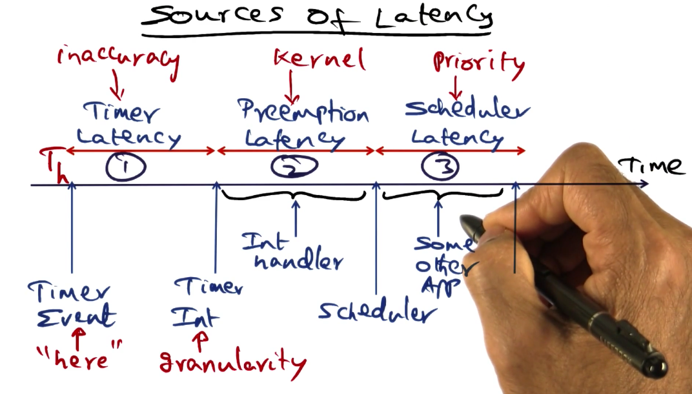
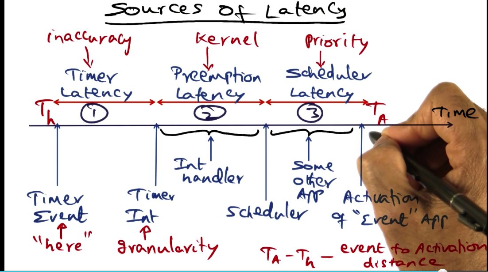
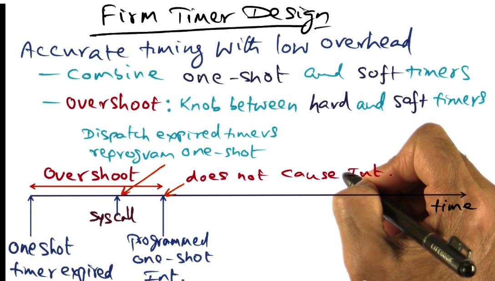
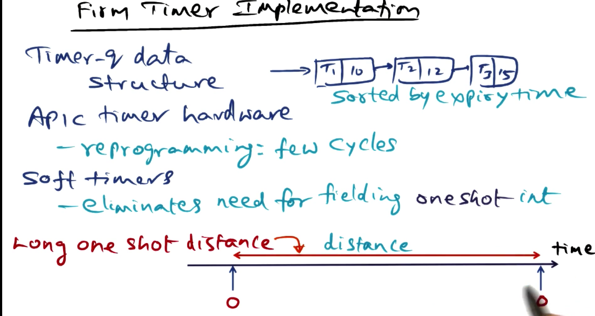
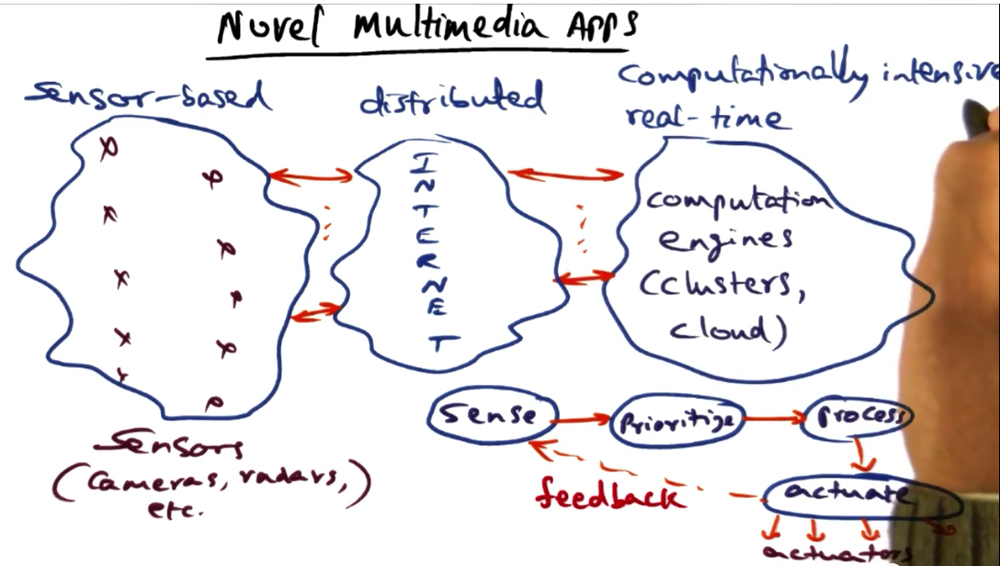
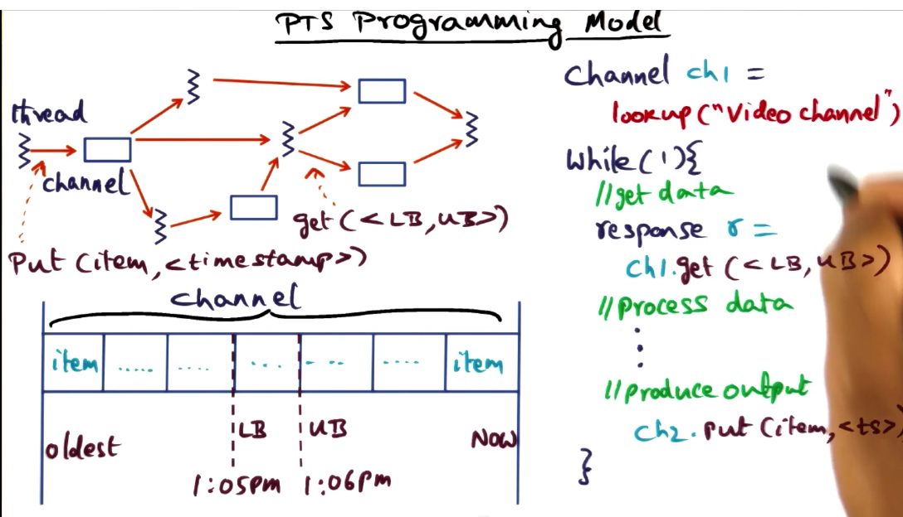

# Real-time Operating Systems

## Table of Contents

## TS-Linux

In this lesson, we will discuss **time-sensitive linux**, an extension of the commodity linux system that addresses two questions
1. **How to provide guarantees for real-time applications in the presence of background throughput-oriented applications.**
2. **How to bound the performance loss of throughput-oriented applications in the presence of latency-sensitive applications.**

### Sources of Latency

Time-sensitive applications require quickly responding to an event.

There are three sources of latency in a general-purpose OS:
1. **Timer latency** - latency between when a timer goes off and when an interrupt is fielded. This primarily comes up in regards to the **coarse timing granularity in a general purpose OS.**

2. **Preemption latency** - The interrupt could have **happened when the kernel was doing something that can't be preempted**. The kernel is in itself in the middle of a higher-priority interrupt.

3. **Scheduler latency** - A higher priority task is in the scheduler queue and the scheduler is busy.

A useful metric to think about reducing for time-sensitive applications is **time-to-activation**, the difference between when a timer event receives an interrupt and when the event is actually executed.

### Timers Available

Let's review the kind of timers available to an OS. 

1. **Periodic timer** - pro is periodicity, the OS is going to be interrupted at regular intervals, the con is event-recognition latency/timer latency. The maximum timer latency is equal to the period itself.

2. **One-Shot Timer** - Exact timers, programmed to go-off exactly the time we want it to go off. This is super-accurate. The con of using these timers is that there is overhead to fielding these timers.

3. **Soft Timer** - If we are concerned with interrupt overhead, one extreme we can take is to get rid of timer interrupts all-together. There is no interrupt, the OS will poll the timer to see if there is an external event. There is going to be polling overhead and latency.

4. **Firm Timer** - a new mechanism that combines all the advantages of the timers above. It is part of TS-Linux.

### Firm Timer Design

The idea behind the firm timer design is to provide **accurate timing with low overhead**. To do this it **combines the good points fo the one-shot and soft timers**. 

The virtue of the one-shot timer is that it goes off exactly when we want it to. We get rid of the timer inaccuracy. The con is that there is overhead with this precision.

In TS Linux, the firm timer design creates a knob known as overshoot. This overshoot parameter allows us to provide a buffer between when a one-shot timer expires and when the timer is supposed to actually interrupt the CPU.

The advantage of this parameter is that it allows us to emit a system call (a la the soft interrupt). When this happens, the system call does two things, first it dispatches the expired one shot timer instead of waiting for it to go off, and it reprograms the one-shot timer so that it is ready for the next interrupt.

The upshot of doing this is that we don't have to spend any more overhead on the programmed one-shot timer.

### Firm Timer Implementation

In Linux, a task is used to reference a schedulable entity.

The **timer-q** is a **data structure maintained by the kernel that contains the tasks and the expiry time for each particular task**. The tasks are sorted by the expiry time. 

The basis for firm timer implementation is the availability of APIC hardware (advanced programmable interrupt controller), implemented on-chip.

With this hardware, reprogramming a one-shot timer only takes a few cycles.

When an APIC timer expires, the interrupt handler goes through the timer-q data structure and look for tasks whose timers have expired. Associated with each task is a callback handler for dealing with that event. 

These callback handlers are going to be called by the interrupt handler on the expiry of the APIC timer. The expired timers are going to be removed from the timer-q. If they are periodic timers, they will be re-enqueued onto the data structure.

The way the APIC timer hardware works is by setting a value in a register that is decremented with each memory busy cycle until it reaches zero, at which point it generates an interrupt. Given a 100 mHz memory bus, this gives a one-shot timer a theoretical accuracy of 10 ns. However, practically, the time it takes to field the interrupt is the lower bound on the latency of the timer.

By choosing an appropriate overshoot timer, we can eliminate the need for fielding one-shot interrupts because of soft-timers going off in the overshoot period.

If periodic events are going to go off and they are close enough to a one-shot timer that would've gone off. Then we can dispatch a one-shot event at a preceding periodic event. This allows us to use the periodic events as the means for dispatching one shot events. Periodic timers are much more efficient than one-shot timers.

### Reducing Kernel Preemption Latency

## PTS

The focus on this lesson is in a middleware that is going to sit between commodity OS's and the multimedia applications that sit on top of the OS.

### Programming Paradigms

We've seen that pthreads are a good library for developing parallel programs. In distributed programs, sockets are an API for developing distributed programs.

Some folks think that sockets have insufficient expressiveness for modern realtime applications.

### Novel Multimedia Apps

Novel distributed apps tend to be sensor based, and these sensors can be simple or complex. These sensors are distributed and they have to be accessed via the internet. 

We would like to be able to do live stream analysis on these sensors. Often these applications are known as situation-awareness applications. 

They exhibit **a control loop of sensing, prioritizing what is important, processing the data, and then actuating**. The loop is then run again.

When you have such a large number of sensors, there is going to be a lot of infrastructure overhead. It is **important to prune these sensor streams at the source**.

### Programming Model for Situation Awareness

The computation pipeline for a video analytics application is as follows (let's say we are interested in detecting an anomalous event).

1. Camera captures images
2. Detecting for something in a frame
3. Upon detection, we should track the object that we are interested in.
4. Create systems for recognizing the thing you detected.

**The objective in situation awareness applications is to process streams for high level inference.** 

How are these systems scaled up? PTS is a simple for creating a system for reducing these pain points in situation awareness applications.

### PTS Programming Model

The PTS programming model is a distributed application that has two entities, threads and channels.

The computation graph that is generated by PTS looks very similar to a unix process-socket graph. While they look the same, the semantics of the channel entity is very different from a socket.

The channel holds time-sequenced data objects. The thread produces these objects, and it can place them into the channel.

The other thing you will notice is that there could be multiple producers of data that are placing objects into a channel. There can also be multiple consumers of data that are receiving data from a given channel. 

A thread that wants to add an object to the channel uses the `put(item, timestamp)` primitive. 

A computation that needs to use the data will use the `get(lower_bound_for_ts, upper_bound_for_ts)` primitive. This will return a sequence of data objects from the channel.

### Bundling Streams

### Power of Simplicity

### PTS Design Principles

### Persistent Channel Architecture