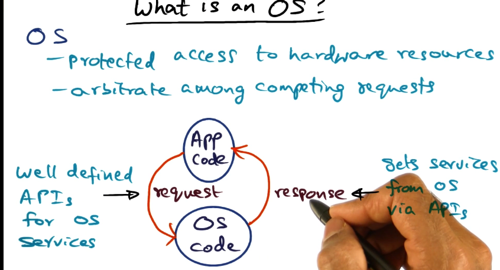

# Introduction to Advanced Operating Systems

## Table of Contents

* [Hardware Resources](#hardware-resources)
    * [I/O Bus](#hardware-organization-with-io-bus)
* [OS Functionality](#os-functionality)
* [Managing the CPU and Memory](#managing-the-cpu-and-memory)
    * [Processor-related abstractions](#processor-related-abstractions)
    * [Memory-related abstractions](#memory-related-abstractions)

## Hardware Resources

One of the OSes **responsibilities is the control of access to the physical hardware**. 

Regardless of the computing system we are talking about: cell phone, laptop, server, etc, the internal organization of the computer hardware is largely the same. 

We have a **CPU** which processes instructions, it is connected to the rest of the hardware by a **bus**, we have **memory** that holds instructions and data. We have **storage** for persistence of files. We might also have other peripheral devices.

The **bus** is the **conduit for communication between all the different devices** in the computing system.

Depending on the sophistication of the devices that are hooked up the bus, they might have the **ability to move memory without intervention of the system CPU**, this is called **direct memory access (DMA)**.

## Hardware Organization with I/O bus

In a more typical elaboration of the computer system, the system bus and the I/O bus are separate. The system bus is a synchronous communication device between the CPU and memory. The I/O bus is for devices to communicate with the CPU. In this model, the system bus is typically much higher bandwidth so that the I/O bus never really disrupts CPU and memory communication.

## OS functionality

1. OS is a **resource manager** that arbitrates amongst competing resources.
2. OS **provides a consistent interface to the hardware resources**.
3. OS **schedules application on the CPU**. 

You can think of an OS like an **API for accessing hardware resources**. It's not too different from a web service accessing a backend API.

## Managing the CPU and Memory

The resource needs of an application are time to compute on CPU, the memory to hold instructions and data, and peripheral devices it might need to access.

At app launch time, are these resources known? Kind of, when an application starts the OS loads a special part of the application to create a memory-resident image (**memory footprint**) of that application that will **serve as the basis of execution**. The footprint is an address space that contains the code that will need to be executed, any global data, the stack that is needed for execution, and the heap which is the dynamic memory it might need. 

Once a program starts running, the application **asks for additional resources at runtime**.

The CPU and OS uses timeslicing to share compute amongst competing applications.

## Processor-related OS abstractions

A **program** is the static image (memory footprint) that is loaded into memory when you launch on application.

A **process** is a program in execution. It is the program plus the dynamic state of the program as it is executing.

## Difference between process and thread

A thread is **a process with multiple execution contexts**. Threads **share the same address space**. They have **different stacks**. 

A process is a program plus all the threads executing in the program. A process is also a term that is colloquially used to describe a single execution context within an address space.

## Memory-related OS abstractions

Processes have their own distinct address spaces. Address spaces are implemented using hardware capabilities. 
