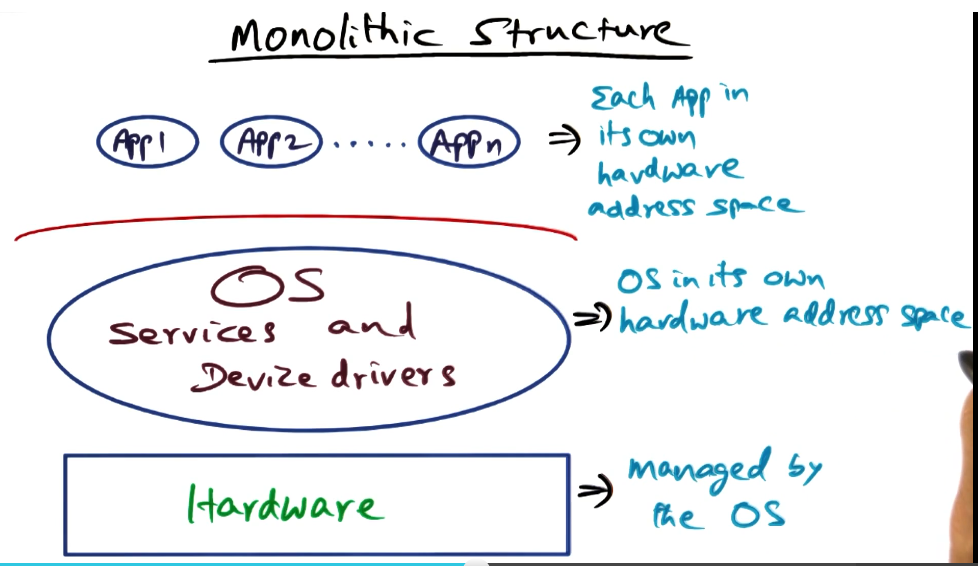
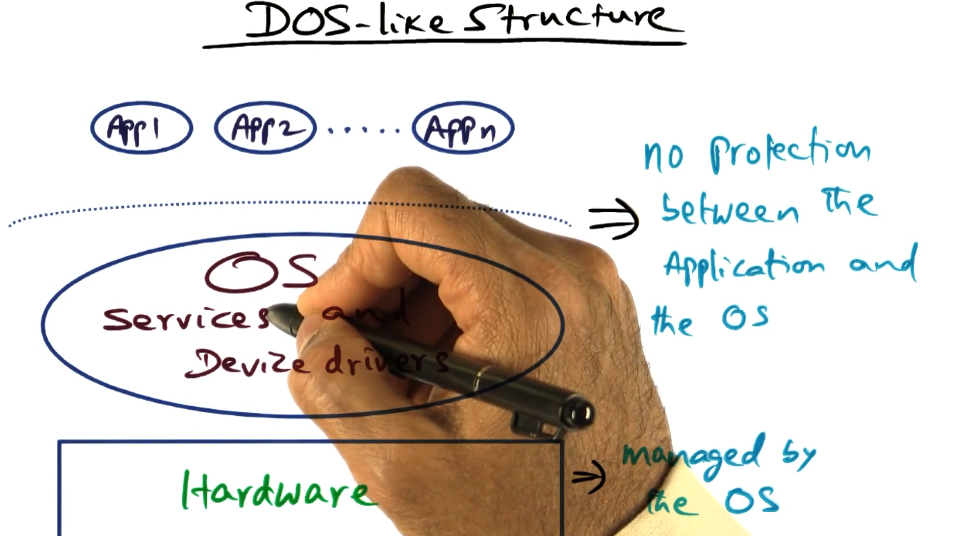
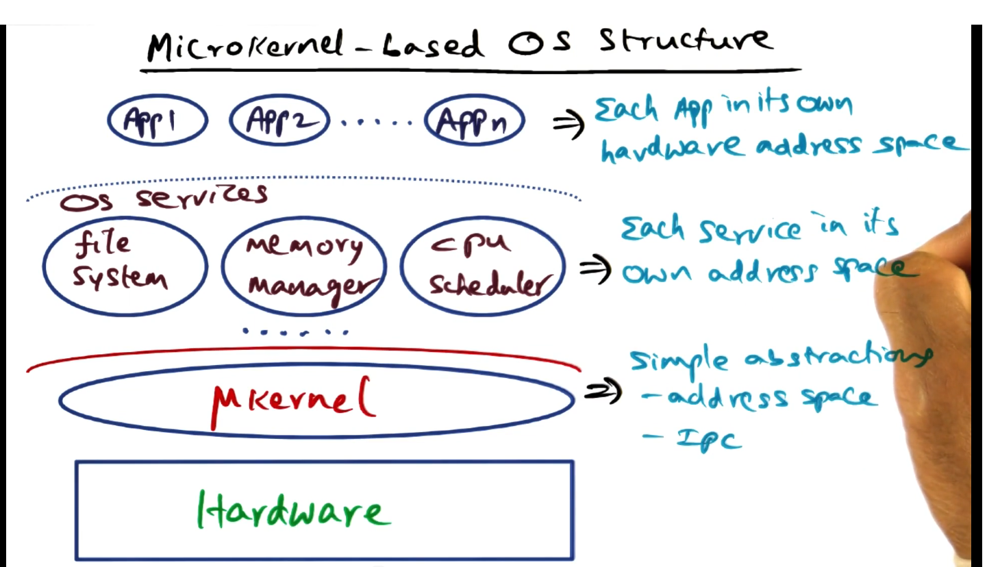
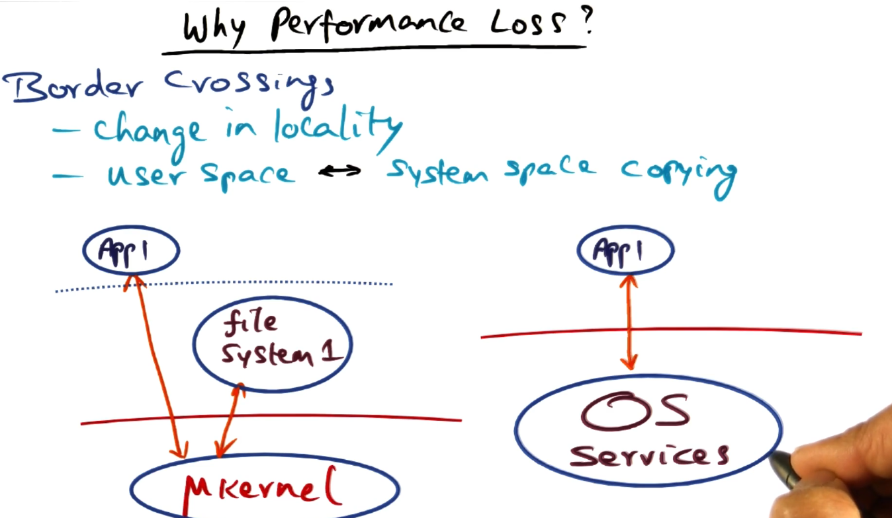
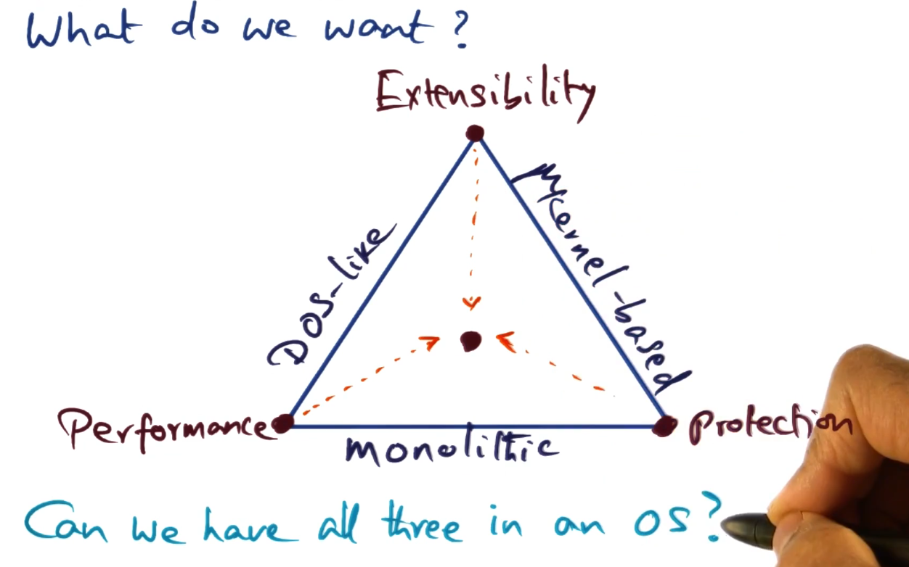
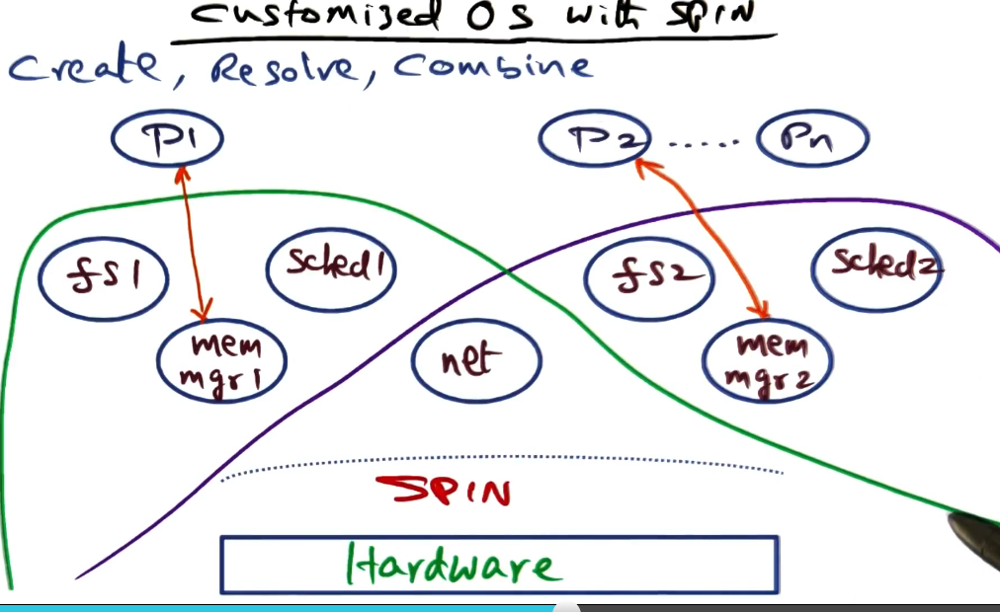
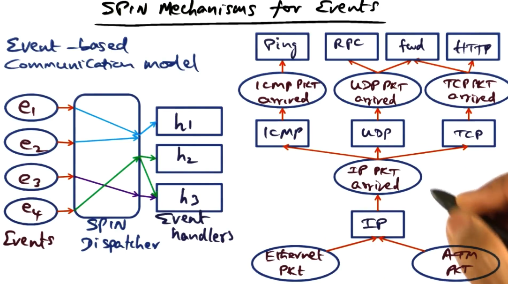

# Operating Systems Structure

## Table of Contents

* [Introduction](#introduction)
* [Goals of OS structure](#goals-of-os-structure)
    * [Monolithic Architecture]()
    * [DOS vs Monolithic]()

## Introduction

An OS needs to protect the integrity of the hardware resources it manages while providing the services to applications.

Some of the components of an OS need to run in a privileged mode of the processor architecture that allows them access to hardware, but most the entire OS have this privilege?

**OS structure** is a term used to reference **how the OS software is organized** with respect to the applications it serves and the underlying hardware it manages.

## Goals of OS structure

* **Protection** - protecting the user from the system and vice-versa. 
* **Performance** - Time taken to perform services on behalf of the applications. A good OS is quick and gets out of the way.
* **Flexibility** - Extensibility, a service is not one-size-fits-all, it is adaptable.
* **Scalability** - The performance increases as the hardware resources increases. 
* **Agility** - The OS is able to adapt to changing application needs or resource availability.
* **Responsiveness** - The OS can react to external events. Especially important for interactive applications.

All of these goals are not simultaneously achievable. There are always trade-offs with design decisions. 

### Monolithic Structure

The most common organization of an OS is the **monolithic** approach, where the entire OS runs as **a single program in kernel mode**. The OS is written as a collection of procedures, linked together into **a single large executable binary program**. 

When this technique is used, each procedure is free to call any other procedure. This is efficient, but having thousands of procedures that can call each other without restriction can also make the system difficult to understand (also **a crash in any of these procedures will take down the entire OS**!).

**System calls** are exported by the OS  to applications to provide a well-defined **interface for interacting with hardware**. 

### Comparing DOS to a Monolithic structure

Microsoft's first OS, DOS (Disk Operating System), let applications have direct access to system services as procedure calls which gave the OS better performance. The problem with this design is that there wasn't much protection against errant applications corrupting the OS!

Technically, this meant that the OS and the application code lived in the same address space. 

The loss of protection to the OS in a DOS-like architecture is unacceptable in today's world. On the otherhand, monolithic architecture ensures this safety.

One of the ways that the monolithic design aids in increasing performance is to consolidate all of its code into a single binary. This means that once a system call has transitioned application code from user space to kernel space, all of the code needed for the OS will be inside the same address space.

What is lost in the monolithic structure is customization and flexibility. Everything is built into a single binary, there is no mix-and-match.

### Microkernel-based Architecture

The need for customization and the opportunity for customization is what spurred OS designers to create an OS structure that would allow for the customization of services offered by the OS.

The basic idea behind the microkernel design is to a**chieve high reliability by splitting the OS into small well-defined modules**, **only one** which, the **microkernel, runs in kernel mode**. The others run as relatively powerless user processes.

**Only mechanisms for accessing hardware (no policies) are situated in the microkernel**. These simple mechanisms include threads, address space and IPC.

The OS services such as VM management, CPU scheduling, and the filesystem are implemented as servers on top of the microkernel. These services execute with the same privilege as the applications themselves. Each service is in it's own address space. 

In a microkernel, in principle, there is no distinction between regular applications and system services that are executing as server processes on top of the microkernel.

This gives us strong protection between all of the different layers of the microkernel. We have also gained extensibility. It's easy to mix and match new OS services by building the on top of the microkernel.

One **downside of the microkernel approach is that there is a potential for performance loss** because we've introduced so many new boundaries (address spaces) between services. There is the potential for many more context switches in a microkernel architecture per system call than in a monolithic architecture.

Border crossings change the locality of the execution of the processor. Also, when are going across boundaries, there may be a need to copy from user space to system space. This can be slow as well.

## The SPIN Approach

Both the SPIN and the Exokernel approaches start with two basic premises:

1. The microkernel design compromises on performance due to frequent border crossings.
2. The monolithic design does not lend itself to extensibility because everything is built in one binary.

Let's revisit what we are trying to achieve in an OS structure.
* We want the OS to be thin, **there should only be mechanisms in the kernel, not policies** (like microkernel). 
* The structure **should allow fine-grained access to system resources without border-crossing** too much (like DOS).
* The OS should be flexible, resource management should be flexible (like microkernel) without sacrificing protection and performance (like monolithic). 

### Approaches to Extensibility

Historically, there has been interest in extensibility in OS's since 1981, when a team of researches from CMU introduced the Hydra OS. Hydra OS used kernel mechanisms for resource allocation. It provided access via **capabilities**, an entity that can be passed from one to another, it cannot be forged, and it can be verified. Capabilities are a heavy-weight mechanism. Resources managers were introduced as course-grained objects to reduce border crossing overheads.

While in principle, Hydra had a thin design and used resource managers to reduce border crossings, the design did not lend itself to extensibility.

One of the most well-known extensible OS's in the early days was the Mach operating system from CMU. It was microkernel based, providing very limited mechanisms in the kernel. It provided all the services above the kernel. It achieved its goal of extensibility and portability, but performance took a back seat. 

### SPINs approach to extensibility

SPIN's idea was to **co-locate the kernel and the extensions** (same hardware address space) so as **to avoid border crossing**. 

SPIN relied on the characteristics of a **strongly-typed programming language to give guarantees** about how protected each process was. This is called **compiler-enforced modularity**. 

SPIN uses **logical protection domains**, not hardware address spaces to protect the OS from services and the kernel.

The flexibility of SPIN comes from **dynamic call binding**, different functions can be attached to the OS interface for a service. This makes extensions as cheap as a procedure call.

### Logical Protection Domains

Modula-3 is a strongly-typed language with built-in safety and encapsulation methods. It does automatic management of memory. It supports objects, threads, exceptions, and generic interfaces. 

OS services are packaged up in Modula-3 objects which gives some guarantees of a protected interface. This allows for both protection and performance. 

Objects that implement the specific services can be fine-grained, or they can be collections of interfaces. All of these are accessible via capabilities. **Capabilities are implemented as pointers in Modula-3**, which means they are much lighter-weight. Modula-3 pointes are type-specific which makes them easier to guard.

### SPIN Mechanisms for Domain Protection

There are three mechanisms in SPIN to create protection domains. Write your code in Modula-3 and use these three mechanisms.

1. `create()` - initiates an object with contents and exports names that are contained as entry point methods to be visible outside the object. This creates logical protection domains.
2. `resolve()` - if one protection domain wants to use the name of another protection domain, it can accomplish this using the resolve primitive, which is **very similar to linking two separately compiled files together**(compiler process). **Once resolved, resource sharing is done at memory speeds**.
3. `combine()` - to reduce the profileration of small logical protection domains, you can combine domains and aggregate them using combine.

This is the secret sauce of SPIN, everything hinges on the strongly-typed nature of Modula-3.

The upshot of the logical protection domain, is the **ability to extend SPIN to include OS services and make them all part of the same hardware address space**. No border-crossings!

This image demonstrates the flexibility of the extensions, here we see two separate extensions (individual OS's) that can share components. 

### SPIN mechanisms for events

An OS has to field external events. For example, external interrupts that come in as a process is executing, or the process itself may incur some exceptions that cause an interrupt in its own execution. All of these are events that an OS has to support.

SPIN supports these events using an **event-based communication model**. Services register event handlers with the SPIN event dispatcher. SPIN supports several types of mapping:
* 1:1 mapping between an event and handler
* 1:many mapping between an event and handlers
* many:1 mapping to the same handler. 

An example of this is a protocol stack. There might be several interfaces for network connections, say ethernet and ATM. These packets arrive on one of these ports and this arrival is considered an event.

Both of those packets might be IP packets, so the event is handled by the IP handler, which looks at the events and decides which event handler to hand it off to: ICMP, UDP, or TCP.