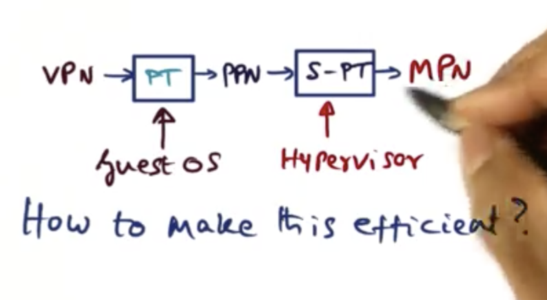
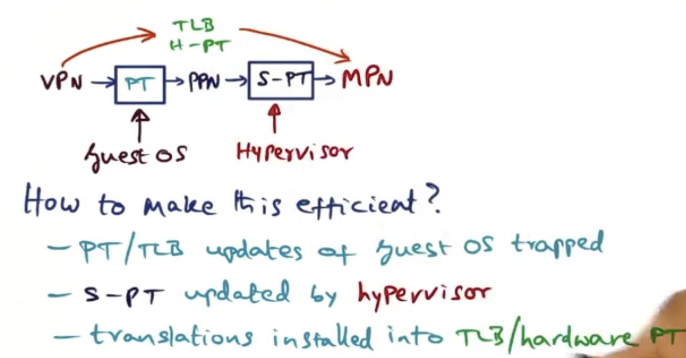
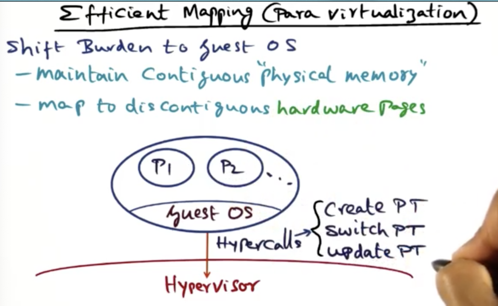
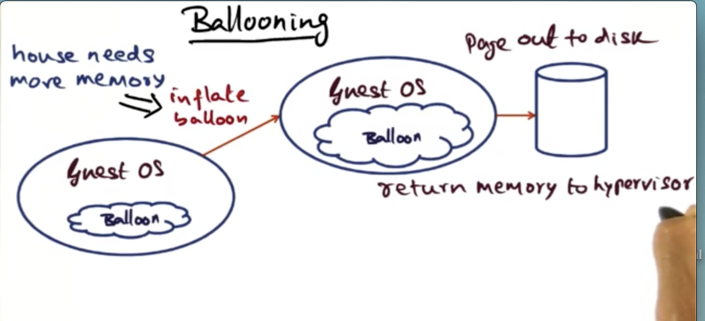
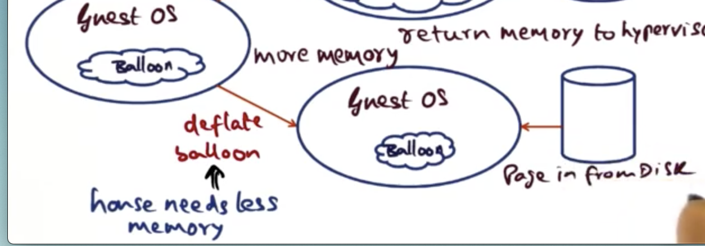

# Virtualization

## Table of Contents

## Introduction

The drive for extensibility in OS services led to innovation in the internal structure of operating systems. In this lesson we will see how the concept of virtualization has taken the vision of extensibility to a whole new level: namely the simultaneous existence of multiple OS's on the same hardware platform.

## Platform Virtualization

The hope for **virtualization** is that we can give applications a platform to run on without having to dedicate that platform to JUST running that application. This **makes running services cheaper**! We as OS designers are interested in how this black box works. 

Sharing resources can make the operating cost of an organization cheaper. However this model introduces a lot of confounding problems for the companies running the virtualization technology. How do we keep these applications secure and prevent them from stepping on each other's toes?

The fundamental intuition that makes sharing hardware resources across a diverse set of users is the fact that **resource usage is very bursty**. The VM typically has a memory that is much bigger than the needs of the individual applications. The cost of maintaining the platform is shared by all the tenants of the system. Virtualization is the application of extensibiilty at the granularity of an entire OS instead of with individual services like in SPIN and the exokernel. 

### Hypervisors

In a shared environment, **how are operating systems protected from one another**, and who decides **who gets the resource and at what time**. What we need is **an operating system of operating systems**, something called a **virtual machine manager**, or more simply (cooly), a **hypervisor**.

There are two types of hypervisors, a native hypervisor/bare metal (type-1). It is running atop the shared hardware. 

The second type is called a hosted hypervisor (type-2), these run on top of a host operating system.

For the purpose of these lessons, we will focus on **bare metal hypervisors**. These hypervisors **interfere minimally with the normal operation of the guest OS's**. For this reason, bare metal hypervisors **offer the best performance for the guest OS** on a shared resource.

### Full Virtualization

In **full virtualization**, the **OS is left untouched**, so that you can run the unchanged binary on top of the hypervisor. 

We have to be clever to get this to work. The **guest OS's** running on top of the hypervisor are run as **user-level processes**. If the OS code isn't changed though, it doesn't know that it doesn't have the privilege for issuing privileged instructions.

When the OS executes privileged instructions (needs to be in kernel mode), those instructions create a trap that goes into the hypervisor and the hypervisor emulates those instructions. This is known as the **trap-and-emulate strategy**. 

There are some thorny issues with this strategy, in some architectures, some privileged instructions may fail silently. In order to get around this problem, the hypervisor will resort to **binary translation**. Meaning, the OS knows which things can fail silently in the architecture, look for those gotchas and through binary editing, ensure that those instructions are dealt with carefully so that if those instructions fail, the hypervisor can catch them and take the appropriate action. This is employed in the VMware system.

### Paravirtualization

Another approach to virtualization is to **modify the source code of the guest OS**. If we can do that, we can avoid problematic instructions and also include optimizations (like letting the guest OS see real hardware resources).

The percentage of the guest OS code that needs to be modified is miniscule, less than 2% of the original guest OS.

### Big Picture

In either virtualization circumstance we need to virtualize the hardware resources and make them safely available to the guest OS's. The hardware resources are the memory hierarchy, the CPU and the devices in the hardware platform.

## Memory Virtualization

Caches are physically tagged so you don't have to do too much about handling them in a virtualized space. The really thorny issue comes in handling virtual memory -- The virtual address to the physical address mapping.

Recall that in any modern OS, each process is in its own protection domain and usually its own hardware address space. The OS maintains a **page table** for each process, and it is the **OS data structure** that holds the **mapping between the virtual pages and the physical pages**.

The physical memory is contiguous starting from 0 to the max of the hardware. The virtual address space is not contiguous, it is scattered all over the physical memory. This is the advantage of page-based memory systems.

### Memory Virtualization in a Virtualized Environment

In the virtualized setup, the hypervisor sits between the guest OS and the hardware. Thus the picture gets more complicated. Inside each guest OS are user-level processes, and each process is in its own protection domain. That means within each guest OS there is a distinct PT for each process within the guest OS. 

Does the hypervisor know about these page tables? No, it doesn't! So how does it manage?

The guest OS's think of physical memory as contiguous, but unfortunately the real physical memory (machine memory), is in control of the hypervisor, not the guest OS. Thus **the physical memory being managed by each guest OS is an illusion in a virtualized environment**. 

So what is going on within a given guest OS?

The process address space within an OS is an illusion, the physical memory that the OS thinks it has is actually being managed by the hypervisor. 

Remember, the page table is a data structure that is managed for each process within an OS that handles the mapping between a Virtual Page Number and the Physical Page Number. This is how a typical OS behaves.

In a virtualized setting we have **another level of indirection whereby each physical page number in an OS has to be mapped to machine memory**,machine page numbers.

The mapping between the **physical page number and the machine page number** is maintained in another page table called the **shadow page table**. 

Thus in a virtualized setting there is a two-step translation process to go from VPN to MPN. In the case of a fully-virtualized hypervisor, the shadow page table is kept in the hypervisor. In a paravirtualized setting, the guest OS knows it is not running on the hypervisor. It can thus house the mapping. 

### Shadow Page Table

In many architectures, the CPU uses the page table for address translation. What that means is that presented with a virtual address, the CPU first checks the TLB to see if there is a match for the VPN. If there is a match, there is a hit and it can translate to a physical address. If there is a miss the CPU goes to the page table in main memory and retrieves the entry for the virtual address. 

The hardware PT is really the shadow page table in the virtualized setting if the architecture is going to use the page table for address translation.

How does the hypervisor make the two-step translation process efficient? This will happen in every memory access!

The guest OS makes the mapping between a virtual page number and a physical page number by creating an entry in the page table for the process that is generating the virtual address. Updating the page table is a privileged instruction, when the guest OS tries to update the page table, it will result in a trap into the hypervisor. The hypervisor then updates the shadow page table and keeps the mapping there. Basically this means we just bypass the guess OS page table.

### Efficient mapping in a paravirtualized space

How does this work in a paravirtualized hypervisor? In a paravirtualized system, the OS knows that its physical memory is not contiguous, thus the burden of **mapping can be shifted to the guest OS** itself.

Now the guest OS is going to maintain contiguous physical memory, but it is also going to know that its notion of physical memory is not the same as machine memory.

In Xen, the guest OS makes **hypercalls** into the hypervisor to tell it about changes to the hardware page table. The hypervisor doesn't know anything about the processes within the guest OS, it just follows the hypercalls of the **guest OS to manage the hardware**.

All the things that an OS would have to do sitting on bare metal are exactly things that a hypervisor must be able to do for its guest OS's.

### Dynamically increasing memory

How do we dynamically increase the amount of physical memory to an OS running atop a hypervisor? The hypervisor must be able to allocate memory on-demand to the requesting OS. 

If all the memory is allocated, how does the hypervisor distribute memory? Well, naturally it doesn't just take the memory from a peer, that would be rude and could lead to service degradation. It asks nicely.

That's the idea behind a technique called **ballooning**. This entails having a **special device driver installed into the guest OS** called a balloon.

Let's say that another guest OS needs memory. The hypervisor talks to the balloon inside a different guest OS. It tells the device driver to inflate, make requests to the guest OS to give it more memory. Since the amount of physical memory is infinite, if one process (the balloon driver) asks for more memory, the guest has to get rid of unwanted memory by paging out to disk unwanted pages. This reduces the memory footprint of the guest OS. Once the balloon driver has pushed memory out of the guest OS, it will return the memory to the hypervisor.

The opposite situation is where the hypervisor has memory to give to the guest OS. The way it does this is by deflating the balloon. It contacts the balloon driver and tells it to contract its memory footprint. This releases memory into the guest OS. This means the guest OS will have more memory and will be able to page in the working set from disk.

Ballooning assumes implicit cooperation with the guest OS by controlling the balloon driver.

This technique is used in fully virtualized and paravirtualized environments.

### Shared memory across virtual machines

