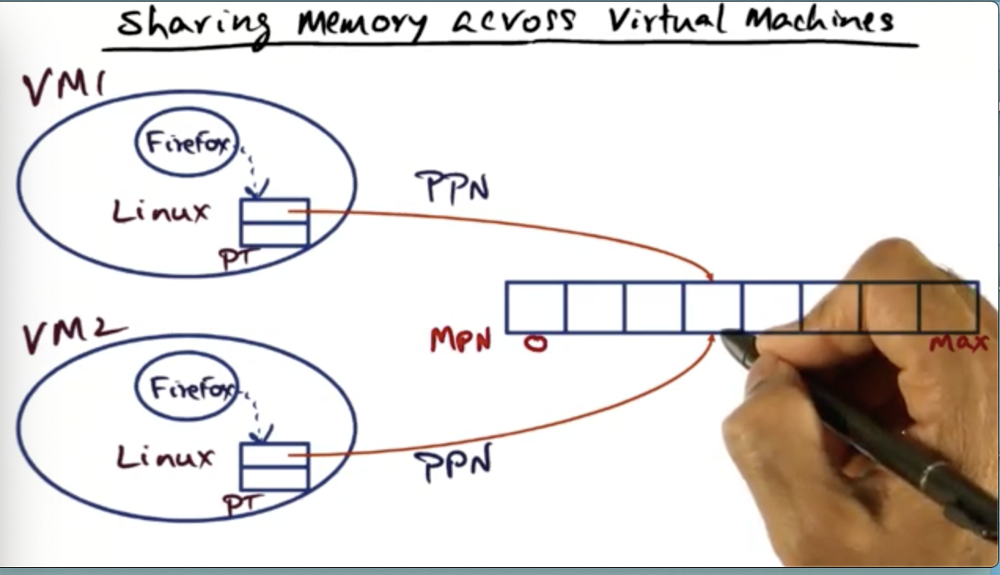
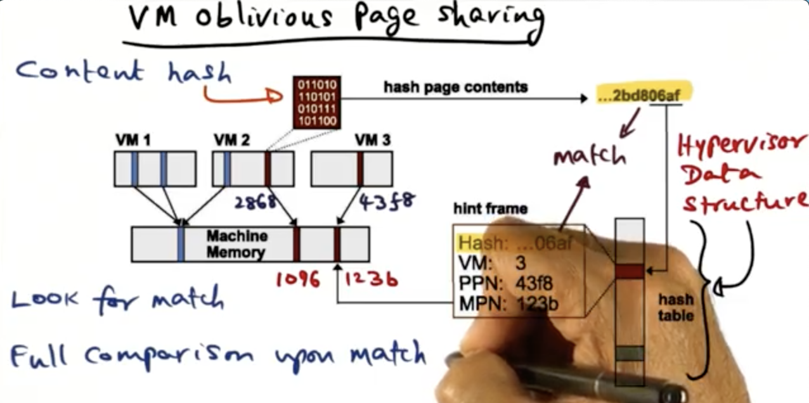
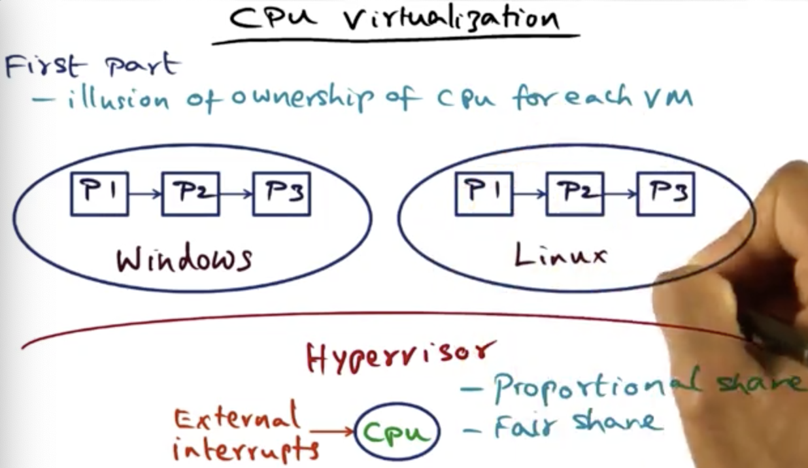
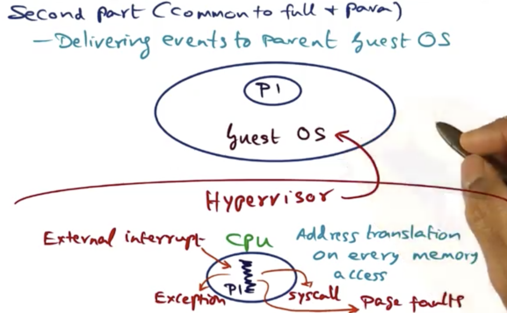
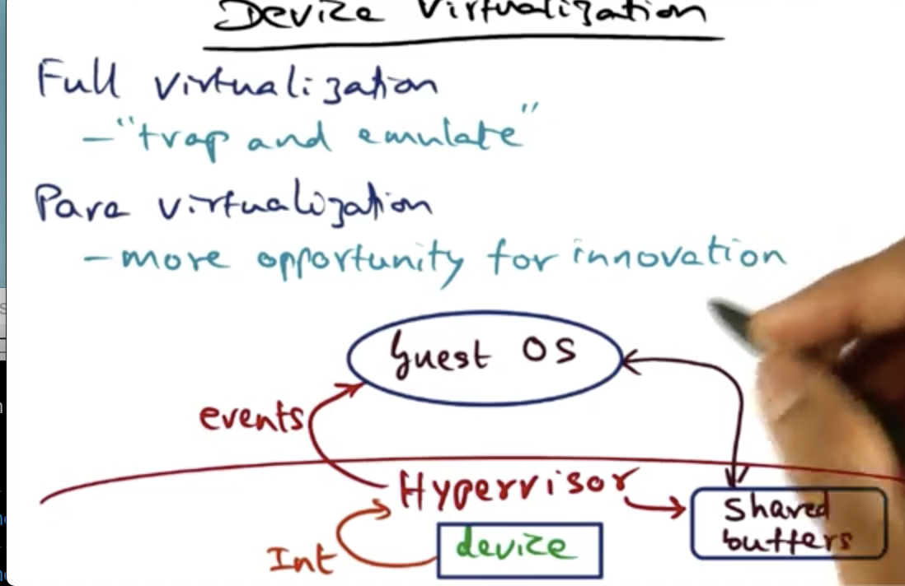
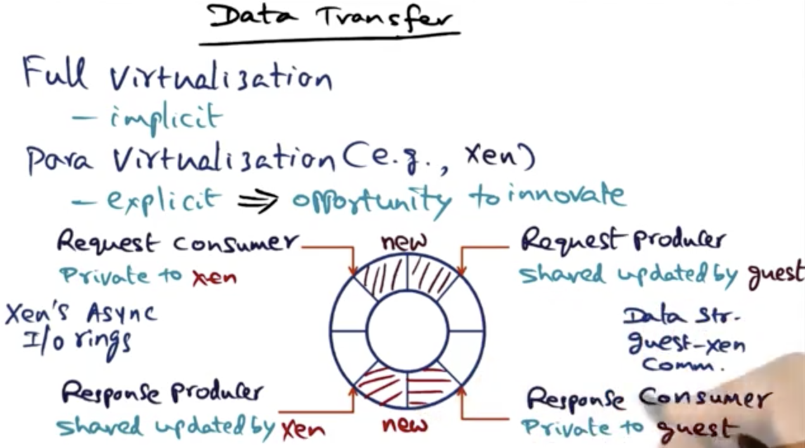

# Virtualization

## Table of Contents

## Introduction

The drive for extensibility in OS services led to innovation in the internal structure of operating systems. In this lesson we will see how the concept of virtualization has taken the vision of extensibility to a whole new level: namely the simultaneous existence of multiple OS's on the same hardware platform.

## Platform Virtualization

The hope for **virtualization** is that we can give applications a platform to run on without having to dedicate that platform to JUST running that application. This **makes running services cheaper**! We as OS designers are interested in how this black box works. 

Sharing resources can make the operating cost of an organization cheaper. However this model introduces a lot of confounding problems for the companies running the virtualization technology. How do we keep these applications secure and prevent them from stepping on each other's toes?

The fundamental intuition that makes sharing hardware resources across a diverse set of users is the fact that **resource usage is very bursty**. The VM typically has a memory that is much bigger than the needs of the individual applications. The cost of maintaining the platform is shared by all the tenants of the system. Virtualization is the application of extensibiilty at the granularity of an entire OS instead of with individual services like in SPIN and the exokernel. 

### Hypervisors

In a shared environment, **how are operating systems protected from one another**, and who decides **who gets the resource and at what time**. What we need is **an operating system of operating systems**, something called a **virtual machine manager**, or more simply (cooly), a **hypervisor**.

There are two types of hypervisors, a native hypervisor/bare metal (type-1). It is running atop the shared hardware. 

The second type is called a hosted hypervisor (type-2), these run on top of a host operating system.

For the purpose of these lessons, we will focus on **bare metal hypervisors**. These hypervisors **interfere minimally with the normal operation of the guest OS's**. For this reason, bare metal hypervisors **offer the best performance for the guest OS** on a shared resource.

### Full Virtualization

In **full virtualization**, the **OS is left untouched**, so that you can run the unchanged binary on top of the hypervisor. 

We have to be clever to get this to work. The **guest OS's** running on top of the hypervisor are run as **user-level processes**. If the OS code isn't changed though, it doesn't know that it doesn't have the privilege for issuing privileged instructions.

When the OS executes privileged instructions (needs to be in kernel mode), those instructions create a trap that goes into the hypervisor and the hypervisor emulates those instructions. This is known as the **trap-and-emulate strategy**. 

There are some thorny issues with this strategy, in some architectures, some privileged instructions may fail silently. In order to get around this problem, the hypervisor will resort to **binary translation**. Meaning, the OS knows which things can fail silently in the architecture, look for those gotchas and through binary editing, ensure that those instructions are dealt with carefully so that if those instructions fail, the hypervisor can catch them and take the appropriate action. This is employed in the VMware system.

### Paravirtualization

Another approach to virtualization is to **modify the source code of the guest OS**. If we can do that, we can avoid problematic instructions and also include optimizations (like letting the guest OS see real hardware resources).

The percentage of the guest OS code that needs to be modified is miniscule, less than 2% of the original guest OS.

### Big Picture

In either virtualization circumstance we need to virtualize the hardware resources and make them safely available to the guest OS's. The hardware resources are the memory hierarchy, the CPU and the devices in the hardware platform.

## Memory Virtualization

Caches are physically tagged so you don't have to do too much about handling them in a virtualized space. The really thorny issue comes in handling virtual memory -- The virtual address to the physical address mapping.

Recall that in any modern OS, each process is in its own protection domain and usually its own hardware address space. The OS maintains a **page table** for each process, and it is the **OS data structure** that holds the **mapping between the virtual pages and the physical pages**.

The physical memory is contiguous starting from 0 to the max of the hardware. The virtual address space is not contiguous, it is scattered all over the physical memory. This is the advantage of page-based memory systems.

### Memory Virtualization in a Virtualized Environment

In the virtualized setup, the hypervisor sits between the guest OS and the hardware. Thus the picture gets more complicated. Inside each guest OS are user-level processes, and each process is in its own protection domain. That means within each guest OS there is a distinct PT for each process within the guest OS. 

Does the hypervisor know about these page tables? No, it doesn't! So how does it manage?

The guest OS's think of physical memory as contiguous, but unfortunately the real physical memory (machine memory), is in control of the hypervisor, not the guest OS. Thus **the physical memory being managed by each guest OS is an illusion in a virtualized environment**. 

So what is going on within a given guest OS?

The process address space within an OS is an illusion, the physical memory that the OS thinks it has is actually being managed by the hypervisor. 

Remember, the page table is a data structure that is managed for each process within an OS that handles the mapping between a Virtual Page Number and the Physical Page Number. This is how a typical OS behaves.

In a virtualized setting we have **another level of indirection whereby each physical page number in an OS has to be mapped to machine memory**,machine page numbers.

The mapping between the **physical page number and the machine page number** is maintained in another page table called the **shadow page table**. 

Thus in a virtualized setting there is a two-step translation process to go from VPN to MPN. In the case of a fully-virtualized hypervisor, the shadow page table is kept in the hypervisor. In a paravirtualized setting, the guest OS knows it is not running on the hypervisor. It can thus house the mapping. 

### Shadow Page Table

In many architectures, the CPU uses the page table for address translation. What that means is that presented with a virtual address, the CPU first checks the TLB to see if there is a match for the VPN. If there is a match, there is a hit and it can translate to a physical address. If there is a miss the CPU goes to the page table in main memory and retrieves the entry for the virtual address. 

The hardware PT is really the shadow page table in the virtualized setting if the architecture is going to use the page table for address translation.

How does the hypervisor make the two-step translation process efficient? This will happen in every memory access!

The guest OS makes the mapping between a virtual page number and a physical page number by creating an entry in the page table for the process that is generating the virtual address. Updating the page table is a privileged instruction, when the guest OS tries to update the page table, it will result in a trap into the hypervisor. The hypervisor then updates the shadow page table and keeps the mapping there. Basically this means we just bypass the guess OS page table.

### Efficient mapping in a paravirtualized space

How does this work in a paravirtualized hypervisor? In a paravirtualized system, the OS knows that its physical memory is not contiguous, thus the burden of **mapping can be shifted to the guest OS** itself.

Now the guest OS is going to maintain contiguous physical memory, but it is also going to know that its notion of physical memory is not the same as machine memory.

In Xen, the guest OS makes **hypercalls** into the hypervisor to tell it about changes to the hardware page table. The hypervisor doesn't know anything about the processes within the guest OS, it just follows the hypercalls of the **guest OS to manage the hardware**.

All the things that an OS would have to do sitting on bare metal are exactly things that a hypervisor must be able to do for its guest OS's.

### Dynamically increasing memory

How do we dynamically increase the amount of physical memory to an OS running atop a hypervisor? The hypervisor must be able to allocate memory on-demand to the requesting OS. 

If all the memory is allocated, how does the hypervisor distribute memory? Well, naturally it doesn't just take the memory from a peer, that would be rude and could lead to service degradation. It asks nicely.

That's the idea behind a technique called **ballooning**. This entails having a **special device driver installed into the guest OS** called a balloon.

Let's say that another guest OS needs memory. The hypervisor talks to the balloon inside a different guest OS. It tells the device driver to inflate, make requests to the guest OS to give it more memory. Since the amount of physical memory is infinite, if one process (the balloon driver) asks for more memory, the guest has to get rid of unwanted memory by paging out to disk unwanted pages. This reduces the memory footprint of the guest OS. Once the balloon driver has pushed memory out of the guest OS, it will return the memory to the hypervisor.

The opposite situation is where the hypervisor has memory to give to the guest OS. The way it does this is by deflating the balloon. It contacts the balloon driver and tells it to contract its memory footprint. This releases memory into the guest OS. This means the guest OS will have more memory and will be able to page in the working set from disk.

Ballooning assumes implicit cooperation with the guest OS by controlling the balloon driver.

This technique is used in fully virtualized and paravirtualized environments.

### Shared memory across virtual machines

Typically separation of virtual memory is a security must, but in some cases, it can be more efficient for virtual machines to **share across the machine memory**. This maximally utilizes the machine memory.

One way of doing this sharing is by enabling cooperation between the guest OS's and the hypervisor. The guest OS has hooks that allows the hypervisor to mark pages as copy-on-write and have the PPN's in each linux page table point to the same location in machine memory. The minute that either of the sharing machines tries to modify the shared page, the OS makes a copy of it and the hypervisor will redirect the PPN of that machine to point to this new copy.

An alternative is to achieve the same effect but in a way that makes the guest OS completely oblivious to the underlying shared machine memory.

The idea is to use content-based sharing. To do this, the **hypervisor maintains a hash table that contains a content hash of the machine pages**. If you hash the content of the machine memory page, you get a signature, and that signature is stored in the table. This allows the hypervisor to compare pages and see if it can have the VM's share the memory. 

Remember a content hash represents the content of the page at the time it was saved. It's possible that the hash is out of date, so the hypervisor needs to inspect collisions to really make sure that the shared pages are identical. Once we've confirmed, we modify the hypervisor data structure to indicate that two VMs share the page. They also signal to the guest OS that the two pages in the respective OS needs to be copy-on-write.

This activity is done as a background activity. We don't want to do this when there is active usage of the system. 

### Memory Allocation Policies

A higher level issue is the policy we need to use to allocate and reclaim memory from the domains that we've allocated memory to in the first place. Ultimately, the goal of virtualization is to maximize the utilization of resources. Memory is a previous resource.

Virtualized environments might use different policies:

1. **Pure share-based approach** - you pay less, you get less. The problem with this approach is that it can lead to hoarding. This is wasteful
2. **Working-set based approach** - If the working-set of a VM goes up, then it is given more memory. If it shrinks, give the memory to someone else. The only problem with this approach is that it ignores the fact that there are pay tiers. 
3. **Dynamic idle-adjusted shares approach** - Tax the hoarders more than the active pages. If you are hoarding resources and wasting them, we will take them away with you. By having an expensive tax rate (but not 100%), we can reclaim most idle memory. This also allows for sudden working set increases for the people who pay more for resources. 

## CPU virtualization

The challenge in virtualizing the CPU and the devices is giving the illusion to the guest OS's that they own the resources when in reality they are protected and managed by the hypervisor.

Each guest OS is already multiplexing processes onto a single CPU. That means each guest OS has a ready queue that is ready to give work to the CPU.

The first part of what the hypervisor has to do is **give the illusion to the guest OS that it owns the CPU**. 

From the hypervisor's perspective, it needs to have a precise method for accounting the time that a particular VM uses on the CPU, from the point of view of billing each customer. It worries that it is sharing equally amongst the guest OS's. The **hypervisor doesn't care about the individual scheduling policy within the guest OS**. 

One straightforward way of sharing the CPU is to give a **proportional share** of the CPU for each guest OS commensurate with the service agreement that the VM has with the hypervisor. Another approach is to use a **fair-share scheduler**. Both of these strategies are straightforward mechanisms.  

In either of these cases, the hypervisor has to account for the time used on the CPU on behalf of a different guest during the allocated time for a particular guest: say an external CPU interrupt comes in.

Another part of virtualizing the CPU is being able to **deliver events to the correct guest OS**.

Once a process has been scheduled on the shared CPU, everything should be happening at hardware speeds (using the clever tricks we talked about earlier). The quick translation of memory addresses is the most crucial component of having efficient computation happen on the shared CPU.

System calls, page faults, exceptions and external interrupts (asynchronous) are all program discontinuities that require communication with the guest OS. Thus we need a way to deliver events from the shared CPU to the correct guest OS. This is common between both fully virtualized environments and paravirtualized environments.

All of these events will be packaged as software interrupts from the hypervisor to the guest OS. OS's know what to do with this, so nothing much has to be done in the guest OS.

One thorny bit about this situation is that some of the handler-specific procedures for these events in the guest OS might require privileged access to the CPU. This is a problem, especially in a fully-virtualized environment because the guest OS doesn't know it doesn't have the privileges!

Some instructions that should be executed in a privileged state, fail silently when executed in an unprivileged state. This unfortunate fact is dependent upon the CPU architecture (older versions of x86 architecture). This isn't a problem in a paravirtualized guest. 

The solution to this problem is binary translation. The hypervisor reads and catches instructions that could be problematic and replaces them on the fly. Newer versions of x86 don't have this problem.

Communication between the guest OS and the hypervisor is always done implicitly via traps in a fully virtualized environment. Between a paravirtualized environment and the hypervisor is done via hypercalls. 

## Device Virtualization

In the case of **full virtualization**, the OS thinks that it has full control over all devices. The hypervisor uses the **trap-and-emulate** technique to give the guest OS the illusion that it has full access to the device. There are a lot of details they hypervisor has to worry about to ensure the legality of the I/O operation. 

The paravirtualized setting is more interesting. The I/O devices seen by a guest OS in this virtualization mode are exactly the ones that are available to the hypervisor. Shared buffers are used to prevent copying between the hypervisor and guest OS's.

The two things we need to worry about with device virtualization are:
1. How to transfer control between the guest OS and the hypervisor. Devices being hardware entities, can only be accessed in a privileged state.
2. How is data transfer done between the hypervisor and the guest OS. The hypervisor and the guest OS are in different address spaces. 

### Control Transfer

Control transfer in a fully virtualized system happens:

1. guest->hypervisor: via traps (implicitly)
2. hypervisor->guest: via software interrupts (events)

In a paravirtualized setting:

1. guest->hypervisor: via hypercalls (explicitly)
2. hypervisor->guest: via software interrupts (events)

The additional facility you have in a paravirtualized environment is that the guest has control via hypercalls on when event notifications are delivered. This is not the case in full virtualized environments.

### Data Transfer

There are two aspects to resource management and accountability when it comes to data transfer:

1. **CPU time** - when an interrupt comes in the hypervisor needs to de-multiplex that data that is coming from the device to the correct guest OS. The hypervisor needs to account for the computation time for managing the buffers on behalf of the guest OS above it. Accounting for this time is essential for billing the correct tenant of a virtualized system.
2. **How is the memory buffer managed**

Let's look at some examples:

Xen provides asynchronous I/O rings, which is basically a data structure that is shared between the guest OS and the hypervisor. Any number of these data structures can be allocated for handling all the device I/O needs of a particular guest OS. 

The I/O ring itself is just a set of descriptors. The idea is that requests from the guest can be placed in the ring by populating the ring descriptors. The I/O ring is specific to a guest.

The Xen hypervisor consumes from the ring and then after fielding the request, places the response back into the ring under the correct descriptor.

The guest is thus the producer, it has a pointer that points to the head of the ring. The guest can modify this pointer to point at a new point, the Xen hypervisor can read this pointer.

The consumer is Xen. It owns a pointer that references at which point in the ring it has consumed requests from. This helps it keep track of what it needs to do. The difference between the pointers is how many outstanding requests exist.

One important thing to remember about the Xen Async Ring data structure is that the data structure only holds file descriptors, any data that exists because of a fielded request will actually be in a memory page somewhere in machine memory and the Ring will be updated with a pointer to that page. This memory page will be shared so that no copying has to be done from the hypervisor address space to the guest OS address space.

