# Shared Memory


## Table of Contents
* [Introduction](#introduction)
    * [Shared Memory Caching](#shared-memory-caching)
    * [Memory Consistency Models](#memory-consistency-models)
    * [Cache Coherence](#cache-coherence)
* [Synchronizaton](#synchronization)
    * [Atomic Operations](#atomic-operations)
    * [Mutex Lock Algorithms](#mutex-lock-algorithms)
        * [Naive Spinlock](#naive-spinlock)
        * [Caching Spinlock](#caching-spinlock)
        * [Spinlock w/ Delay](#spinlocks-with-delay)
        * [Ticket Lock](#ticket-lock)
        * [Queueing Lock](#queueing-locks)
        * [Comparing Lock Algorithms](#comparing-lock-algorithms)
    * [Barrier Synchronization](#barrier-synchronization)
        * [Count Barrier](#count-barrier)
        * [Sense Reversing Barrier](#sense-reversing-barrier)
        * [Tree Barrier](#tree-barrier)
        * [MCS Tree Barrier](#mcs-tree-barrier-4-ary)
        * [Tournament Barrier](#tournament-barrier)
        * [Dissemination Barrier](#dissemination-barrier)
* [Communication](#communication)
    * [RPC](#rpc)
    * [Copying in RPC](#copying-in-rpc)
    * [Reducing overhead in RPC](#reducing-overhead-in-RPC)
    * [Analysis of Improved RPC](#analysis-of-improved-RPC)
    * [RPC on SMP](#rpc-on-smp)
* [Scheduling](#scheduling)
    * [Cache Affinity Scheduling](#cache-affinity-scheduling)
    * [Scheduling Implementation](#scheduling-implementation)
    * [Performance in Scheduling](#performance-in-scheduling)
    * [Cache Affinity in Multicore Processors](#cache-affinity-in-multicore-processors)
    * [Cache Aware Scheduling](#cache-aware-scheduling)
* [Shared Memory Multiprocessor OS]()
* [Barrier Synchronization]()

## Introduction

Parallelism has become fundamental to computing systems, any general purpose CPU has multiple cores, any general purpose OS is designed to take advantage of these hardware features.

In this unit we will discuss the algorithms needed to synchronize, schedule and communicate in a shared memory multiprocessor.

Let's look at some possible models of a shared memory machine.

The first architecture we will look at is **Dancehall Architecture**. In this model, CPUs are on one side of an interconnection network, and memory on the other side.

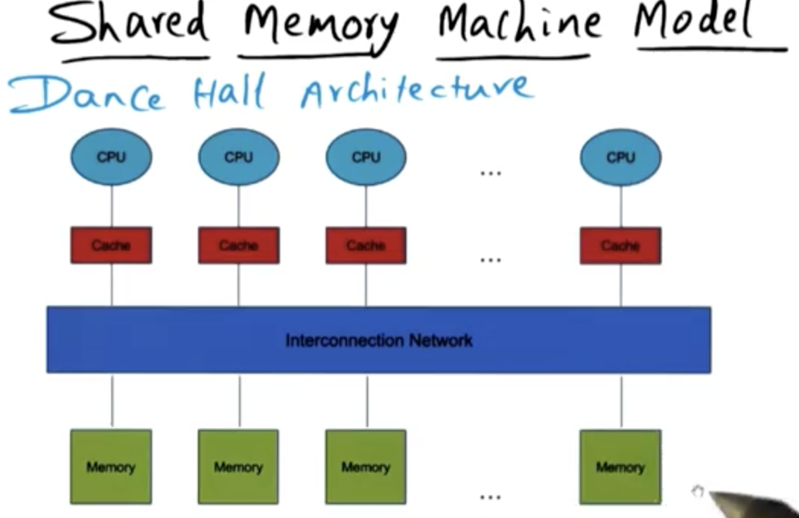

The commonalities between the three structures we are going to dicuss is that there are going to be **CPUs, memory, and an interconnection network**. 

A **shared memory system** means that the **entire address space is accessible by any of the CPUs**. 

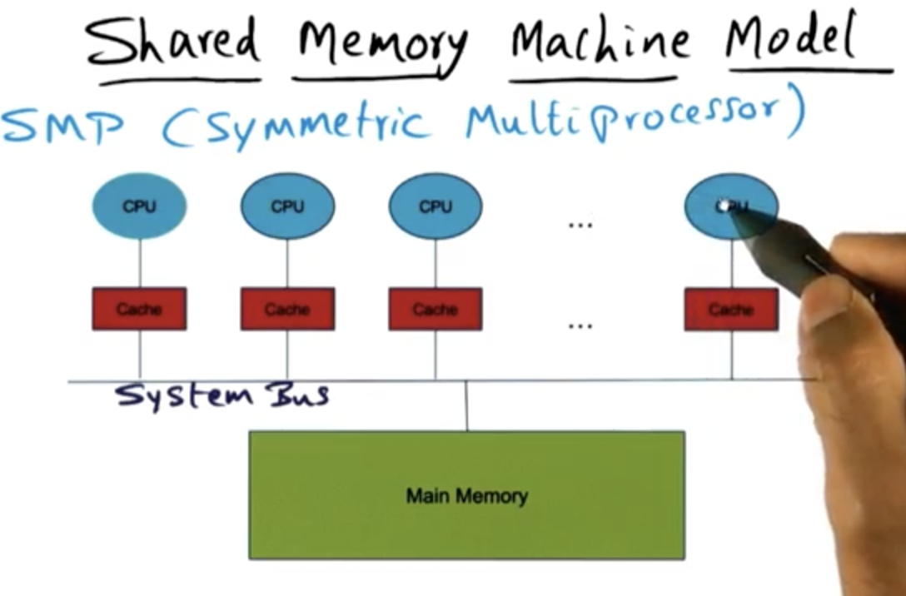

The next style is the **SMP(symmetric) architecture**. The interconnection network has been simplified to a system bus. This architecture is symmetric because the **access time of any of the CPUs to memory is the same**.

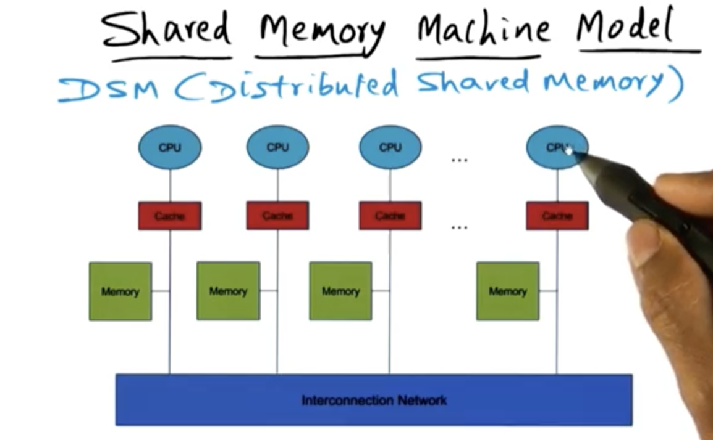

The third style is a **distributed shared memory (DSM) architecture**. What you have is **memory that is associated with each CPU**. Each CPU is able to access all of the memories through the interconnection network, it is just that the access to **memory close to the CPU is faster ti access**, than the memory accessed through the interconnection network.s

### Shared Memory Caching

A **cache in a shared memory** architecture shares the exact **same purpose as a cache in a uniprocessor system**: it **stores memory close to the CPU** for quick reference. 

If the memory doesn't exist in the cache, then the CPU fetches the data from main memory.

There is one **unique problem in multiprocessor systems**: the fact that there are private caches associated with each CPU, and the memory is shared amongst the processors. How does the **system handle cache invalidation**?

This is referred to as the **cache coherence** problem. Who ensures this consistency? There is a partnership between hardware and software, they agree on a **memory-consistency model**.

The memory-consistency model is a **contract between hardware and software as to what behavior a programmer should expect when a multi-threaded application is run on the architecture**. 

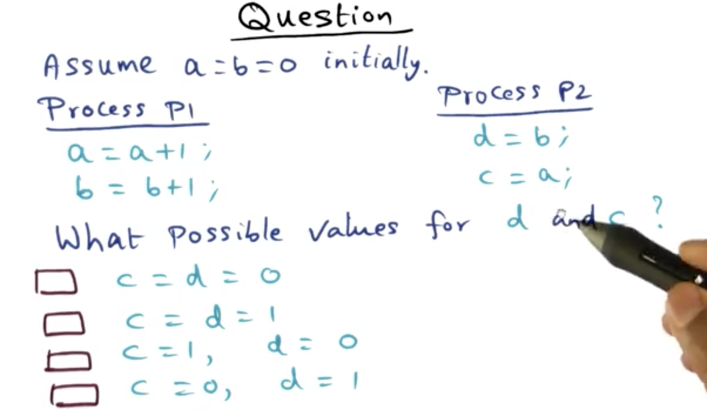

* `c = d = 0` - Process p2 runs first. This is possible.
* `c = d = 1` - Process p2 run after both the instructions on p1 have executed. This is also possible.
* `c = 1, d = 0` - The first instruction of p2 is run, then both instructions in p1, then p2 finishes. This is also possible.
* `c = 0, d = 1` - While seemingly impossible, this is actually possible. How? Remember that the processes on each CPU are connected via an interconnection network, if the messages are received out-of-order, then this outcome is possible. This is non-intuitive, so memory-consistency models typically disallow this type of behavior.

### Memory Consistency Models

The memory-consistency model is a **contract between hardware and software as to what behavior a programmer should expect when a multi-threaded application is run on the architecture**. 

There are many possible different models, let's talk about one, the **sequential consistency model**.

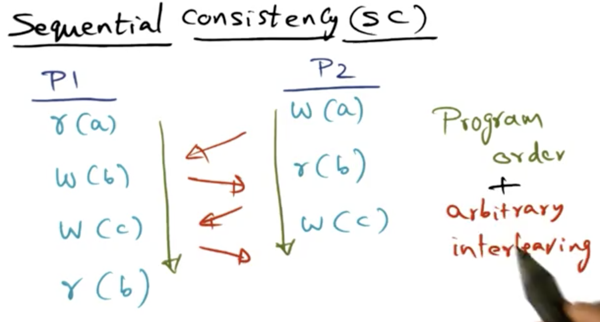

One expectation that a programmer has is that the **memory accesses** within an individual process are going to **happen in the order that the program is written**. 

Additionally, there is going to be **arbitrary interleaving** of memory accesses between the two processes.

A good physical analogy of this model is shuffling two halves of a card deck together. There is no guarantee over how the cards get interleaved, but you know they will be in the same order that they started out in when they were split.

Let's go back to our original example from the quiz, under the sequential consistency model the last outcome where the messages along the interconnection are received out-of-order would not be possible. This is comforting. 

### Cache Coherence

**How are memory consistency models implemented efficiently?** This brings us back to **cache coherence**, the implementation of this model in the presence of private caches. 

If the hardware only gives shared address space, but no way of determining whether the caches are consistent, then this system must have the software (the OS) guarantee the contract of the memory consistent model. This is a non-cache coherent shared address space multiprocessor (**ncc shared memory multiprocessor**).

Another option is that the hardware does everything for you, this is a cache coherent multiprocessor (**cc multiprocessor**).

Let's focus on the **hardware implementing cache coherence**. There are two possibilities: **write invalidate or write update**. 

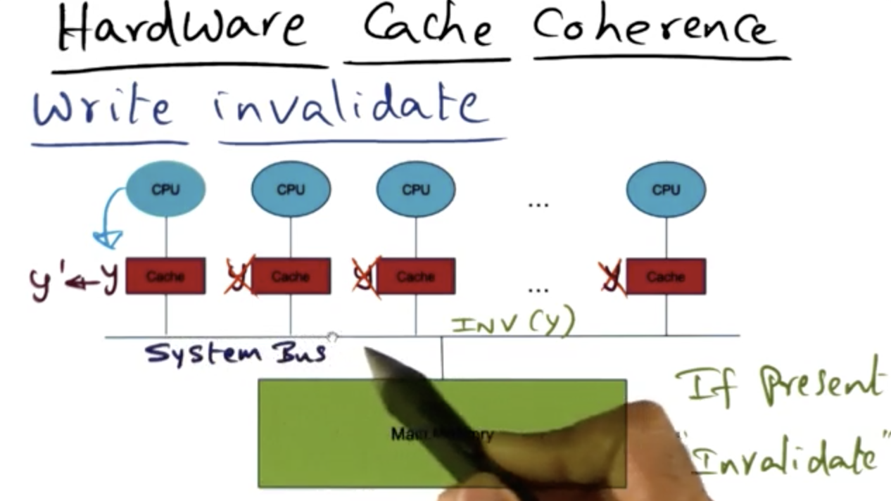

In **write invalidate**, if a particular memory location is contained in all the caches, and if a processor decides to write to said memory location in the cache, then the **hardware will ensure that all the other references in the other caches are invalidated**. It does this by broadcasting a signal on the system bus. The caches snoop on the system bus to watch out for these kinds of signals.

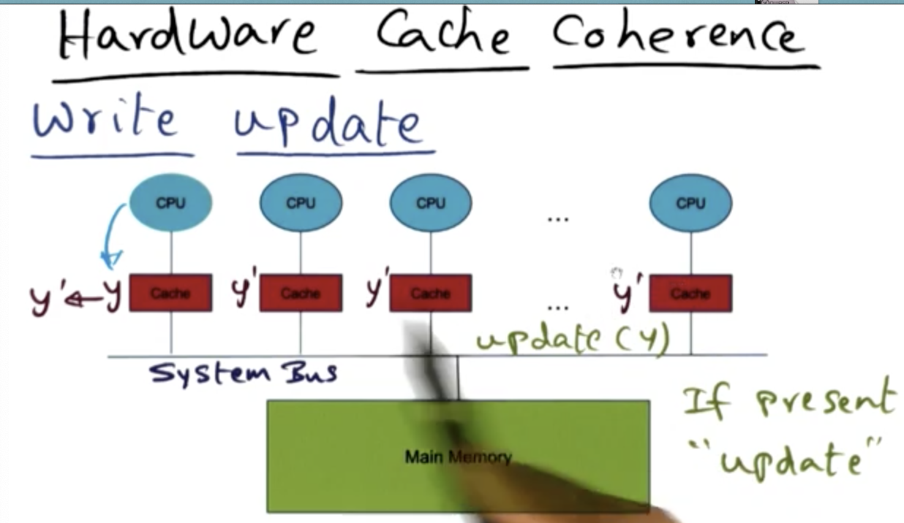

In **write update**, if a particular CPU writes to the memory location in its cache, then the **hardware sends an update signal on the bus with the new value for that memory location**. 

One thing that is important to remember is that no matter what scheme is used, there is work to be done by the hardware. Overhead grows with an increasing number of processors. So while is is reasonable to expect that increasing the number of processors will increase the performance of a system in general, it is not in a linear fashion because of these overheads.

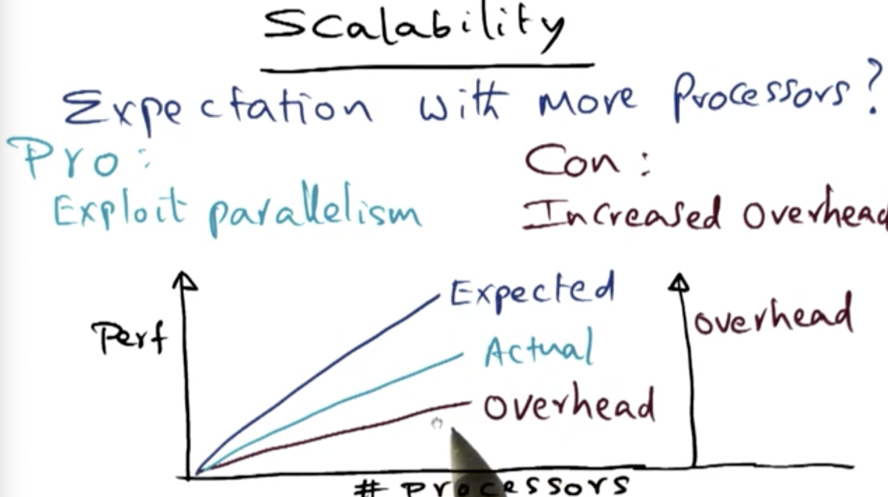

Limit the amount of memory you share across machines in parallel system to have efficient code.

## Synchronization

Synchronization primitives are key for parallel programming. A **lock** is an **entity that allows a thread to make sure it is has exclusive access to shared data**. 

Locks come in two flavors:
1. **Exclusive Lock** - which means the lock can only be used by one thread at a time.
2. **Shared Lock** - simultaneous threads can access the data at the same time. This happens a lot with read access for data entries. 

Another kind of synchronization primitive that is very popular in multithreaded parallel programming is a **barrier**. The idea behind this primitive is that there are multiple threads and they are all doing some computation in parallel. At some point, they want to get back together and check up with each other to see what they've been up to. This means that threads need to wait at the barrier until the other threads have shown up.

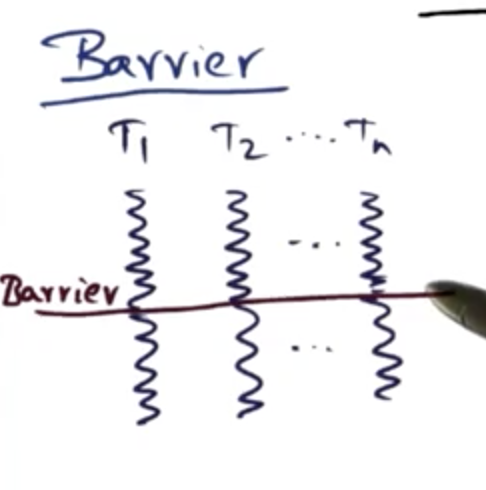

A physical analogy to this idea is a restaurant that only seats you if all members of your party have arrived.

### Atomic Operations

Let's look at a simple implementation of an exclusive lock. 

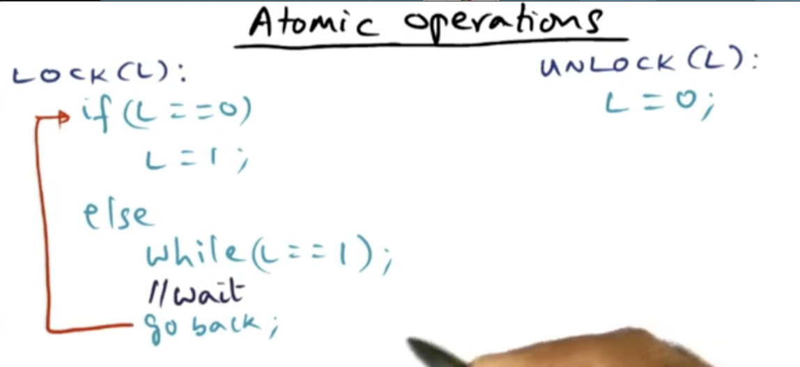

**Is it possible to implement this with atomic reads and writes alone?**

Let's look at the lock acquisition code to answer this question.

```c
if (l == 0) {
    l = 1;
}
```
There are three instructions that need to be performed here:

1. Read `l` from memory.
2. Compare `l` to 0. 
3. Set `l` to 1.

We know that reads and writes are *individually* atomic. But, these three instructions **need to be executed together (atomically)** to ensure that different threads don't interfere with each other's lock acquisition.

Therefore **reads and writes are not sufficient to implement this lock algorithm**.

What is needed is a **read-modify-write atomic instruction**. There are several flavors of these instructions.

1. **Test-and-set** - Takes a memory location as an argument, it returns the current value at that memory location and sets the current value to 1. 
2. **Fetch-and-inc** - Takes a memory location as an argument, it returns the current value at that memory location and increments the current value by 1. 

**Generically**, these **read-modify-write instructions** are known as **fetch-and-phi instructions** because they fetch a value and modify it in some way. 

### Mutex Lock Algorithms

Let's discuss some scalability issues with synchronization primitives in a shared memory processor. The source of inefficiencies in both barrier and lock algorithms are
1. **latency** (time spent by a thread to acquire a lock)
2. **waiting time** (how long do I wait to obtain a busy lock?)
3. **contention** (when a lock is freed, how long does it take in the presence of contention for a winner to emerge with a lock?). 

### Naive Spinlock

Let's start our discussion with the simplest/naive lock. This lock is called the **spin lock** because the processor has to actively wait on the lock when it needs to acquire it. The lock will be implemented with a test-and-set instruction.

We have a shared memory location, `l`, that can have one of two possible values, locked or unlocked. 

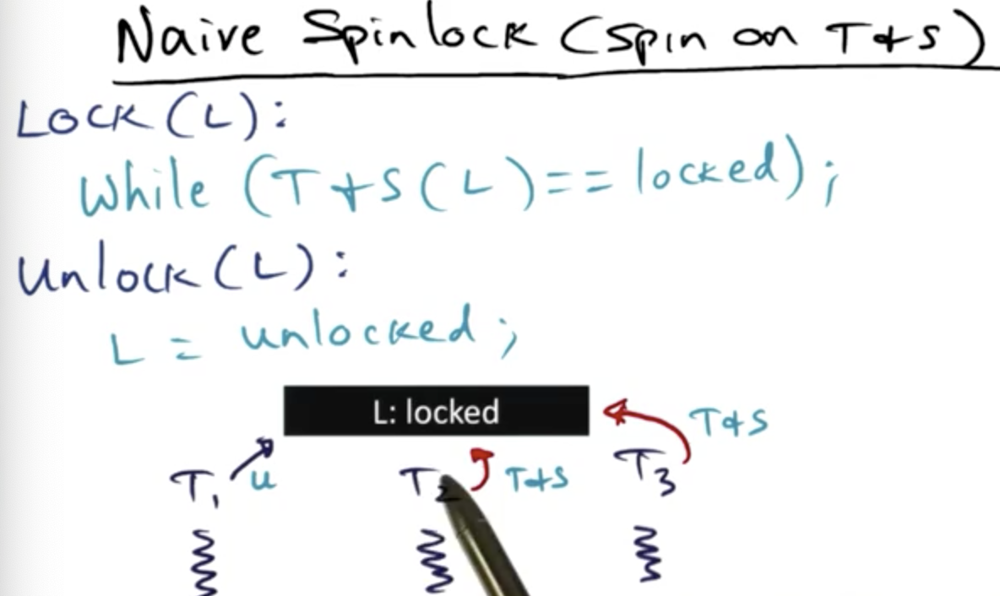

To acquire a lock a thread spins on the test-and-set operation. To unlock it, the thread that has the lock sets the value to unlocked. 

**What are the problems with this naive spinlock?**
* **too much contention** - each thread is spinning on the test-and-set instruction on that shared memory value. 
* **does not exploit caches** - every CPU in a shared memory architecture has its own cache. It is often the case that these caches are kept coherent by the hardware. Caches are used to make the execution faster. However, there is an **issue with the test-and-set instruction.** Test-and-set cannot use the cached value, because by definition it has to make sure that the memory value it is operating on is modified atomically. It will bypass the cache and go to memory.
* **disrupts useful work** -  When a processor releases the lock, that processor is prevented from doing work by the contention of the other processors. 

### Caching Spinlock

Let's look at how we can exploit the CPU caches. The problem with the previous approach is that the **test-and-set instruction HAS to go to memory**. The implementation of the naive spinlock involved spinning on this instruction: when we wanted to acquire the lock, we had to execute this instruction that goes to memory.

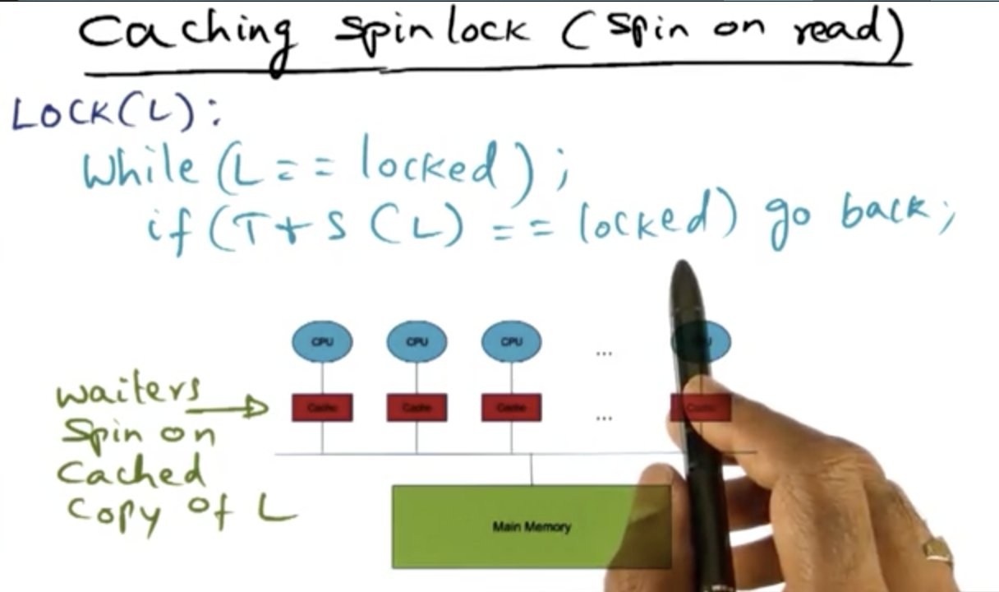

Well what about if we modify this a bit. What if the threads that have to wait on the lock rely on the cache instead of going to memory every time? This strategy is called **spin-on-read**. The assumption about the architecture here is that it provides cache coherence (and thus that all the caches reflect what is in main memory). 

So, lets have the waiters spin locally on the cached value. Practically this means that instead of having a test-and-set operation be in the tight loop, we just have a normal read instruction be in the loop. So if the value doesn't exist in the cache, it is fetched from memory and placed in the local cache and now the instructions can just spin on this cached value. **The released lock will be detected via the cache coherence mechanisms of the hardware**. 

Let's talk about one of the inefficiencies of this schema.  When a lock is released, all of the processors are going to do a test-and-set at the same time. We know that this instruction bypasses the cache and goes into main memory. This is going to create A LOT of chatter on the system bus. In a write-invalidate cache mechanism, there will be an O(n^2) bus transactions. Because every CPU will invalidate the cache.

### Spinlocks with delay

In order to **limit the amount of contention** on the system bus when a lock is released we are going to use a **delay**.

Each process will delay asking for the lock immediately even though they know that it has been unlocked. You could liken this behavior to pulling your car off the road during rush hour and going for a walk. 

**Static delays** aren't a great strategy because there can be wasted cycles. 

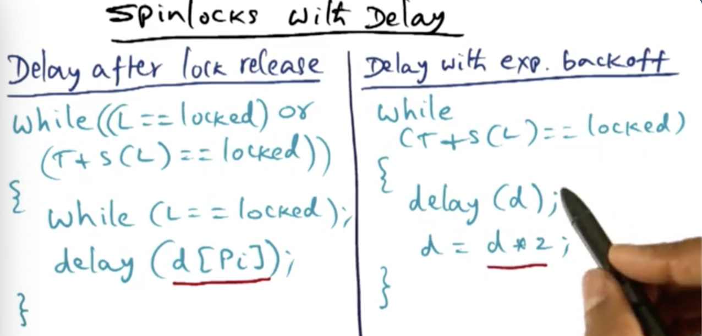

Let's talk about two different delay alternatives:

1. **Delay after lock release**  - uses static delays
2. **Delay with exponential backoff** - uses dynamic delays, in this schema you delay immediately after checking the lock. This delay is some small number at first, but it increases exponentially.

One of the nice thing about the exponential delay algorithm is that we are not using the caching at all. This means the algorithm will work on a non-cache coherent multiprocessor architecture. 

Generally speaking, if there is a lot of contention, then static delay will be a better strategy than exponential backoff.

### Ticket Lock

Up until now we've discussed strategies for reducing latency in acquiring a lock, and the contention when the lock is released.

We haven't talked about **fairness**, **giving the lock out to the threads that asked for it first**. Not the line cutters. This is impossible in the spinlock strategy.

The basic idea of the ticket lock algorithm implements a system whereby a ticket the demarcates a threads place in the queue of other threads that want the lock. How does this work?

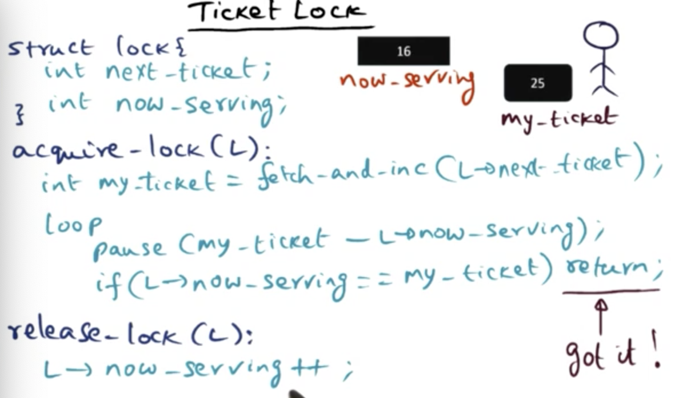

The lock has a struct with two fields, `next_ticket` and `now_serving`. A thread that wants to acquire the lock issues a fetch-and-inc instruction on the lock's `next_ticket` field. It then loops on pausing and then checking the lock's `now_serving` field. When a thread releases the lock, the thread increments the `now_serving` field.

One downside of this algorithm is that the `now_serving` value in the local cache is being incremented which causes cache-coherent mechanisms to flood the system bus.

Ideally, we would want a system where one thread could be signaled instead of all of them. 

### Queueing Locks

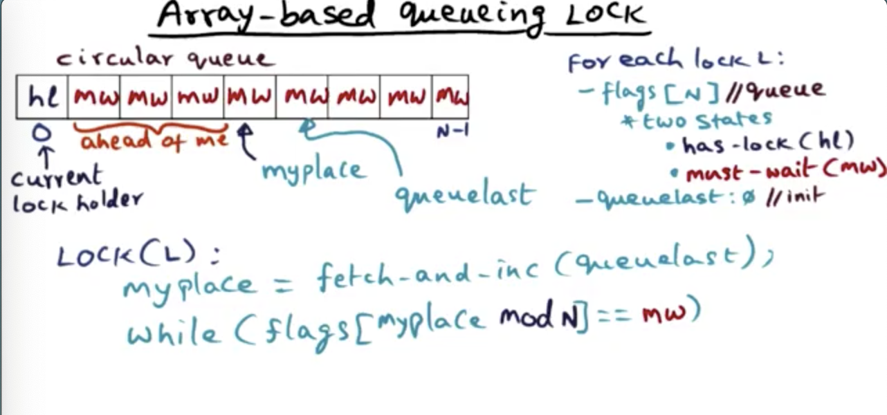

Let's talk about an array-based queueing lock. Associated with each lock, `l`, is an array of flags. The size of this array is equal to the number of processors in the shared memory processor. The **flags array serves as a circular queue for enqueueing the requestors for a particular lock**. This means that **each lock has a flags array**.

Each element in the flags array can be in one of two states:
1. **has-lock** - the thread has the lock and can do what it wants to do with it!
2. **must-wait** - the thread does not have the lock and must wait.

There can be exactly one processor with the **has-lock** state. One thing to notice is that the slots in the array are not statically-associated to any particular processor. There is a spot designated for each processor, but it is not an assigned spot. So how does it work?

Well, there is an integer associated with the flags array called `queuelast`. This references the index in the array that is available for queueing in the array. This index is incremented each time a processor requests a lock.

Because the array size is N (the number of processors), no processor will be denied a place in the queue. 

When a lock request is made, a fetch-and-inc instruction is made on the `queuelast` variable. This ensures that a spot  is set aside. Then the processor waits for its turn, this means it checks the flags array for the `has-lock` state.

A variant on the array-based queueing lock is the **linked-list based queueing lock**. This strategy **avoids the space-complexity of the array**-based queueing lock.

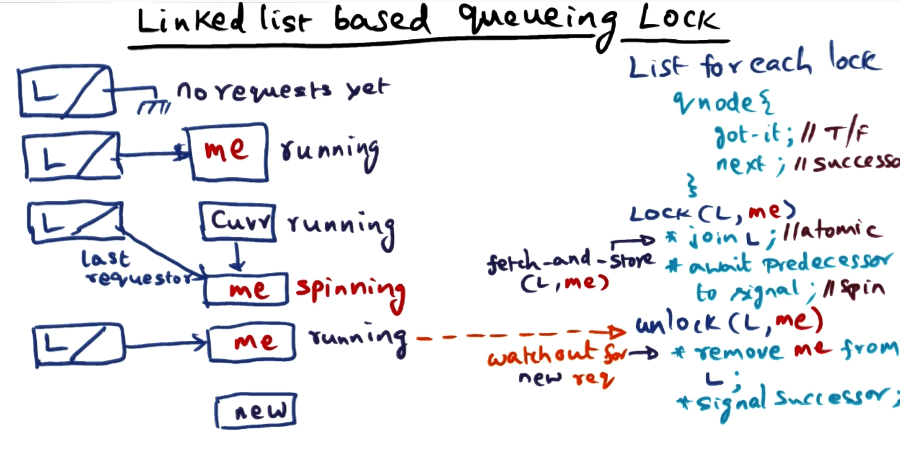

The size of the queue is going to be as big as the dynamic sharing of the lock. The head of the queue is a dummy node that is associated with every lock. There are two fields for every queue node for a requestor:

1. **guarded** - a boolean that says if the requestor has the lock
2. **next** - points to the successor in the queue. 

To add yourself to the linked-list you need to increment the last-requestor field on the dummy node of the linked list. This ensures that you are referenced by the previous last requested node. Now the requestor can spin on the guarded boolean variable.

Let's now talk about the lock algorithm. The lock takes the name of the lock, and the queue node that wants to be enqueued. The first thing to do is join the queue. 
1. **Join the queue** - The following must be done atomically. Set the last pointer of the head node to the new node. Update the last element in the list to point to the new last node. 
2. **Await the lock** - spin on the guarded value.

To facilitate the atomic queue-joining actions, we propose that an instruction called **fetch-and-store** is added to the instruction set.

The unlock function removes the current node from the linked list and signals to the successor that it is the current node.

A special case occurs when there is no successor to the current node. When that occurs, we have to set the head node of the linked list to point to NIL to indicate that no successor exists.

Let's talk about one of the classic race conditions of parallel programs. Imagine that a new request is forming for the lock queue, but the current node that is unlocking hasn't fully released itself from the lock queue. The requestor will be trying to build itself into the queue based on the current node's position, and the current node will be trying to extricate itself! This is a classic race condition that happens in all sorts of places in distributed/parallel systems. 

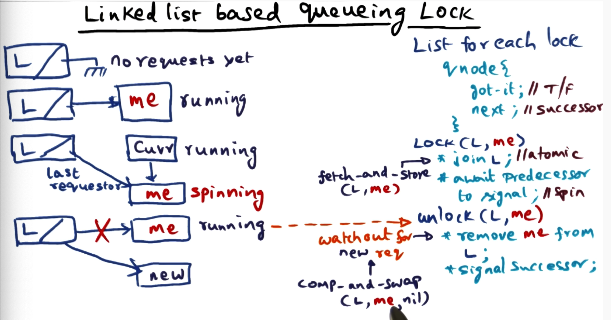

The solution to this problem is to add some more logic into the unlock function. Before the linked list sets the value of NIL on the head node, double check that there are no requests forming. This means **we need an atomic instruction for setting the value to NIL if the head node is pointing to the currently escaping node and not a currently forming request**. The solution is a **conditional store instruction called a compare-and-swap**. This instruction will only store if a condition is satisfied. 

Compare-and-swap will return true if the head pointer is pointing to the node trying to unlock itself. In this case, the compare-and-swap instruction will set the pointer to NIL. On the other hand, if the comparison fails, it won't do the swap, it will return false. If this is the case, then the node that is trying to leave needs to spin until the joining node finishes the lock call. At this point, the next pointer of the leaving node will be not NIL, and it can proceed with the unlock call by signaling to the successor that it now has the lock.

So what are the virtues of this linked-list based queueing lock? It is **fair**. And there is **not much contention** when a lock is released. These two points are the same as Anderson's lock. It is also more space-efficient than Anderson's lock. It is dynamic and proportional to the amount of requestors at a current time.

The downside of this implementation is that there is **linked-list maintenance** that is associated with locking and unlocking nodes. Anderson's array-based queue can be faster.

If a processor supports the fancy instructions we indicated as prerequisites to the queueing strategies, than these are good choices for implementing locks. Otherwise, exponential back-off is probably the best bet. 

### Comparing Lock Algorithms

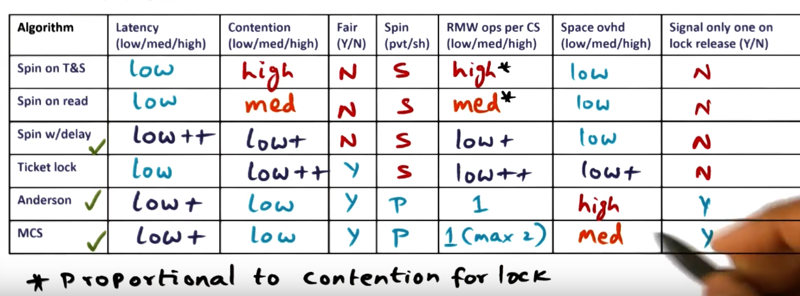

## Barrier Synchronization

In barrier synchronization, a "barrier" is erected along threads of execution. At this barrier, all the threads meet up and exchange information about the work they've done. Barrier synchronization is very popular in scientific applications.

### Count Barrier

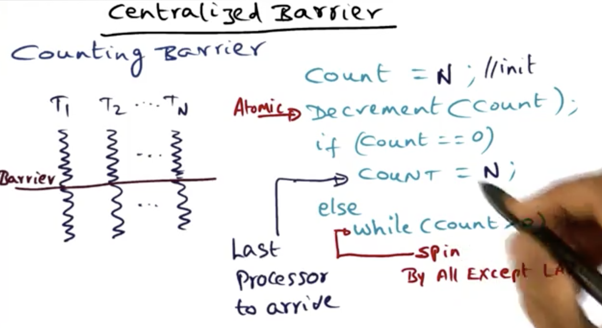

The first barrier we are going to discuss is the **centralized/counting barrier**. The idea is simple, we have a counter that is initialized to N, the number of threads that need to synchronize. 

When a thread arrive at the barrier, it atomically decrements the counter. If the count is not zero, the thread is going to spin.

One big problem with this algorithm is that as soon as the counter reaches zero, all the other threads start off running. This leaves the straggler to increment the count back up to N while the others are racing ahead. Not ideal.

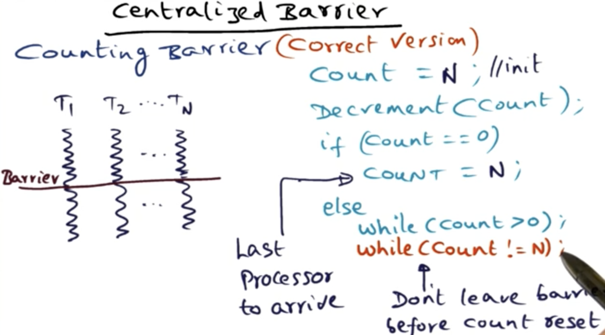

The solution to this problem is adding a second spin loop that asserts that the threads shouldn't leave the barrier until the count has been reset to N. 

### Sense Reversing Barrier

The count barrier needs two spin loops for every barrier. We would like to see if we can reduce that number.

In the **sense reversing barrier** we remove one of the spin loops by not having the threads waiting for the count to become 0. In addition to the count, we keep a new variable called `sense`. 

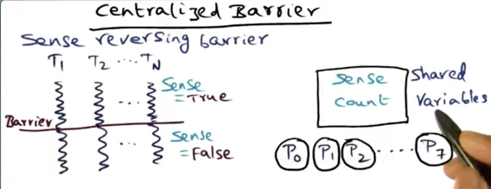

This variable indicates whether all the threads have not reached the barrier. So when the algorithm starts, it is false, and after they all cross the barrier, it is true. 

So **when a thread arrives at a barrier, it decrements the count and spins on sense reversal (changes value)**. 

The last thread will reset the count to N and reverse the sense value. 

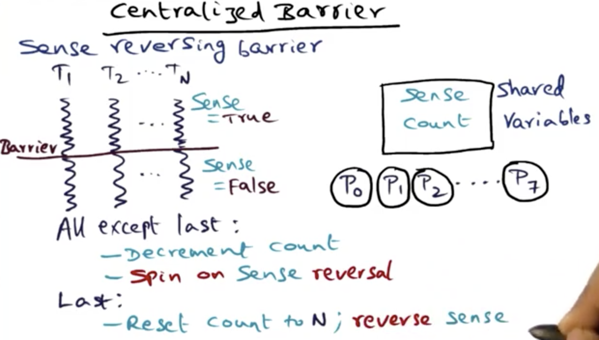

The problem with this solution is that we have a shared variable for all the processors. If we have a shared memory multiprocessor with tons of processors (let's imagine we are doing some sort of massively parallel scientific computation) then there is going to be **a lot of contention on the interconnection network** because the variable is a hotspot.

### Tree Barrier

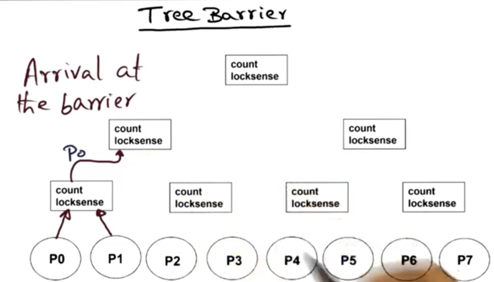

First we are going to discuss a **more scalable solution to the sense reversal algorithm**. The basic idea is to use divide-and-conquer. **Limit the amount of sharing to a small number of processors**. Break them up into small groups and into a hierarchy. This leads to a **tree data structure**. 

At each level `count` and `locksense` variables will be managed. The sense-reversing algorithm will be run in many different rounds and slowly filter its way up the tree. 


There are many more shared variables in this solution, but the shared variables are only shared with a small subset of the processors. At each barrier, **only one of the pair (the last one) that finished continues because only one of them needs to go ahead to signify that both finished**. This is what makes the algorithm more efficient from a contention standpoint.

Once the root sense-reversal barrier is breached, all the CPUs can wake up and proceed with their computation.

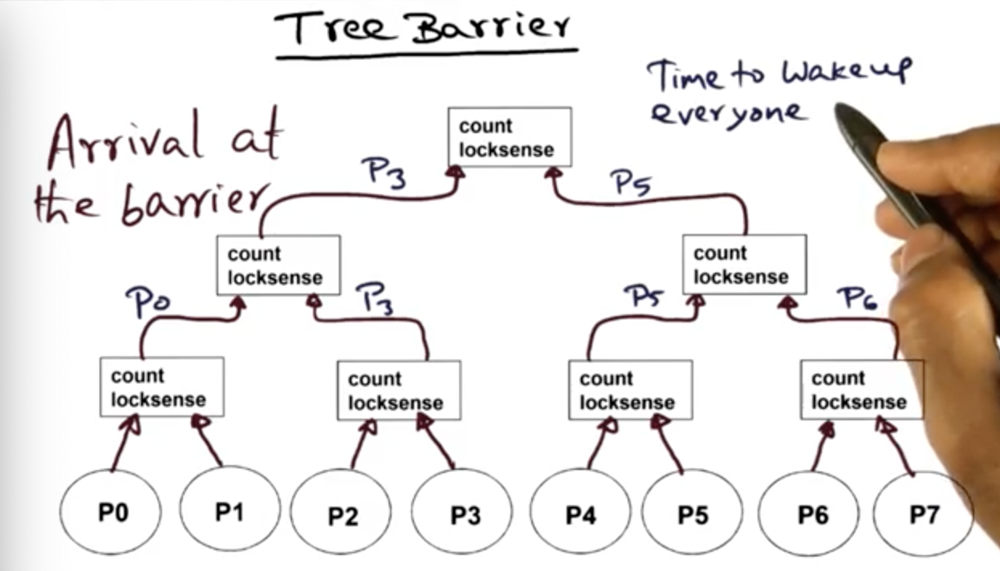

### MCS Tree Barrier (4-ary)

In the MCS variant of the tree barrier, there are different trees used for each stage of the barrier, arrival and release. In the **arrival variant** each node has the potential to have four children. Each node represent a processor, and each node maintains a set of data structures to manage the barrier synchronization: the **Have Children Array** and the **Child Not Ready Array**.

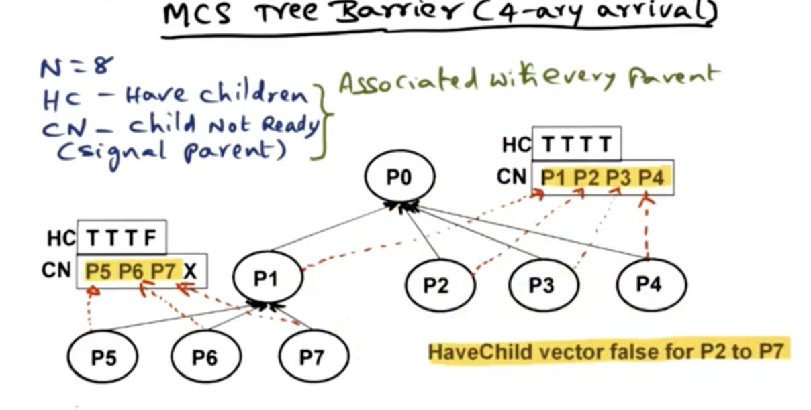

To indicate that they've reached the barrier, each processor updates its statically determined index in its parents Child Not ready Array. Once each child has marked that they are good to go, the parent is ready and proceeds to mark its index in its parents Child Not Ready array (these are indicated by the red arrows in the diagram). 

The reason why they chose the 4-ary tree is that there is a theoretical/mathematical result that proves that this is an optimal setup for performance. In a cache-coherent multiprocessor, it is possible to arrange this data structure so that the Child Not Ready array can be packed into one word of a processor. This means that a parent only has to spin on one memory location. The cache coherent mechanism will modify the parents immediately. Neat!

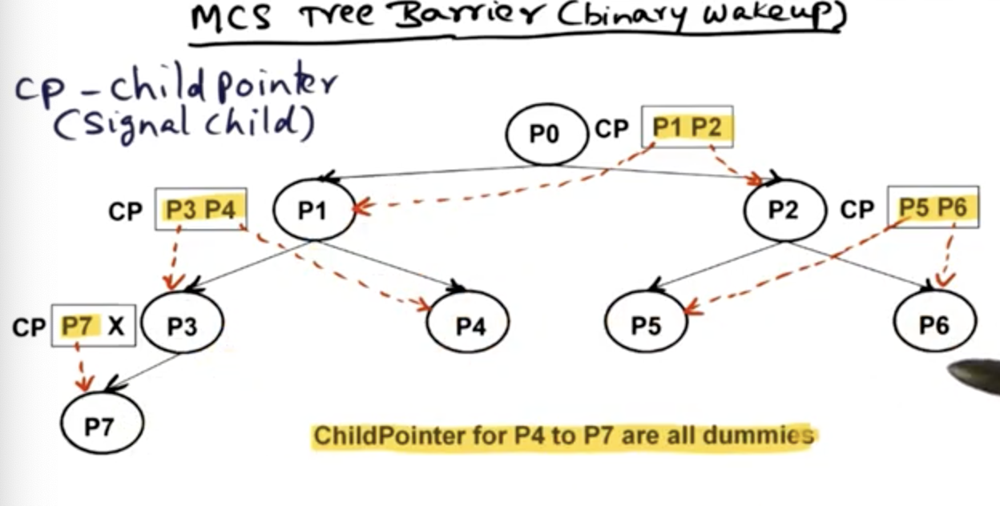

In the **release (wake-up) section of the MCS tree**, the data structure is split into a binary tree. To signal that a processor is free to go, the root tree begins a recursive freeing task where it looks down at its children and says, you are free to go. Each one of these children also needs to free its children. These child pointers are statically-determined.

### Tournament Barrier

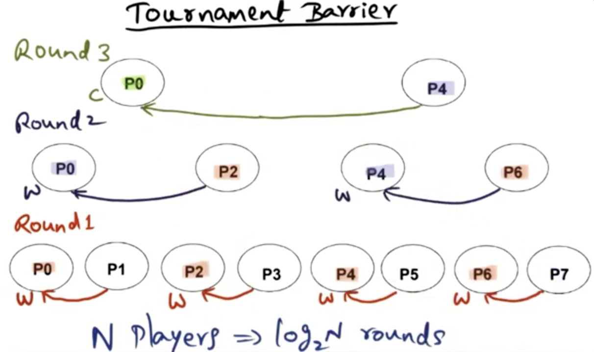

The **tournament barrier** is organized as a tournament with N players, this means that there will be **log2(N) rounds**.

We are going to **rig this tournament and choose who is going to win from each round**. The rationale for this is that if these processors are executing in a shared memory multiprocessor, and the winner is waiting for the loser to "finish" (reach the barrier), then the **location that that winner is spinning on is static/fixed**. The spin location will be pre-determined, this is very very useful, especially if you have a non-cache coherent multiprocessor. 

Once the champion (who we've predetermined) has been signaled, we know that all threads have arrived at the barrier! To wake up all the rest of the processors, the champion walks over to the processor that signaled to it and indicates that it should wake up. This happens recursively back down the tree. 

There is a lot of similarity between the tournament algorithm and the sense-reversal tree algorithm and the MCS wake-up algorithm. The **main difference** is that in the tournament barrier, the **spin locations are statically-determined**, while in the tree-barrier they are dynamically-determined based on who arrives at a particular node first. 

Another important difference is that **there is no need for a fetch-and-phi operation in the tournament barrier**. As long as we have an atomic read/write instructions, that's all we need for a tournament barrier. Whereas, the tree barrier needs a fetch-and-phi to atomically decrement the counter variable at each node in the tree algorithm.

The total amount of communication needed is similar between the two: O(logN). All of the communication, because it is split up, could possibly be done in parallel. The tournament barrier also works if the machine isn't a shared memory multiprocessor, because basically all we are doing is **message-passing**. 

Let's make a comparison of tournament to MCS. The tournament is only going to be able to represent a tournament between two processors. This means that it **cannot exploit the spatial locality** that exists in the caches (multiple spin variables exist in the same cache line). 

### Dissemination Barrier

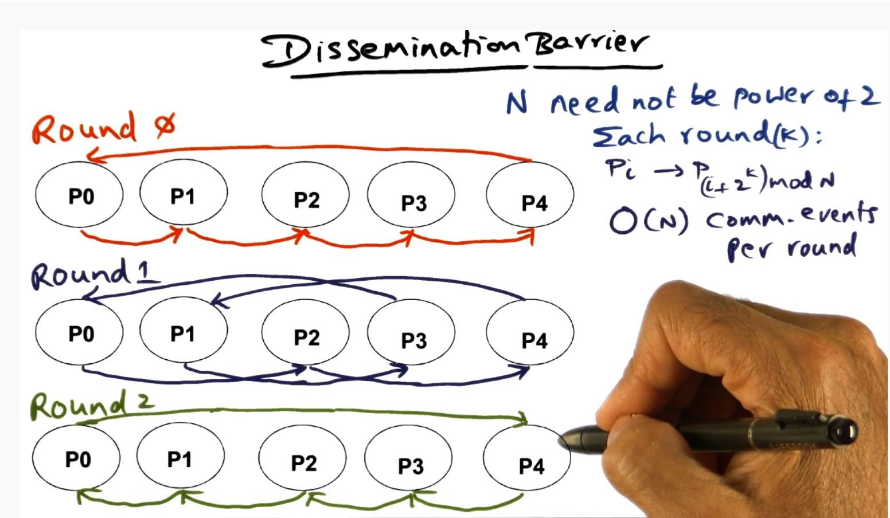

Works by **information diffusion in an ordered manner (orchestrated gossip) between the participating processors**. It is not pair-wise communication as we saw in the tree barrier/tournament barrier models.

One of the nice things about this particular barrier is that **the N (number of processors) doesn't need to be a power of 2**. 

In each round, a processor sends a message to **another processor who is chosen as a function of which round it is in**. All of these communications are in parallel, they **send a message as soon as they reach a barrier**. How do the nodes know when a round is finished? **As soon as each node has sent a message and received one it can proceed**. This means that the processors each move independently through the rounds.

So how many communication events happen per round? O(N) events. 

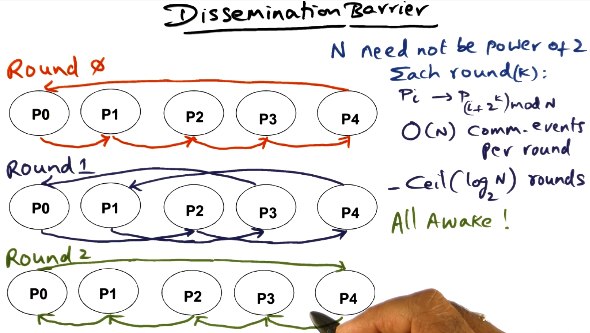

So how many rounds in total for the dissemination barrier to complete? It is **Ceil(Log2N)**, this means that every processor has received a message from every other node in the system. The reason it is a ceiling function is because of the fact that N need not be a power of two.

It is convenient to think about these communications as messages because in a shared memory machine, a message is basically a spin location. Because we know an ordained processor is going to talk to each node, the spin location is statically-determined. At every round we can statically-determine this spin location and this is very helpful if the machine is non-cache coherent. 

One of the virtues of this algorithm is that there is **no hierrarchy**! It also works in NCC machines and clusters (non shared memory machines).

The communication overhead in this algorithm is O(nlogn)

### Comparing Synchronization Algorithms

Which **algorithm to choose depends on the architecture** that you are running on.

## Communication

The next topic we will be discussing is efficient communication across address spaces. The **client-server paradigm** is used in structuring system services in a distributed system. If you are using a file system in a local area network, you are using a client-server system.

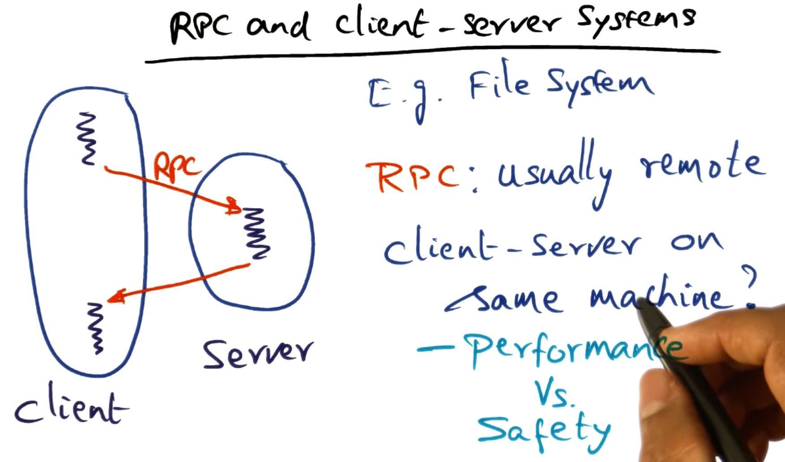

**Remote procedure calls** are the mechanisms that are used to build the client-server system. What happens when the client and server are on the same machine? Does it still make sense to use RPC? The main concern is performance.

As OS designers, **we would be able to make RPC calls across protection domains as efficient as possible**. 

### RPC

Let's compare RPC to a procedure call. In a procedure, all the functions are compiled and linked together to make an executable. When a caller makes a call to the callee, it passes the arguments to the stack, and the callee can read these variables, do some work and then return the result back to the callee through the stack. The important thing to not is that all of this is compiled beforehand. 


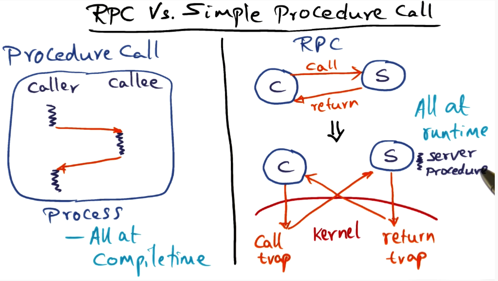

In RPC, the principle is th same, but under the cover some more things are happening.

1. When a client makes a call, it is actually trapping down into the kernel.
2. The kernel validates the call and copies the arguments of the call into kernel buffers from the client address space.
3. The kernel locates the server procedure and then copies the arguments it has buffered into the address space of the server. 
4. It schedules the server to run the procedure
5. At this point the server executes the function.
6. When the server is done, it traps into the kernel.
7. The kernel validates the call and copies the return value into kernel buffers from the server address space.
8. The kernel locates the client procedure and then copies the return value it buffered into the address space of the client.

The important thing to note here is that **all of this happens at runtime**. This is a large source of the overhead of RPC.

There are **two traps**, the call trap and the reverse trap, and there are **two context switches**, from client to server and server back to client. 

The **sources of overhead** are: **kernel validation in the client trap, copying data between address spaces, and context switch overhead**. 

So how many times does the kernel copy stuff from user address spaces into kernel buffers and vice-versa? FOUR TIMES 😱.

### Copying in RPC

If there is a place we want to avoid overhead, it is in this copying of data multiple times. 

Let's analyze all the possible places for potential efficiency gains.

The kernel doesn't understand any of the syntax of how an RPC call works, and yet it has to be the intermediary of the message passing. So how does the RPC call work granularly?

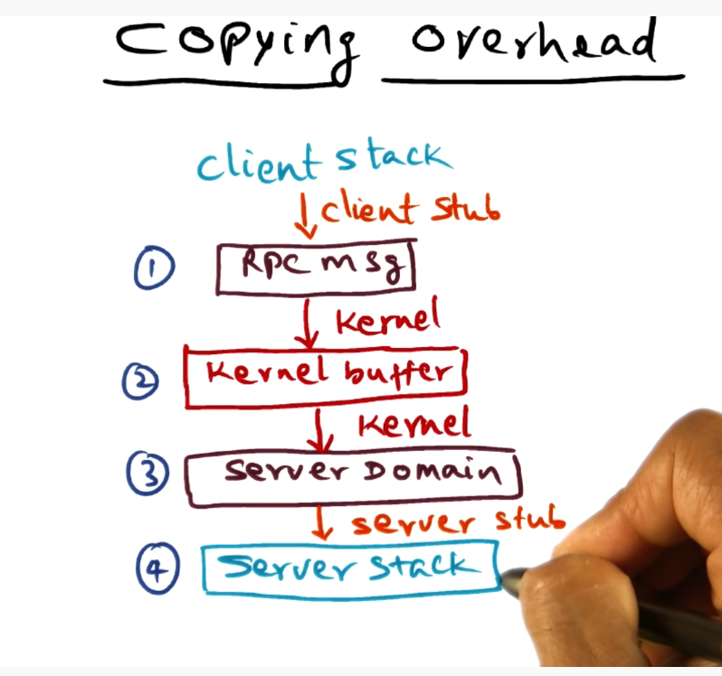

When a client makes a call there is an entity called a client stub that intercepts the request from the client (who thinks it is making a normal procedure call), and the stub takes the arguments from the client stack and makes an RPC packet out of it. This is a serialization process that takes the arguments from the client and packs them into a pre-defined byte sequence.

This is the first copy that happens in the RPC system. This happens even before the kernel is involved.

The next thing that happens is that the client stub traps into the kernel and copies the serialized message from the address space of the client to the kernel buffers.

Next the kernel schedules the server in the server domain, once this has been scheduled it then copies the buffer into the server domain.

The server stub intercepts this message and then deserializes the arguments so that they can be fed to the server stack. 

We can see here that just going from the client to the server there are 4 copies. Two at the user-level and two at the kernel-level.

Once the server finishes executing it makes a call to the server stub which does the same serialization process as the client stub but with the return value. 

### Reducing overhead in RPC

Focus on the recurring costs, not the one-time costs. In RPC, these are the actual calls between the client and the server. 

**Setup Cost**

The set up cost isn't very important because it only happens once. 

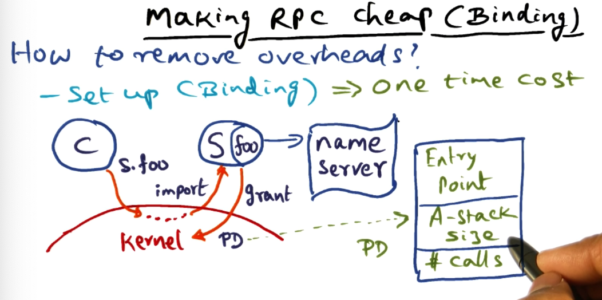

To set up a connection between a client and a server, the client needs to issue a request for a  specific procedure from the server. This request gets routed (trap) through the kernel to the name server which is a directory of all the services available. 

The kernel needs to validate that the client can indeed make a call to this server, and it does this by checking with the server to see if it accepts requests rom the client.  

Once this validation has been done, the kernel sets up a **descriptor** (data structure) called a procedure descriptor that is in the kernel. This descriptor tells the kernel about certain aspects of the RPC. The starting address of the procedure (entry point), the size of the arguments, and the number of calls the server is willing to expect.

The kernel establishes **a buffer of shared memory** and maps it into the address space of the client and the server. What we have now is a method of communication directly between the client and the server without mediation with the kernel. 

So now the kernel is done with setting up the RPC mechanism between the client and the server. All the kernel does now is authenticate the client, it does this by giving the client a token called the **binding object**. Everytime the client wants to make a call to the server, it needs to present this token.

This kernel mediation happens only once. Now that we have done all this set up, there actually isn't much overhead between the calls.

**Making RPC calls**

What the client stub does now is to take the arguments from the calling procedure and feed them into the A-stack, the shared memory established by the kernel. 

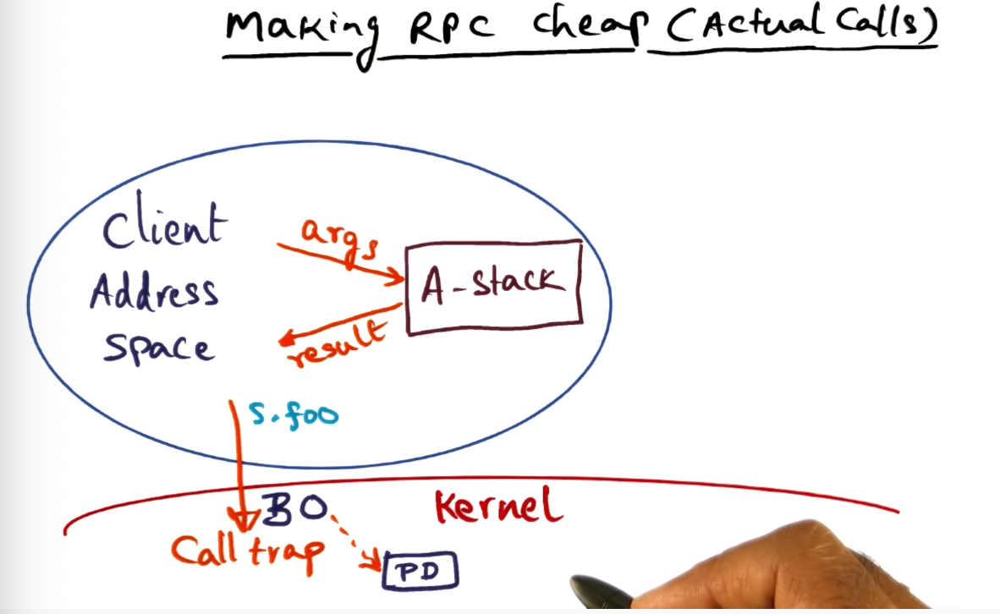

Data can only be passed by value into this shared memory. Why? because pointers in the address space of the client won't make any sense in the server.

Then the client traps into the kernel with the binding object, the binding object indicates what procedure descriptor to use, the kernel can then use the procedure descriptor to pass control to the server to start executing.

Next, the server's server stub deserializes the arguments from the A-stack and feeds them to the server procedure.

The procedure is executed, the result is serialized and passed to the A-stack. The server then traps back to the kernel who can inform the client that the procedure has finished. 

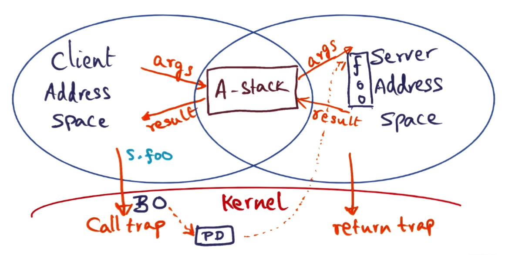

### Analysis of Improved RPC

There are now only two copies that are being done because of the shared memory establishment during the binding process. These copies are done in user space.

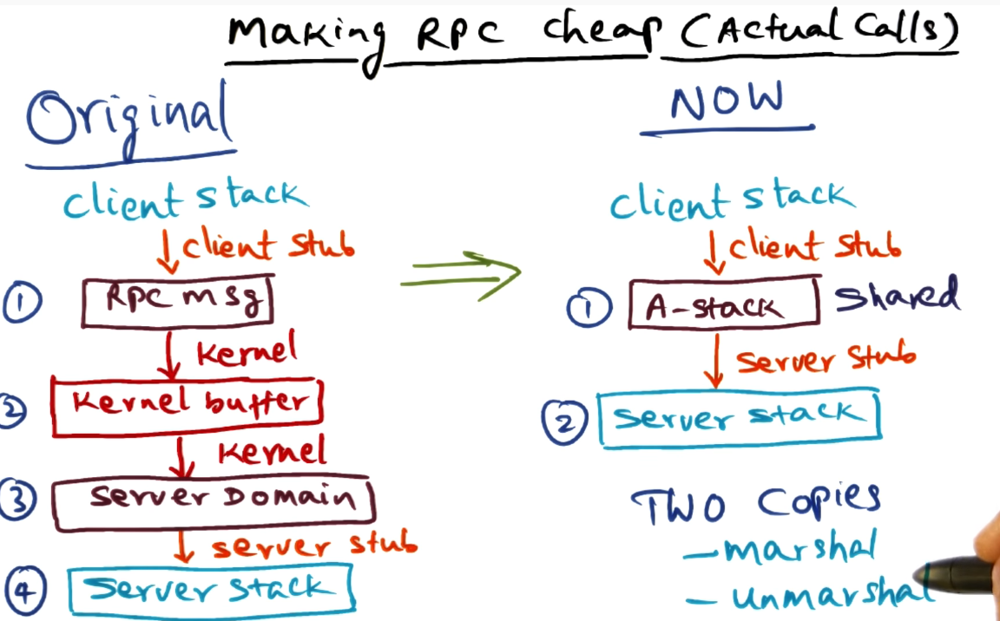

To summarize, during the actual calls, copies through the kernel are eliminated. The **actual overhead that are incurred in making these calls are the client trap/kernel validation and the switching of domains/address spaces** between the client and the server. The implicit overhead comes from the loss of locality during the domain switching.


### RPC on SMP

If we are implementing RPC on a shared memory multiprocessor, we can avoid some of the locality issues that we talked about. How? Just **pin the server domains to one of the CPUs**. This helps keep caches warm. 

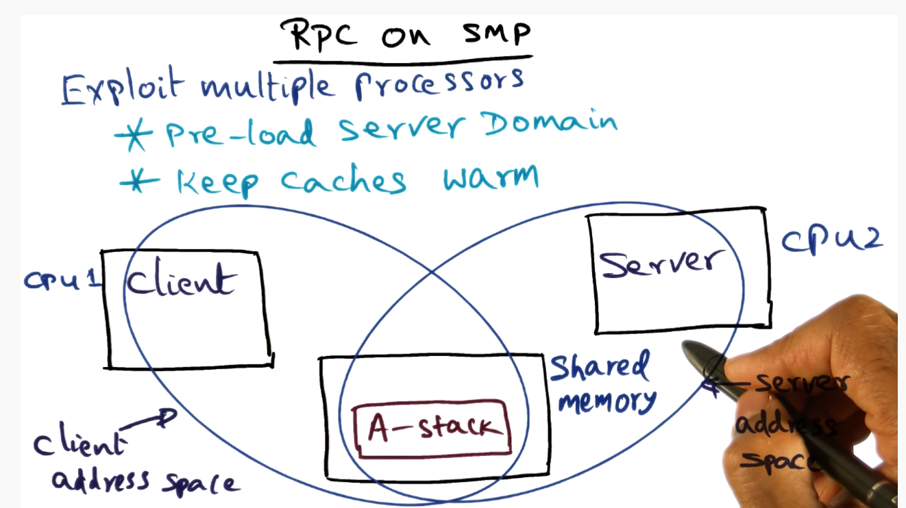

## Scheduling

The mantra for scheduling is to keep the cache warm if you want to have good performance.

The algorithm that you use for scheduling depends on the situation that you are in. 

Keeping the memory hierarchy in mind is a great tactic when thinking about how to optimize scheduling. There can be a many-orders-of-magnitude difference between how long it takes to run a thread that is present in the L1 cache and one that is in main memory.

### Cache Affinity Scheduling

The idea behind **cache-affinity scheduling** is that **threads should be scheduled to run on the processors that they were originally run on**. Why? The caches of these processors are probably much hotter than one who hasn't seen this thread before. 

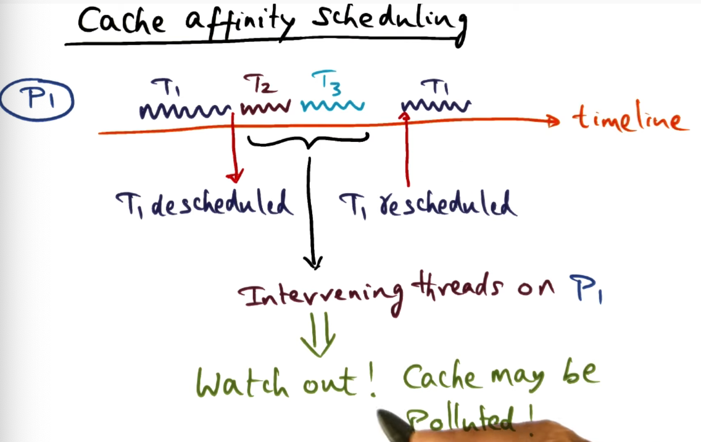

What can go wrong with this strategy? Intervening threads can pollute the cache on the processor. 

Let's look at different scheduling policies that an operating system may choose to use. 

1. **FCFS** - Pick the earliest scheduled thread. **Ignores affinity for fairness**. 
2. **Fixed Processor** - A thread is always scheduled to the same processor. This might be decided by a load balancer. 
3. **Last Processor** - The processor is going to pick a thread that used to run on it. It gives preference to the threads that might have a hotter cache. If such a thread is unavailable, pick someone else.
4. **Minimum Intervening Policy** - Save the affinity for every thread for each processor. Pick the processor that has the highest affinity.
5. **Limited Minimum Intervening** - If I have a thousand processors, than the metadata per processor might grow to be too big. Therefore, we should only keep data for that last couple of processors in the metadata.
6. **Minimum Intervening Plus Queue** - Don't just make a decision based upon the affinity index of the processor, but we should also look at the queue for this processor because the scheduling queue might already be full. By the time that the process is scheduled, the cache might already be invalidated which kind of ruins the scheduling algorithm in the first place. Thus the processor that should be picked **minimizes the affinity index AND the number of processes in the queue**. 

Fixed processor and last processor scheduling focus on cache affinity of the thread (thread-centric), and the minimum policy focus on cache pollution when the thread needs to be run (processor-centric).

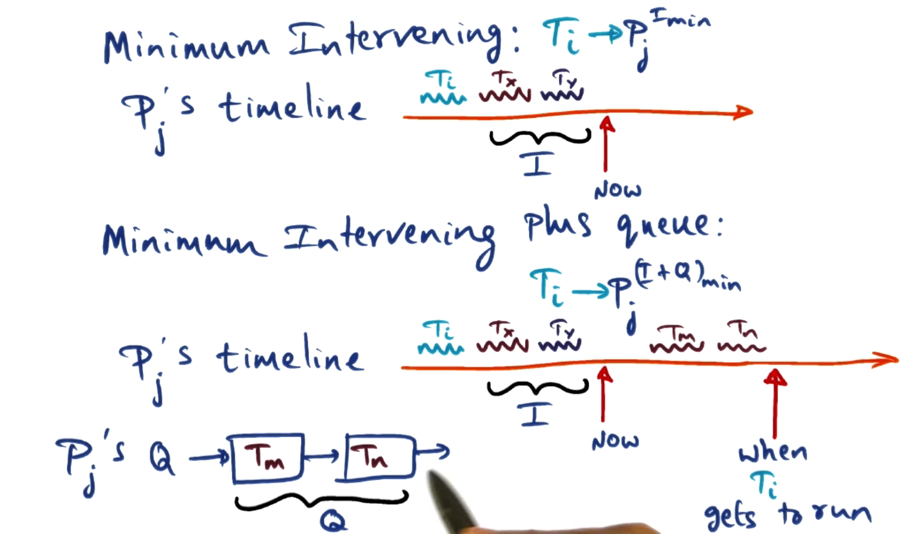

### Scheduling Implementation

Now that we've looked at policies, let's look at some of the implementation issues of doing them. 

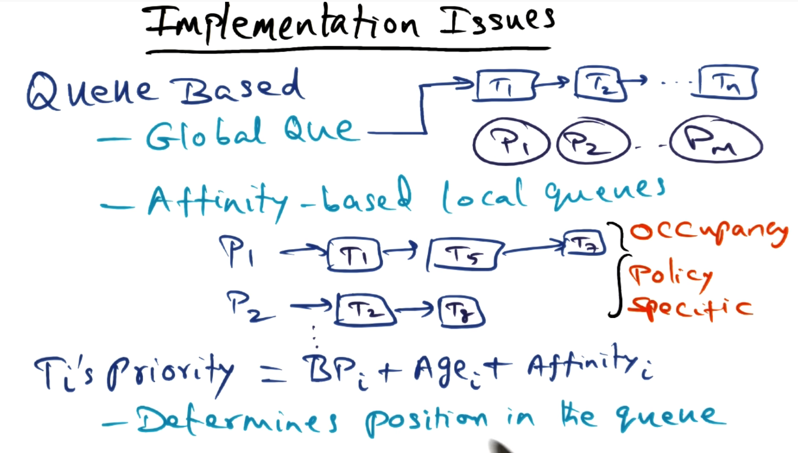

One strategy is to have the operating system maintain a global queue of all the possible threads that are runnable. Processors then will pick the next available thread. Unfortunately, this is unfeasible when the size of the multi-processor is very big. 

Typically, what is done is to **maintain local queues based on affinity with each processor**. The organization of these queues is determined by the policy.

In addition to policy-specific attributes, the OS might use additional information to organize the queues. For example, a priority of a thread could be determined by the affinity of the thread to a processor, a priority that was assigned to the thread at initialization and the age of the thread.

### Performance in Scheduling

We will analyze our scheduling perfomance with three metrics, **throughput, response time and variance**. 

**Throughput** is a system-centric metric that means **how many threads get completed per unit time**. 

**Response time** and variance are user-centric measurements. Response time asks **if a thread is started, how long does it take to finish**? 

**Variance** asks **if the time it takes to run a particular thread varies**. 

One important relationship to keep in mind when thinking about exploiting cache availability is the **relationship between the memory footprint of the process and the time it takes to reload the cache**.

The bigger the memory footprint of a particular thread, the more time it is going to take for the processor to load the working set of a particular thread into the cache so that the process can do its work.

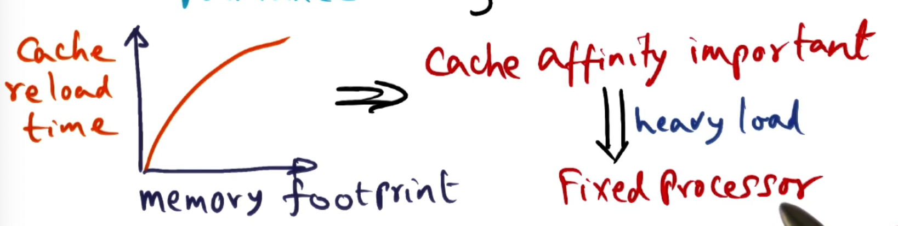

What this suggests is that cache affinity is really important. On the other hand, if there is a **heavy load** on a system, it is likely that the cache will be polluted, and thus **a fixed processor scheduling policy might be the best** way to improve cache hits.

One interesting strategy for improving cache hits is **procrastination**. In this strategy, a processor that is looking for a thread to schedule will notice that none of the ready threads have been run on it before. If this is the case, it will **run an idle loop** and check back after the idle loop. If a thread is scheduled that has affinity for it, it will pick it up. Otherwise, it will pick up one of the threads that it doesn't have much affinity for.

### Cache Affinity in Multicore Processors

In modern multicore processors, there are multiple cores on a single processor. In addition to these multiple cores, the processes themselves are also **hardware-multithreaded** (also called hyperthreading). This means that if a thread on a current processor is experiencing a long latency operation, in that case the hardware may switch to execute one of the other threads (just concurrency). 


The difference however between hardware-multithreading and basic concurrency is that the thread isn't removed from the core, it can hang around in the CPU while it is waiting for the async action, and then immediately be switched to when the interrupt comes in. This is implemented by **providing extra storage (more caching) in the CPU**. 

Therefore the goal of a good scheduler in this type of system is to make sure that all the contents of a scheduled thread can be found as close to the CPU as possible.

### Cache Aware Scheduling

Let's assume we have a pool of ready threads (say 32). Let's assume we have a 4-way multi-core CPU. That means we have 4 CPU cores and each core is 4-way multi-threaded.

At any point in the time, the OS can choose 16 threads to be scheduled on the processors. The OS should try schedule a mixture of cache-hungry and cache-frugal threads across the cores. Ideally, the summation of all the cache-hungriness in the pooled threads would be less than the size of the caches present on the hardware. 

Therefore **scheduling involves characterizing a thread along a spectrum of cache-frugality to cache-hungry**. So how do we do this? We **profile the execution of the thread overtime**. 

## Shared Memory Multiprocessor OS

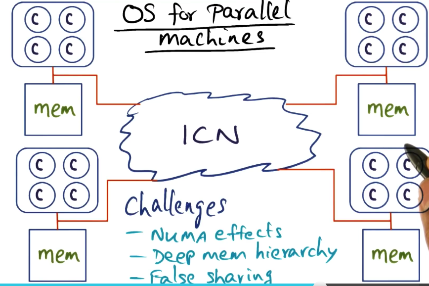

Modern parallel machines offer a lot of challenges for converting techniques into scalable implementations. Some challenges include:
1. **Size bloat** - managing more systems means that more system software needs to exist.
2. **Memory latency** - going outside a chip to memory is huge.
3. **NUMA** (non-uniform memory access) effects - Individual nodes that contain processor and memory can either access memory local to it or out into the network.
4. **Deep Memory Heirarchy**
5. **False Sharing** - even though programmatically there is no connection between memory shared between cores, the cache heirarchy might associate the memory on the same cache line and cache coherence mechanisms might effect seeming unconnected memories. 

### Principles

Some general principles of desigining parallel OS's are:

1. **Cache-conscious decisions** - pay attention to locality and exploit cache affinity in scheduling decisions.
2. **Limit shared system data structures** - reducing sharing reduces contention. 
3. **Keep memory access local** - reduce the distance between the accessing processor and the memory.

### Refresher on Page Faults

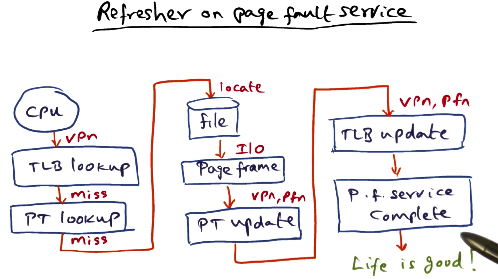

When a thread is executing on the CPU it generates a VPN (virtual page number), the hardware takes this VPN and looks it up in the TLB, to see if it can translate it to to a physical page frame.

If the lookup fails, the hardware consults the page table. It checks the page table for the mapping between the virtual page number and a physical frame. If the hardware had accessed this data before, it will exist in the page table. Otherwise, it needs to go fetch the data from disk. 

If the **mapping doesn't exist in the page table, we have a page fault**. The OS page fault handler then has to locate where on the disk the page exists. As part of the page file service, the OS allocates a physical page frame and do the I/O to move the memory onto the disk into the page frame.

Once the I/O is complete, the OS can update the page table with the mapping between the VPN and the physical page frame. 

Lastly, a TLB update is executed. Finally, after this is complete, the page fault service is complete. 

Let's now **analyze the page fault process for potential bottlenecks**. 

Lookup, both in the TLB and the PT can be parallelized because it is thread-specific. The TLB update is processor-specific, so this can be parallelized as well. The actual disk fetch of the page can be the big bottleneck in this system. We should try to avoid serialization in this process.

The **easy scenario for a multi-process OS is a multi-process workload** wherein threads are executing in all the nodes of the multiprocessor, but the **threads are completely independent** of one another. Page faults can be handled independently. 

* This is because the threads are independent
* The page tables are distinct
* We don't have to serialize access to that place in memory

The **hard scenario for a multi-process OS is a multi-threaded workload**. A process with multiple threads that has the potential for exploiting the concurrency of the multiprocessor by scheduling the threads on the nodes of the multiprocessor. In that case, we have a multi-threaded workload on different cores, and we use hardware concurrency to keep things in sync.

* The address space is shared
* The page table is shared
* Shared entries in processor TLBs