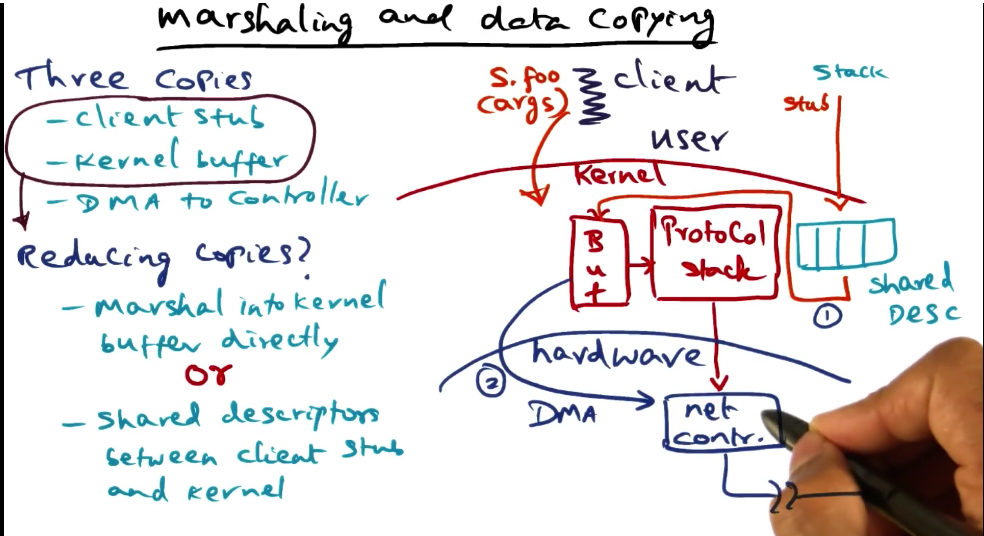
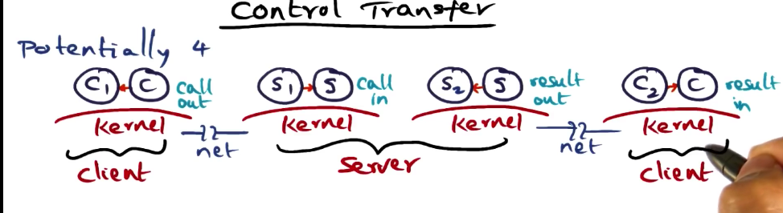
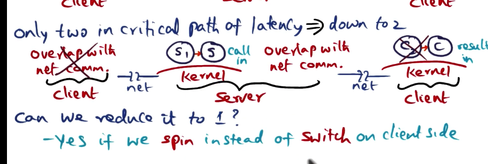
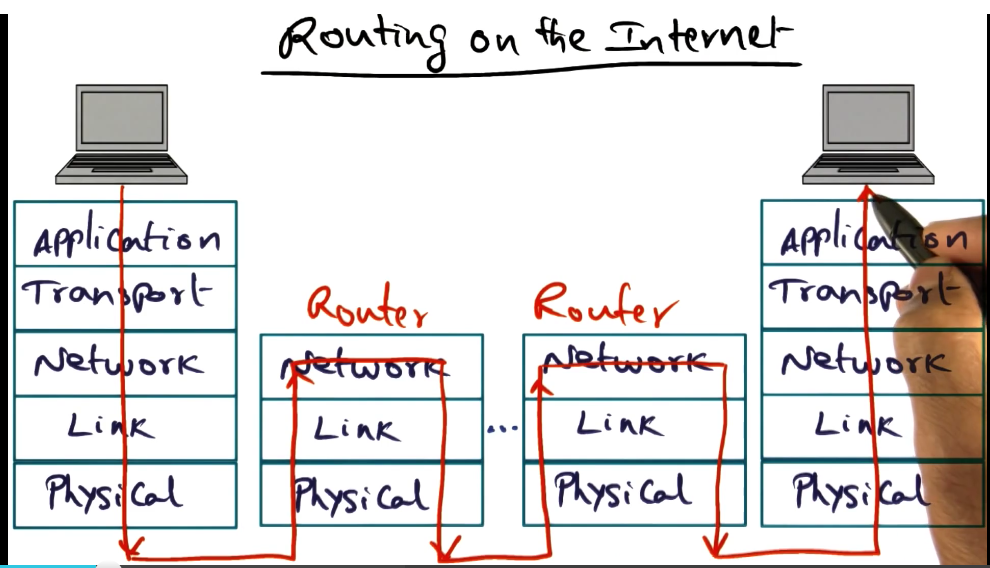
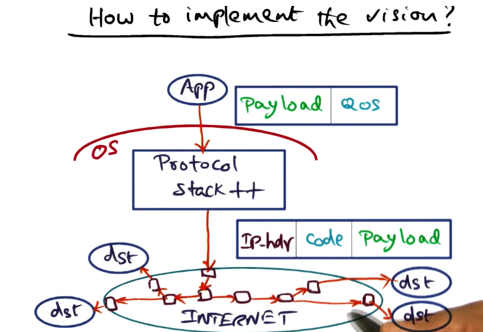
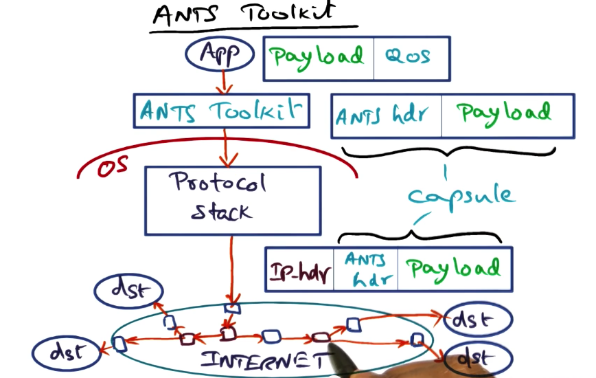
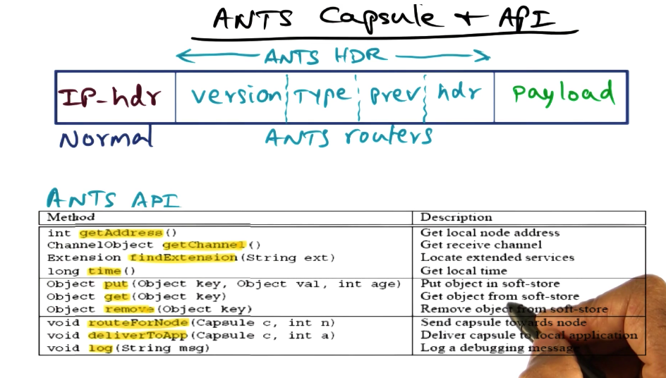
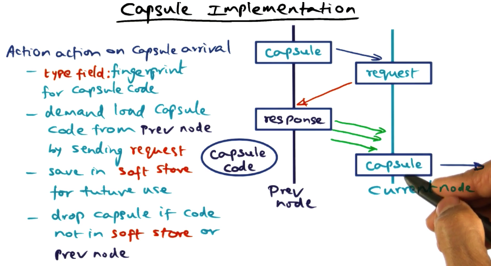

# Distributed Systems

## Table of Contents
* [Introduction](#introduction)
    * [Defining Distributed Systems](#defining-distributed-systems)
    * [Happened Before Relationship](#happened-before-relationship)
* [Lamport's Clock](#lamports-clock)
    * [Logical Clock Conditions](#logical-clock-conditions)
    * [Lamport's Total Order](#lamport's-total-order)
    * [Distributed Mutual Exclusion Lock Algorithm](#distributed-mutual-exclusion-lock-algorithm)
    * [Real World Scenarios](#real-world-scenarios)
* [Latency Limits](#latency-limits)
* [RPC Latency](#rpc-latency)
    * [Marshaling and Data Copying](#marshaling-and-data-copying)
    * [Control Transfer](#control-transfer)
    * [Protocol Processinng](#protocol-processing)
* [Active Networks](#active-networks)
    * [Routing on the Internet](#routing-on-the-internet)
    * [Implementation](#active-network-implementation)
    * [ANTS API](#ANTS-Capsule-and-API)
* [Systems from Components](#systems-from-components)

## Introduction

What fundamentally distinguishes a distributed system from a parallel system is the **individual autonomy of the nodes** of a distributed system. The interconnection network that connects all the nodes is wide-open to th world, as opposed to just being connected inside a box or through a rack.

Many of the issues that are considered to be just within the domain of distributed systems are now surfacing even within the problem space of a single chip. This makes the useful to study.

### Defining Distributed Systems

There are a couple of definitions of distributed systems. Let's touch on a couple of useful ideas.

A distributed system is **a collection of nodes connected by a local area network or wide area network**. The network can be implemented through twisted pair coaxial cable, optical fibers, or even satellite links. The media access protocols used by the notes may be ATM, ethernet, etc. 

There is **no physical memory that are shared between nodes in a distributed system**. This means that the only way nodes can communicate is by **sending messages** to each other. 

Lastly, the third property is that the **event computation time**, the time taken on a single node to do some meaningful unit of work, is that the **time for communication between nodes is much larger than event computation time**. 

Leslie Lamport gives us a definition of distributed systems: **a system is distributed if the message transmission time is not negligible to the time between events in a single process.**

What's interesting about this definition is that clusters can even be considered distributed systems because processing time is much faster than event communication in a rack.

There are some core tenets of distributed systems:
* Processes are sequential, the events are totally ordered and that a message has to be sent before it is received. 

### Happened Before Relationship

**A -> B**, "A" happened before "B". What this notation implies is that either A and B are events on the same process and that A happened before B on the same process. Or that they are on different processes, then there must be a communication event that connects A and B.  

There is also **transitivity** between happened-before relationships. If A happened before B, and B happened before C, then A happened before C. 

There is another concept that needs to be explored, **concurrent events**. Concurrent events are **events where there is no apparent relationship between events**. This means it is impossible to get a total ordering of events in a distributed system. This means it is important to think about how events are structured/related when designing a distributed algorithm.

Let's look at an example of a real-world distributed system and the associated events.

## Lamport Clocks

**What does each node in the distributed system know?**
* It's own events. 
* It's communication events with the rest of the nodes in the system.

**Lamport's logical clock** builds on this idea. We want to **associate a timestamp with every event** that happens in every process in the system. 

How is this accomplished? **A counter is associated with each node**, when an event happens, the event is associated with the current value of the counter. The counter is monotonically increased for each event. 

Communication events are more complicated. The receipt of a message is considered an event. Which timestamp does the receiving node pay attention to? The timestamp associated with the sending node, or the local counter timestamp?

A function is used to determine the timestamp. **The timestamp is set as the maximum value between the current timestamp and the received timestamp incremented by some monotonic quantity**.

So how do we give timestamps for concurrent events?

### Logical Clock Conditions

Concurrent events have arbitrary timestamps. Also, just because a timestamp for `x` is less than the timestamp for `y` , it does not mean that `x` -> `y` (x happened before y). 

**Is partial order good enough for constructing deterministic distributed algorithms?**

It turns out it is sufficient for certain situations. However, there are some situations where total order is needed. Let's look at a real world example. 

Say you live in a family and you have a car that you need to reserve. To reserve it, you send out a group text with a timestamp. The earliest timestamp wins, if there is a tie, the oldest member of the family wins.

### Lamport's Total Order

If there are two events, `A` and `B` in a distributed system, where `A` happens on node `I` and `B` happens on node `J`. 

If we want to assert that `A` is totally ordered ahead of `B`, then we have to prove that either the timestamp associated with `A` is less than the timestamp associated with `B`, or that if the timestamp happens to be the same, there is some other arbitrary function that can be used to break a tie between the two identical timestamps and that `A` is less than `B` when evaluated with this function.

### Distributed Mutual Exclusion Lock Algorithm

Let's put Lamport's clock to work by using it to implement an algorithm. 

In a distributed system we don't have shared memory to host a lock implementation. We will use Lamport's clock instead. 

Any process that needs to acquire a lock is going to send a message to all the other processes. The intent to acquire a lock may emanate simultaneously from different processes.

The algorithm is as follows, every process has a **queue data structure that is ordered by the happened-before relationship**. To request a lock, a process is going to **send a message to all the other processes with its local timestamp**. All the peers are going **stick the request into their local queue** in the appropriate place. It then **acknowledges the request to its peers**. 

A tie is broken by the process that has a lower process ID. At some point, it is possible that the queues are not equivalent, this is because messages take time to travel to the other processes across the network. 

Two things have to be true for the process to know it has the lock.

1. The request for the lock is at the top of the process's queue. 
2. The process has received ACKs from the other processes. Alternatively, all the requests that the process has received are later than the current lock request.

The lock is **released by sending an unlock message**. This removes the entry from the current processes queue, and as soon as the other processes receive the unlock message, they will also remove the entry. 

Here's a quiz. 

The **message complexity for this algorithm is 3(N-1)**. 

1. There are N-1 messages request messages sent.
2. There are N-1 ACK messages sent back to the requesting process.
3. There are N-1 unlock messages sent. 

One good question to ask is **can we do better**?

Yes, we can defer ACKs if the lock requests from the peers are greater than the current requested timestamp. In such a case, the requesting process can acquire the lock and send the ACK message with the unlock request. Under these conditions the complexity is 2(N-1).

### Real World Scenarios

In some instances, the logical/virtual clock is not appropriate or sufficient. These anomalies occur due to individual clock drift and also relative drift between two clocks in different processors.

This brings us to **Lamport's physical clock**. In physical/real time, event `A` happens before `B` then we need to provide two guarantees or conditions. 

1. The first condition is that there is a bound on individual clock drift. 
2. There is a bound on mutual drift. 

Lamport's clock is the **theoretical underpinning for achieving deterministic execution in distributed systems**.

## Latency Limits

This chapter will move from the theoretical underpinnings of modeling a distributed system to talking about the more practical matter of **how OS's implement the network layer software stack in an efficient way**.

**Latency** is the elapsed time for an event.

**Throughput** is the number of events executed per unit time. **Bandwidth** is a measure of throughput.

RPC is the basis for client/server based distributed systems. In the context of this lesson, latency is the time it takes for an application-generated message to reach its destination.

There are two components to the latency that is observed for message communication in RPC system:

1. **Hardware overhead** - dependent upon how the network is interfaced to the computer. Typically, the network controller copies data from system memory to its internal buffer (usually via DMA) and then queues them up for transmission. 
2. **Software overhead** - what the OS tacks onto the hardware overhead of moving the bits onto the network. 

The focus of this lesson will be to reduce the software overhead. 

### RPC Latency

1. **client call** - sets up arguments for the call, and then make a call into the kernel. Kernel validates the call and then marshals the arguments into a network packet and sets up the controller to do the network transmission.
2. **controller latency** - Once the packet is ready, the controller needs to DMA the message into its internal buffer and then put the message out on the wire.
3. **time on wire** - This really depends on the distance between the client and the server. 
4. **Interrupt Handling** - The packet arrives in the form of an interrupt to the OS. Part of handling the interrupt is moving the bits that come into the wire into the controller buffer and then from the controller buffer to system memory.
5. **Server setup to execute** - The server procedure needs to be located, and then the procedure needs to be dispatched with the unmarshalled arguments of the packet. Then the server can actually execute.
6. **Server Execution and Reply** - This is application-specific latency, it depends on what the actual server procedure does. However, when the server finishes, the results are marshalled into a response packet and the controller picks it up. 
7. **Client setup and receive results**

What are the sources of overhead in RPC?

1. Marshaling  
2. Data Copying 
3. Control Transfer 
4. Protocol Processing 

In general, to reduce latency, an OS developer should think about how to use the hardware. 

### Marshaling and Data Copying

Marshaling refers to the fact that the semantics of the RPC call is something that the OS doesn't understand. The arguments that are passed between client and server are something that are only understood by those two entities, the OS doesn't understand anything about the contract.

**Marshaling** is the term used to describe **the accumulation of arguments in the RPC call and making one contiguous network packet out of it** so that it can be handed to the kernel for delivery.
 
The **biggest source of overhead in marshaling is data-copying**.

There are potentially three copies in the data marshalling process. 

1. The arguments of the client live on the stack. The Client stub needs to take the arguments from the stack and convert them into a contiguous sequence of bytes called an RPC message. 
2. The client is a userspace program. The RPC message needs to be copied into the Kernel's internal buffer.
3. The third copy happens when the network controller does DMA to copy the RPC message from the Kernel buffer to the wire. 

The network controller is part of the hardware, so we aren't going to analyze how to improve this process. That leaves us with copies 1 and 2. 

The first idea we will explore is if we can eliminate the copy made by the client stub. If the client stub lives in the kernel, it can directly copy from the stack into the kernel buffer. This will eliminate the intermediate copy. However, it also means we need to inject some code into the kernel, is that something we want to do?

An alternative to dumping code into the kernel is to leave the stub in the userspace, but to have a **structured mechanism for communicating between the client stub and the kernel**. That structured mechanism is a **shared descriptor**. The shared descriptor describes where the arguments live on the stack and how big they are. 

### Control Transfer

Control transfer refers to the context switches that have to happen in order to process an RPC call and return.

In the simplest possible situation, there will be 4 context switches:

1. The client makes the RPC call from userspace, there is a context switch so the kernel can send the RPC message onto the wire.
2. The server kernel receives the client RPC message, and marshals it into userspace so that the server method can be called. 
3. The server produces the result and marshals the result into an RPC message which the server kernel sends out on the wire.
4. The client kernel receives the server result and marshals it into the userspace so that the application can use it. 

Which of these are critical context switches? It turns out **only two of the context switches are in the critical path** of latency: The context switches that receive the messages. The 1st and 3rd context switches are merely there to keep the hosts occupied while they are waiting for more RPC communication.

We can reduce the context switches down to 1 by just spinning the client machine. 

### Protocol Processing

What transport should we use for RPC? How can we reduce latency in the information transfer? Often times performance and reliability are at odds with each other. Let's assume that the LAN is reliable and not worry about the reliability so we can optimize performance.

Let's take a look at all the things that could go wrong in a message transmission and analyze why they might not matter if we have a reliable LAN.

1. No low-level ACKs. Probably not necessary in a LAN, maybe a WAN. In an RPC system with proper timeouts, the result returning can serve as an ACK.
2. Hardware checksum for packet integrity. In a LAN, we should probably just use a hardware checksum instead of a software checksum.
3. No client side buffering. Since a client is spinning, we don't need to buffer a message on the client side. We can just resend the message if there is a timeout and the message is lost.
4. Overlap server-side buffering with result transmission. We do want to buffer on the server side because we could lose the result from the server side process.

## Active Networks

In the previous lesson we learned tricks we could use as OS designers to optimize RPC software. Of course, user interactions extend beyond a LAN. How do we think about communication that goes out into the wild-wild-west of the Internet?

Routing is part of the functionality of the network layer of the protocol-stack of the OS. For the next part of the lesson, we will ask **what can be done at intermediate routers to accommodate QoS needs for individual packet loads**.

### Routing on the Internet

At the source node a network packet is created, this packet is built through the layers of the network stack, and then sent out on the network. It goes through intermediate routers to get to the destination.

The routers on the internet don't inspect the packet, they look at the destination node and figure out the next hop for the packet. They make this decision by consulting their routing table.

**What does it mean to make these nodes active?** It means that instead of just doing a passive table lookup, the next hop is determined by actively executing code. One model of this is that the packet has some code bundled up with it, and the code is executed by the router to determine where it should go.

This sounds clever, but slow. It is an **opportunity to virtualize the traffic flow** for network traffic independent of other network flows. There are lots of challenges to this vision.

## Active Network Implementation

The protocol stack of the OS needs to be enhanced to service the API of the active network. The application that is now relying on the active network needs to provide QoS constraints that the OS uses to perform whatever 'activity' it needs to perform.

There are two problems:
1. Changing the OS is non-trivial. The protocol stack already has a hundred thousand lines of code. This is difficult.
2. Not all routers on the internet are open. How would you get them to comply with your changes?

The ANTS (Active Node Transfer System) toolkit, tried to show how useful this vision would be. **Instead of modifying the protocol stack, they provided an application-level package** to help create new headers and payload to pass to the protocol stack.

Once a packet is packaged up with the header, it can be sent out into the Internet. If intermediate routers are equipped with ANTS software, they can read the ANTS header and do whatever magic they want to do with the packet. Otherwise, the packet is backwards-compatible and goes through the normal routing flow.

The edge of the network could be a perfect place for placing ANTS software.

### ANTS Capsule and API

Let's take a deeper look into the ANTS package.

The ANTS header is composed of three parts:
1. **The original IP header** - which allows for backwards compatibility.
2. **The ANTS header** - There are two important fields here, the `type field` identifies the code that needs to be executed, the `prev field` is the identity of the upstream node that successfully processed the capsule.
3. **The payload** - the data needed to be transferred

The capsule itself does not contain the code that needs to be executed. It only contains a `type field`. 

The ANTS package on the node contains the instructions (code) for the active network. The `type field` is a pointer to these instructions. Capsules will retrieve this code and the node will execute it.

What are the actions taken on capsule arrival? The capsule doesn't contain code, it contains the `type field`, which is a cryptographic fingerprint of the capsule code. This serves as a reference for the code itself.

When a node receives a capsule there are two things that can happen:
1. **The node has seen capsules of this type before**, if that is the case, then it is likely that the code for that type is present in the storage of the node, so all the node has to do is retrieve this code and execute it.
2. **The node has not seen capsules of this type before**, in this case, the node needs to reach out to the previous node and ask for the type code so that it can save it in its local cache. The current node then checks the cryptographic hash of the type code and checks it against the original capsule.

If the previous node doesn't contain the capsule code, it will drop the capsule.

### Potential Applications

1. Protocol independent multicast
2. Reliable multicast
3. Congestion notification
4. Private IP
5. Anycasting

This is useful for building applications that are hard to build in the Internet.

### Pros and Cons

Pro

1. Flexibility from application perspective. 

Con

1. Protection threats. There will no be many more entry points for malicious users.
2. Resource management threats. Because we are executing code at a router, the result of this execution could be that you proliferate packets in the internet. This could become a DDoS threat. 
3. Needs buy in from router vendors
4. Software routing throughput might not match what is needed at the internet core

## Systems from Components

Hardware design utilizes a component-based approach to build large and complex hardware systems. Can we mimic this method in software systems? Let's explore :).

In this section we will dicuss the paper, Building Reliable High Performance Communication Systems.

IO Automata is utilized to specify the system requirements of the code. 

The second part of the paper is converting the specification into code that can be executed. The language used is OCAML. OCAML has some properties that make it a good candidate for doing component-based design. It is object-oriented, and the formal semantics of ocaml are similar to IO Automata. The code is efficient and it is similar to C. 

Lastly, the code is optimized using nuprl, a framework for optimizing OCAML code. The input is OCAML code, the output is verified to be functionally-equivalent, but more optimized than the input. 