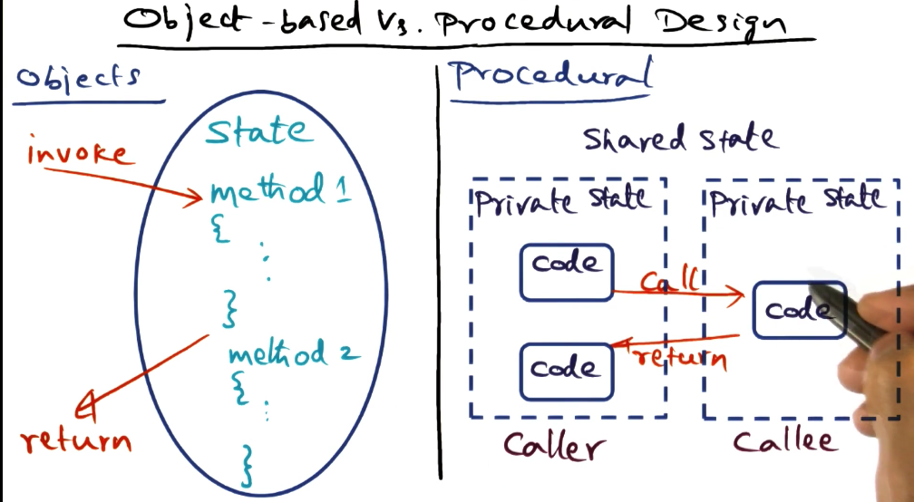
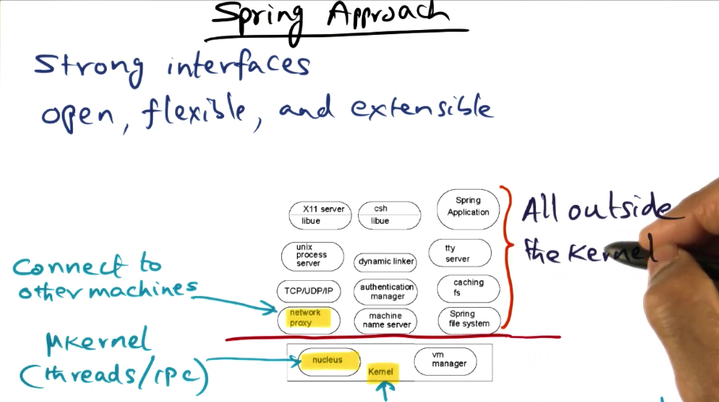
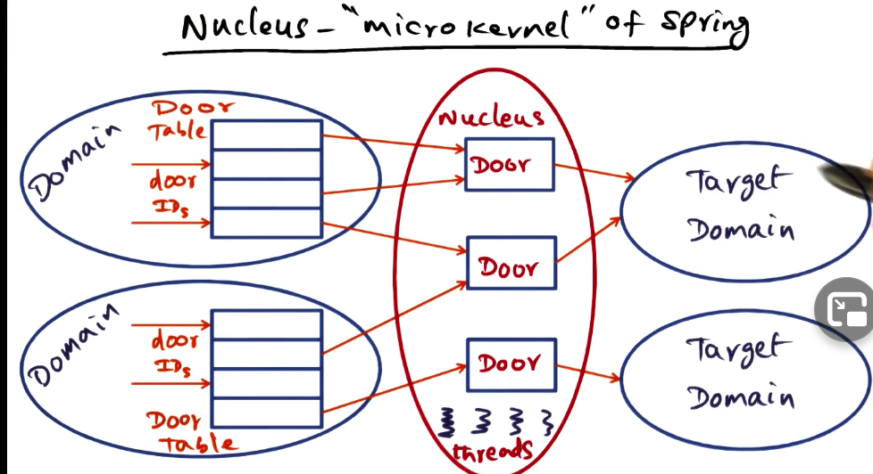
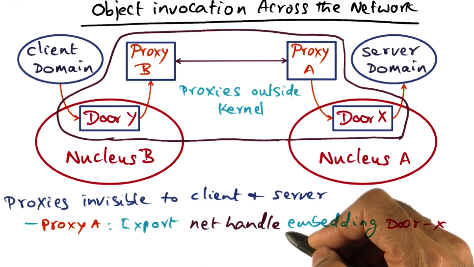
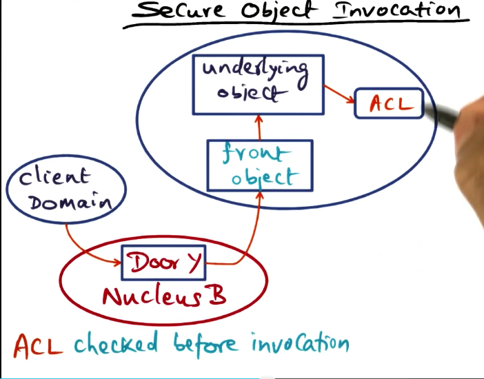

# OS Examples

## Table of Contents

## Introduction

One pain point of designing scalable OS's and distributed systems is **how to design them for continuous and incremental evolution**. The short answer to this puzzle is **distributed object technology**. 

In this module we will see examples of how distribute object technology is influencing commercial offerings.

There is a always **a conundrum in the design of OS**'s. Should we **create a new one, or should we create a better implementation** of a known OS?

### Procedure design vs Object-based design

With procedural design, code is written as a monolithic entity wherein shared state can be global, and private state can be managed by individual functions. This means the interface between subsystems is through procedure calls. State is strewn throughout the monolith.

To contrast this with Object-based design, an object-based design encapsulates the entirety of the state within an object, and uses methods to manipulate the state within the object. Externally, the state is not visible, the only things that are visible are the methods that manipulate the state. Thus, **with object-based design you get strong interfaces and complete isolation of the state of the system.**

### Spring Approach

The spring approach to designing an OS is to use strong interfaces for each subsystem. This means the only things that are exposed outside a subsystem is **what services it provides, not how it provides them**. 

This design naturally leads to object-orientation. Which means that the internal implementation of the services can change at any time as long as the interface doesn't change. 

Extensibility is important to Spring. Naturally, this leads to a micro-kernel based approach. Most services exist outside the kernel. Inside the kernel, are two parts, the nucleus which provides the abstractions for threads and IPC, and the VM manager that manages virtual memory.

### Nucleus Microkernel

Nucleus manages only threads and IPC. The abstractions that belong to the nucleus are as follows:

* **Domain** - similar to a Unix process. It's an address space. Threads can execute within a domain. 
* **Door** - A software capability to a domain. Access to a door is granted through a door handle which is simply an entry in the domain's door table. You can kind of thing of this like file descriptor's in Unix. Every door ID points to a door, every door handle points to a specific door ID. 

So how does the nucleus actually manage the protected access to target domains?

1. It intercepts requests to the target domain from the client domain.
2. It checks that the client domain has access to the door it is trying to use.
3. It allocates a server thread on the target domain to execute the method indicated from the door handle.
4. On return of the procedure call, the server thread is deactivate and the client thread is re-activated.

This is very similar to the communication process described in the lightweight RPC system described in the distributed systems lectures.

### Object Invocation Across the Network

Spring is network OS. We just described the execution of the nucleus on a single node, but what about in a distributed system?

Object invocation is extended across the network using network proxies. Proxies are just interfaces to the network, they can be implemented with whatever protocol you desire to provide extensibility. The proxies are invisible to the client and the server. It just looks like they are invoking a method to a local object. (This kind of reminds of the stub in GRPC).

*Note the network handle is not accessed through the nucleus.* 

### Secure Object Invocation

It may be necessary for a server object to provide different privileges to different clients.

In order to facilitate this differential invocation, the spring model uses the idea of a front object. 

The front object is a mechanism created by the service developer, it is not something that is provided by the Spring microkernel.

The front object registers the door that accesses it, and it checks the access control list (ACL) for the privileges of the requesting client domain.

