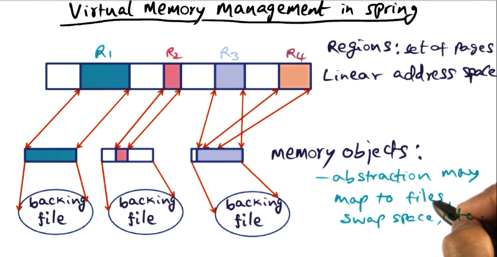
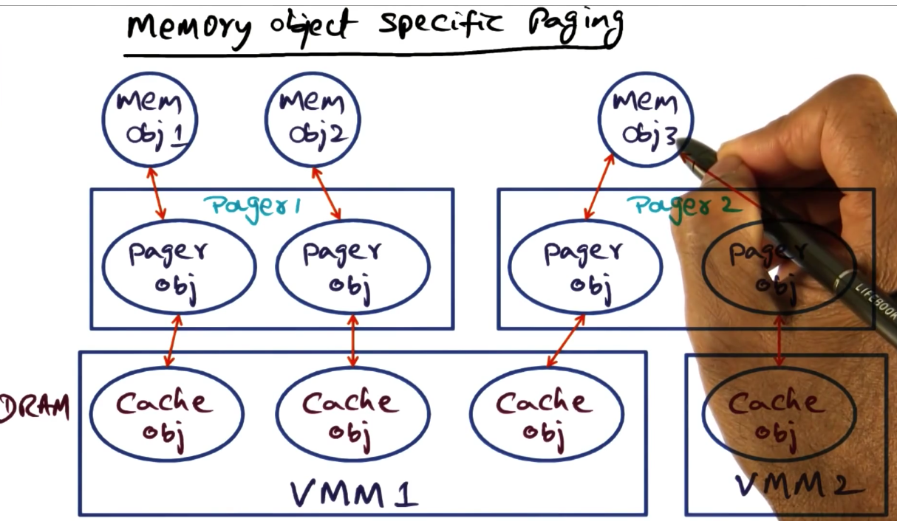
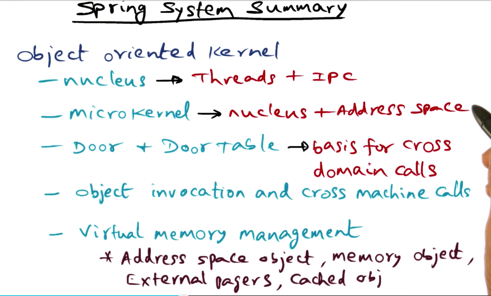
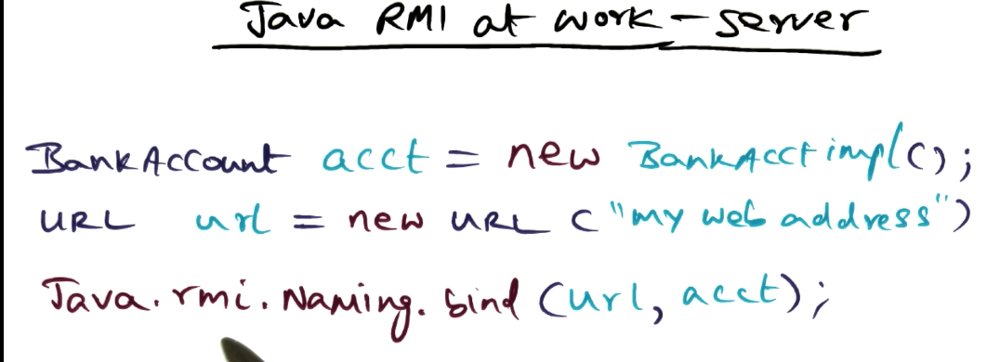
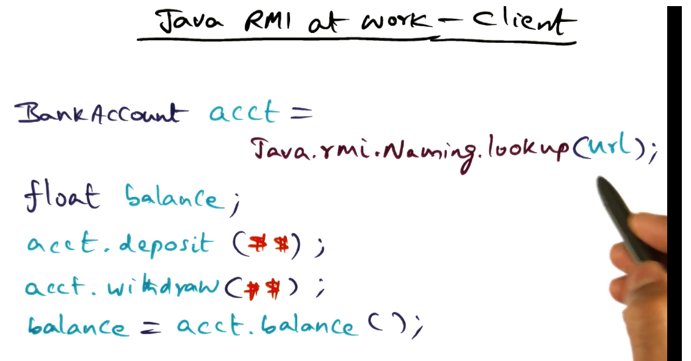
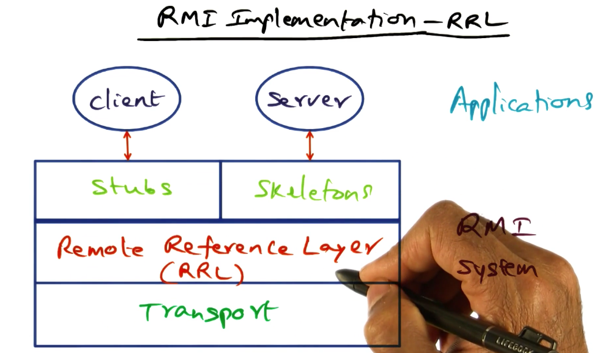
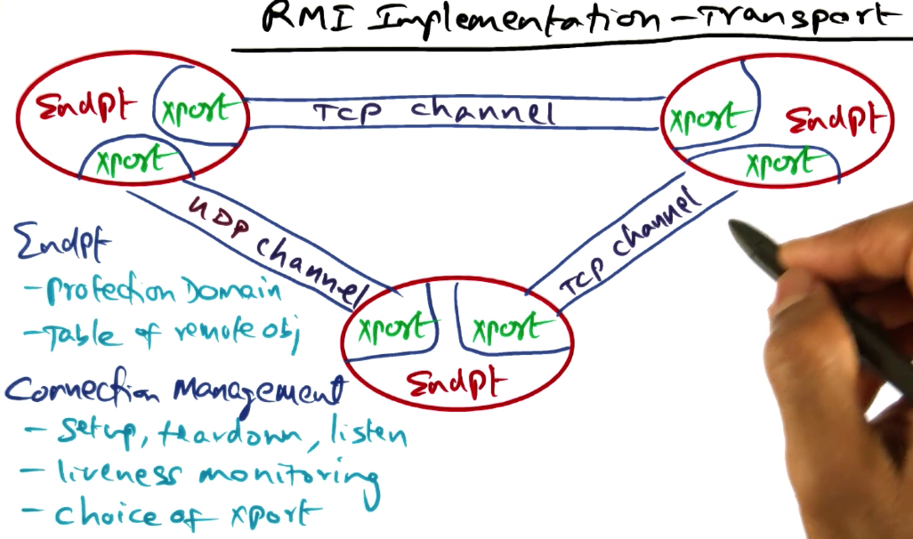
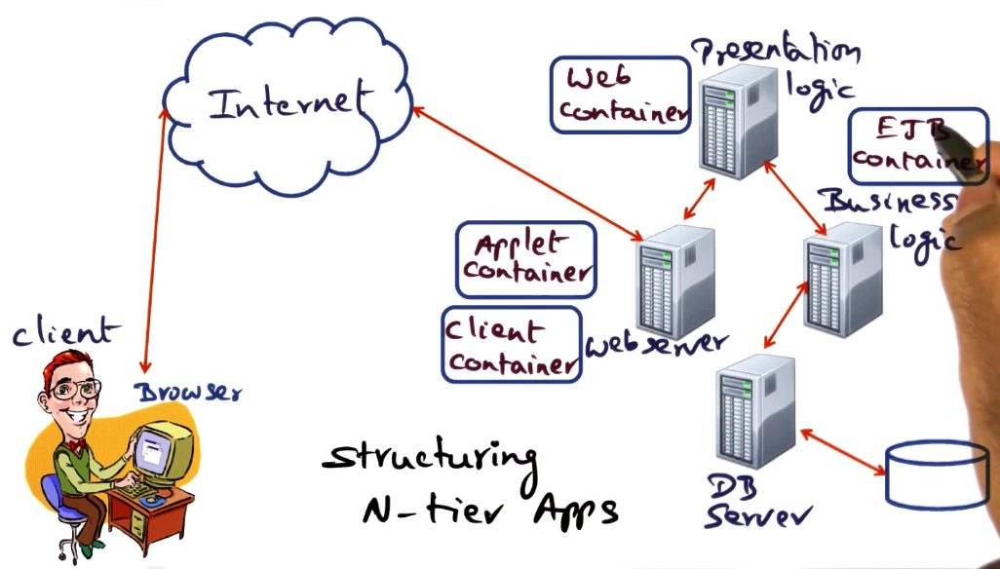

# OS Examples

## Table of Contents
* [Introduction](#introduction)
* [Procedural vs Object-oriented design](#procedural-design-vs-object-based-design)
* [Spring Approach](#spring-approach)
    * [Nucleus Microkernel](#nucleus-microkernel)
    * [Distributed Object Invocation](#object-invocation-across-the-network)
    * [Secure Object Invocation](#secure-object-invocation)
    * [Virtual Memory Management](#virtual-memory-management)
* [Java RMI](#java-rmi)
    * [How does RMI work?](#how-does-rmi-work)

## Introduction

One pain point of designing scalable OS's and distributed systems is **how to design them for continuous and incremental evolution**. The short answer to this puzzle is **distributed object technology**. 

In this module we will see examples of how distribute object technology is influencing commercial offerings.

There is a always **a conundrum in the design of OS**'s. Should we **create a new one, or should we create a better implementation** of a known OS?

### Procedural design vs Object-based design

With procedural design, code is written as a monolithic entity wherein shared state can be global, and private state can be managed by individual functions. This means the interface between subsystems is through procedure calls. State is strewn throughout the monolith.

To contrast this with Object-based design, an object-based design encapsulates the entirety of the state within an object, and uses methods to manipulate the state within the object. Externally, the state is not visible, the only things that are visible are the methods that manipulate the state. Thus, **with object-based design you get strong interfaces and complete isolation of the state of the system.**

### Spring Approach

The spring approach to designing an OS is to use strong interfaces for each subsystem. This means the only things that are exposed outside a subsystem is **what services it provides, not how it provides them**. 

This design naturally leads to object-orientation. Which means that the internal implementation of the services can change at any time as long as the interface doesn't change. 

Extensibility is important to Spring. Naturally, this leads to a micro-kernel based approach. Most services exist outside the kernel. Inside the kernel, are two parts, the nucleus which provides the abstractions for threads and IPC, and the VM manager that manages virtual memory.

### Nucleus Microkernel

Nucleus manages only threads and IPC. The abstractions that belong to the nucleus are as follows:

* **Domain** - similar to a Unix process. It's an address space. Threads can execute within a domain. 
* **Door** - A software capability to a domain. Access to a door is granted through a door handle which is simply an entry in the domain's door table. You can kind of thing of this like file descriptor's in Unix. Every door ID points to a door, every door handle points to a specific door ID. 

So how does the nucleus actually manage the protected access to target domains?

1. It intercepts requests to the target domain from the client domain.
2. It checks that the client domain has access to the door it is trying to use.
3. It allocates a server thread on the target domain to execute the method indicated from the door handle.
4. On return of the procedure call, the server thread is deactivate and the client thread is re-activated.

This is very similar to the communication process described in the lightweight RPC system described in the distributed systems lectures.

### Object Invocation Across the Network

Spring is network OS. We just described the execution of the nucleus on a single node, but what about in a distributed system?

Object invocation is extended across the network using network proxies. Proxies are just interfaces to the network, they can be implemented with whatever protocol you desire to provide extensibility. The proxies are invisible to the client and the server. It just looks like they are invoking a method to a local object. (This kind of reminds of the stub in GRPC).

*Note the network handle is not accessed through the nucleus.* 

### Secure Object Invocation

It may be necessary for a server object to provide different privileges to different clients.

In order to facilitate this differential invocation, the spring model uses the idea of a front object. 

The front object is a mechanism created by the service developer, it is not something that is provided by the Spring microkernel.

The front object registers the door that accesses it, and it checks the access control list (ACL) for the privileges of the requesting client domain.

### Virtual Memory Management

VMM is part of the kernel of Spring. There is a per-machine VMM. It is in charge of managing the linear address space of every process. The VMM breaks the linear address space into regions (set of pages). 

The second abstraction is of a memory object. Memory objects are an abstraction that allows a memory region to be associated to something living on a disk like files, swap space.

So how are these memory objects used? To bring a memory object into virtual memory, the Spring system uses a pager object to establish a connection between virtual memory and physical memory. It is the responsibility of the pager object to create the mapping between the two. The pager object creates a cached object representation in DRAM. 

If cache coherence is needed, it is responsible for pager objects to coordinate in the use of the cache representations.

### Spring System Summary

### How are client-server relationships managed in the Spring system?

The dynamic relationship between the client and the server are managed by an entity called the subcontract. 

The subcontract is the implemented interface for communication between the client and the server. It hides the runtime behavior of an object from the interface. This means that it handles all of the details of the connections between the system. New subcontracts can be loaded dynamically and not effect the client behavior, because the subcontract is a strong interface.

So, what does the interface look like? It has a marshalling and unmarshalling interface. Once this has been done, the client side can invoke the method on the server. The subcontract on the server side can create, revoke, or process invocations.

## Java RMI

Much of the heavy-lifting that an application developer has to do while building a client-server system using RPC, like marshalling/unmarshalling are all subsumed by the Java remote/distributed object runtime.

Let's address some key features of the Java remote/distributed object model.

* **Remote Object** - objects accessible from different address spaces.
* **Remote Interface** - declarations of methods in a remote object
* **Failure Semantics** - Dealing with exceptions in the runtime
* **Similarities and differences with local objects** - object references can be params, the difference is that in the distributed model, the object passes them as values. In the local objects, they can be used as references and directly modify the entity in memory.

The following images show how easy it is to interact with remote objects using RMI.

Instantiating the server is as simple as registering the object instance with the RMI runtime.

Interacting with the server looks like normal procedure calls.

### How does RMI work?

At the core of the RMI implementation is the remote reference layer.  The client side stub uses this layer to initiate a request-response cycle.

The transport layer sits below the RRL layer. The abstractions that the transport layer in RMI provides are:
* **Endpoint** - A protection domain, a sandbox for execution. A table of remote objects. 
* **Connection Management** - details for connecting endpoints together. Setup, teardown, listening for connections, establishing connenctions. 
    * **Channel** - Abstraction to represent the connection between a client and server. 
    * **Connection** - Abstraction for I/O. The abstraction that is written to by the endpoint.

## Enterprise Java Beans

How do you structure the software for a large scale distributed service?

Organizations provide a single point of service, an abstracted interface for interaction. Inside, they are a complex organization of moving parts that all work together to service the end product. Sometimes, it's even more complicated in that internal components require external resources.

The software stack of these types of services can be organized efficiently using object-oriented programming.

What are our goals in serving users? Decreasing network requests (to reduce latency), reducing security risks (the business logic should not be compromised), increasing concurrency for individual requests (there is an opportunity to exploit parallelism).

To structure these N-tier applications, we will talk about the Enterprise Java Beans framework, this is just an example, and many other frameworks suffice. 

There are 4 containers (protection domains in a Java VMM). 

1. Client container - reside on webserver, interacts with browser
2. Applet container - reside on webserver
3. Web container - dynamically creates pages
4. EJB container - manages business logic
(Honorable mention) Database server - is connected to by the EJB container. 

The key idea to this structure is that we want to **reuse components**. The word **bean** is used to describe an object of reuse. This could refer to an entity (persistence object with primary key), a session (a stateful/stateless connection with another computer), or a message (useful for asynchronous behavior). 