# Memory Systems

## Table of Contents

* [Global Memory Systems](#global-memory-systems)
    * [Introduction](#introduction)
    * [Big Picture](#big-picture)
    * [Terminology](#terminology)
    * [Page Faults](#handling-page-faults)
    * [Page Fault Algorithm](#page-fault-algorithm)
    * [Implementation in Unix](#implementation-in-unix)
        * [Data Structures](#data-structures)
* [Distributed Shared Memory](#distributed-shared-memory)
    * [Implicit Paralellization](#implicit-parallelization)
    * [Message Passing](#message-passing)
    * [Distributed Shared Memory](#distributed-shared-memory)
    * [Shared Memory Programming](#shared-memory-programming)
    * [Memory Consistency and Cache Coherence](#memory-consistency-and-cache-coherence)
    * [Release Consistency](#release-consistency)
        * [Memory Model](#memory-model)
    * [Lazy Release Consistency](#lazy-release-consistency)
    * [Comparing Lazy RC and RC](#comparing-eager-to-lazy-rc)
    * [Software DSM](#software-dsm)
    * [Lazy Release Consistency with Multi-Writer Coherence](#lazy-release-consistenncy-with-multi-writer-coherence)
    * [Implementation](#implementation)
    * [Non Page-based DSM](#non-page-based-dsm)
    * [Scalability](#scalability)
* [Distributed File Systems](#distributed-file-systems)

## Global Memory Systems

### Introduction

In this module we will discuss the design and implementation of select distributed system services.

*Wisdom from Kishore - The byproducts of a thought experiment may have more lasting impact than the original vision behind the thought experiment.* 

The common theme we are going to discuss is **how we can leverage memory in a distributed system**. 

### Big Picture

Typically, the virtual address space of a process running on a processor is much larger than the physical memory that is allocated for a particular process. Thus, **the role of the virtual memory manager is to give the illusion to the process that all of its virtual address space is contained in physical memory**, when in fact only a portion of it (**the working set**) is actually in physical memory. The VMM supports this illusion by paging in-and-out of disk, the pages that the process needs for computation.

When a node is connected to other nodes in a LAN, it is likely that the memory pressure that a particular node feels compared to another node is different. One interesting question is to to think about how to take advantage of idle resources. 

**Is it possible that accessing remote physical memory on other nodes through network calls is faster than accessing a disk on the same machine?** At some point yes, networking technology is approaching 10GB/s throughput. 

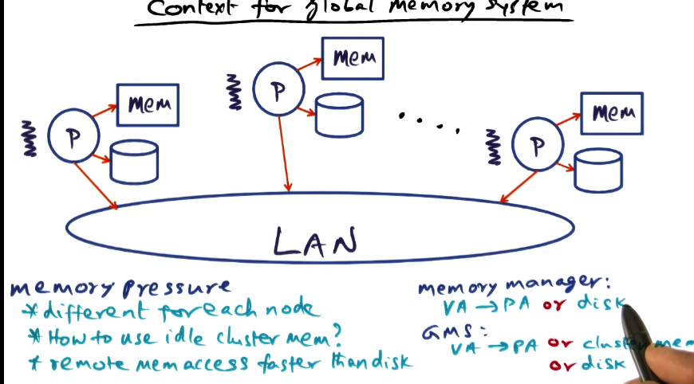

The **global memory system (gms)** uses cluster memory for paging across the network. This effectively **adds a new layer to the memory hierarchy**. 

GMS trades network communication for disk i/o. However, this **only applies to disk reads**. It does not get in the way of writing to the disk. The only pages that are paged out across the cluster are clean copies of pages. This means that if a node goes down, it's totally fine because the only thing that was a lost was a copy of what already exists on the original disk. 

When the VMM needs to replace the working set, instead of paging out the current memory to disk, it will place the pages out on the network (as long as they aren't dirty).

### Terminology

With GSM, "**cache**" **refers to physical memory** not the processor cache.

The word "community", is used to describe handling page faults at a particular node.

We are going to use peer memories as a supplement for the disk. **The physical memory for a node is split into two components**:
1. **Local memory** - working set of the currently executing processes.
2. **Global memory** - similar to a disk, out of my current physical memory, this is the part that is used as space for holding swapped-out pages. 

This split is dynamic, it is made in response to memory pressure. 

There are two states to memory pages in GMS, **private or shared**. A private page is local only to one node. A shared page is local amongst many nodes. If a page is in the global cache, it is still private. In the global cache, it is basically just a private copy, but stored somewhere else.

The whole idea of GMS is to **serve as a paging facility**. Coherence for shared pages is outside the purview of GMS, it considers this an application problem. Why? You can think about a uniprocessor example where many processes are sharing pages. It isn't really the VMM's responsibility to make sure that these pages are coherent, thus, in GMS, it is not it's responsibility.

Managing age information of pages in a distributed system of pages is one of the key technical contributions of the GMS system.

### Handling Page Faults

Let's look at an example of a page fault in a GMS system with two hosts, P and Q. 

Let's say we are running a process on host P, and it page faults on same page X. When that happens, we have to find out if that page is in the global cache of the cluster.

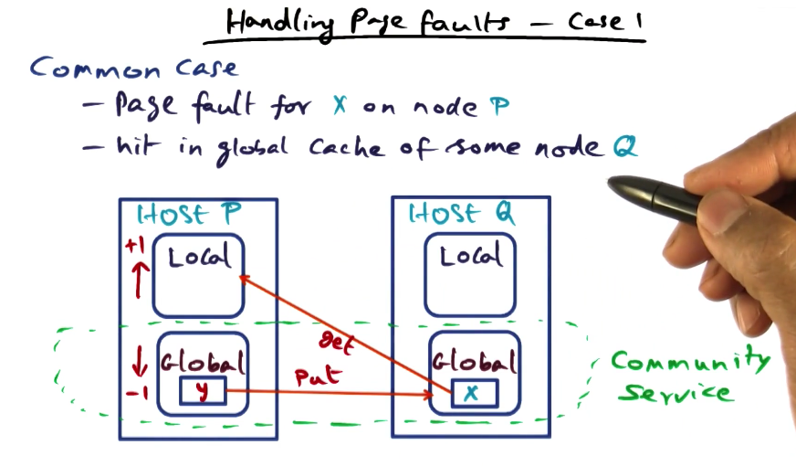

To handle the page fault, 
1. node P sends a search request for page X across the GMS. 
2. The GMS locates the page on host Q.
3. Host P makes a request to host Q for page X. 
4. Host Q sends page X to P across the network. 
5. Host P adds X to its current working set. This means that it needs to remove something from its local global memory (community service) and page it out to GMS. 

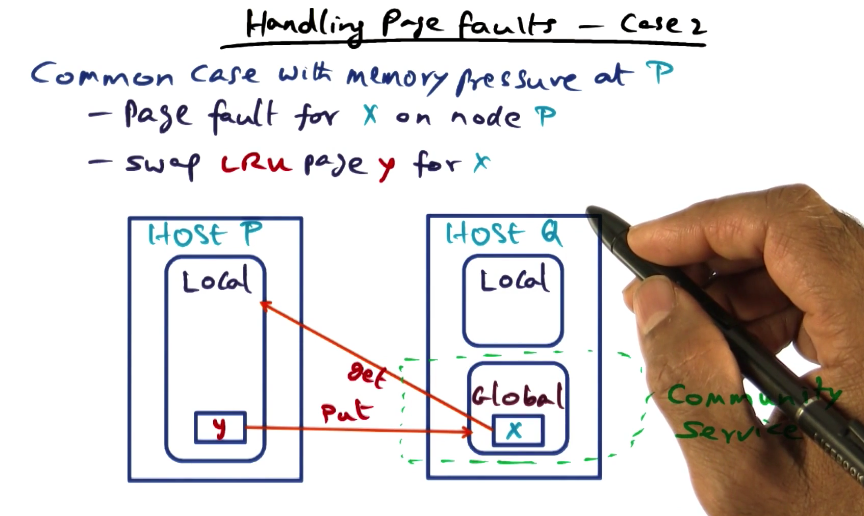

The second case is similar to the common case except that the memory pressure is exacerbated on host P. There is so much memory pressure that all the physical memory that is available on P is taken up by the working set. There is no community service happening on host P. To handle the page fault,

1. The steps are roughly the same as above except the candidate/victim page for paging out comes from the local cache. 

The third page fault case happens when page X doesn't exist in the community service/global cache. 

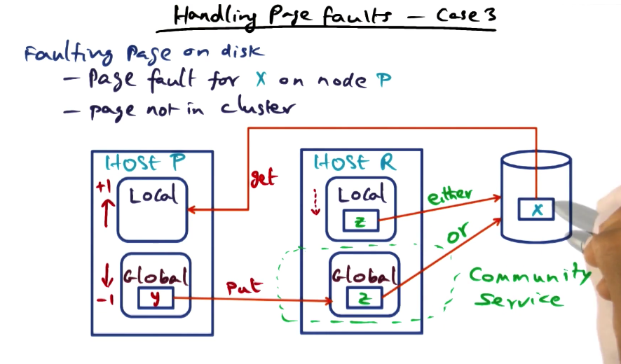

1. When a page fault on node P happens, it searches across the GMS.
2. It isn't found, so it makes a request for the page on its disk.
3. When the page comes in, it needs to page out into the GSM.
4. It uses LRU or some other scheme to page out a page in its working set. It's paged out to the node with the globally oldest page. 
5. If the node with the oldest page has memory pressure, it has to make some room for the new page. Because all paged out pages in GMS are clean, it can just discard the oldest page without worrying about writing it back to disk. 
6. However, if the oldest page has to be in local part of the node, then it is conceivable that the page is dirty and needs to be paged out to disk. 

So far the cases we've considered have assumed that the page we are faulting on is private to a process. Let's consider the case where the page is actively shared. In this scenario, two hosts, P and Q are both actively using a page to do some work. 

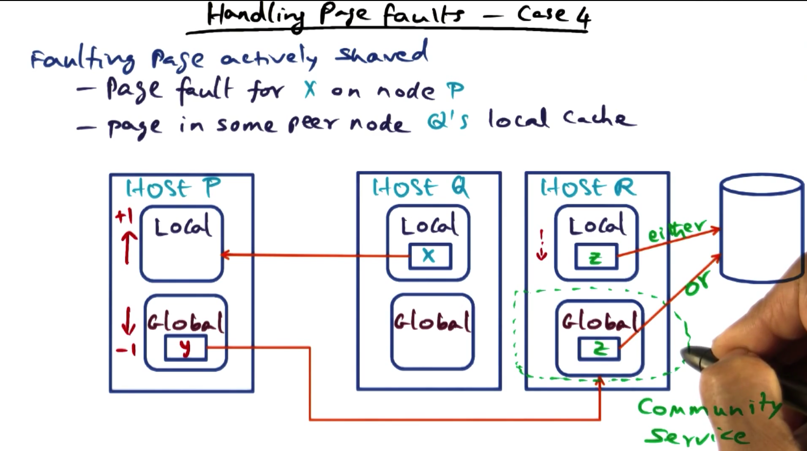

When host P, needs page X
1. It makes a request for page X to the GMS.
2. The page is found in the local memory of host Q. 
3. Because it is in the current working set of host Q, we don't want to yank it out of memory. We want to **make a copy**.
4. Again, if there is pressure, the host P needs to page out a least-recently used page. 
5. The page is paged-out to the node with the globally oldest page. 

### Page Fault Algorithm

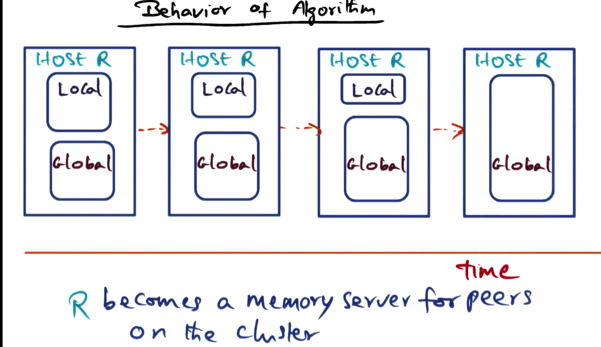

The behavior of the GMS algorithm is as follows.

If there is an idle node in the LAN, then the node's working set is going to decrease as it accommodates more and more of its peers pages that are swapped out to fit in the global cache. Eventually, a completely idle node because a memory server for peers on the network.

The **most important parameter in the working GMS system is age management**. We need to identify the globally oldest page whenever we want to do replacements.

One of the goals of distributed systems, or honestly, probably systems in general, is to **make sure that any management of the system doesn't bring down the productivity of any particular node**. This means that management work is distributed and is not centralized in one node. 

Because the **GMS system is dynamic, each node needs to understand how to communicate its needs with all the other nodes**.

In GMS, management is broken up along two axes, space and time. Two parameters are used to describe an epoch (the granularity of management work done by a node), T, the maximum duration of an epoch. Or space-bound, M, maximum number of replacements.

This sounds complex but it is pretty simple. If a certain amount of time (T), passes, it's time to pass the management work of GMS to another node. If the node has done a certain amount of management work (M), then it is time to pass the management work to another node. 

At the start of each epoch, every node is going to send some information to the initiator (the node doing the work). That information will be the age of each page in its system (both local and global).

The initiator node will then do two things:
1. It will calculate the minimum age of all the M pages that are going to be replaced. Any page that is less than the minAge will be safe from eviction.
2. It calculates the weight parameter for each node, which is the fraction of pages to be evicted in the current epoch that exist on the node. 

Remember, the algorithm doesn't know the future. So, these are **expected calculations**.

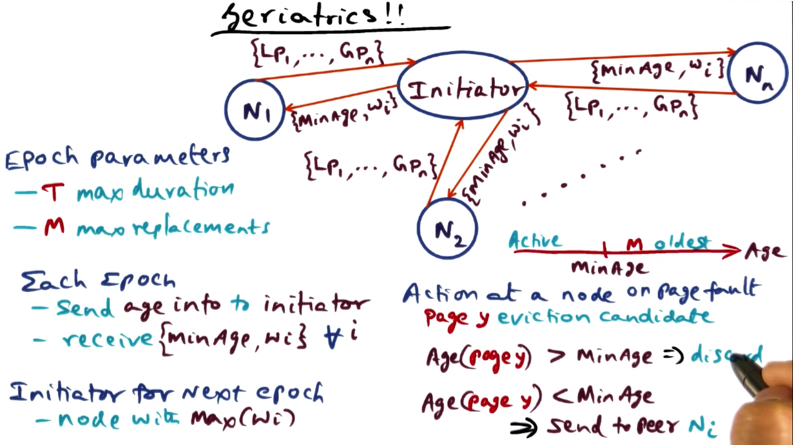

The **initiator node is new at each epoch**. The initiator is chosen to be the node with the highest weight. Why? Because **the weight parameter indicates that it is the least active node**. It is the node currently doing the least amount of work, that's why it is storing all the other nodes pages.

This election process happens because the initiator node sends back all the weights to each of the nodes in the system.

So **what is the action at a node when there is a page fault?**

If upon a page fault, a node needs to evict a page Y, if the age of the page is more than the minimum page, than we know it is going to be replaced, we can just drop it. 

However, if the age of the page that needs to be replaced is less than this minimum, we send it to a peer to store. **Which peer is it sent to? It depends, usually it is the node with a higher weight.** 

This algorithm approximates a global LRU algorithm.

### Implementation In Unix

The authors of GSM used a DEC OS as the base system.

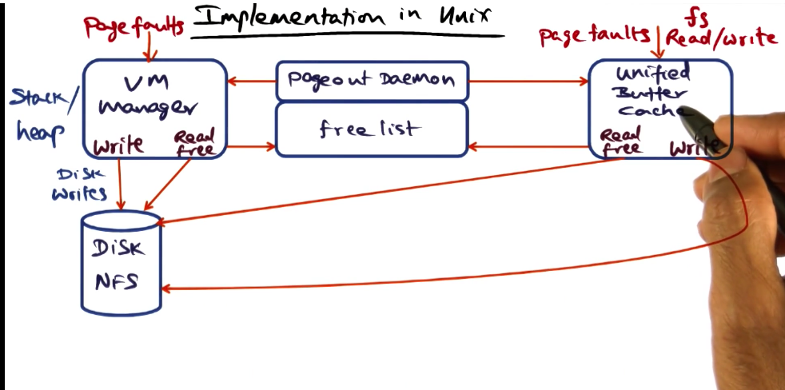

There are two key components to the GSM implementation.
1. **The virtual memory system** - responsible for mapping process virtual address space to physical memory and worrying about page faults, etc.
2. **The unified buffer cache** - the cache used by the filesystem, exists in physical memory for faster access. It serves as the abstraction for the disk-resident files. Reads and writes to files actually go to this entity. 

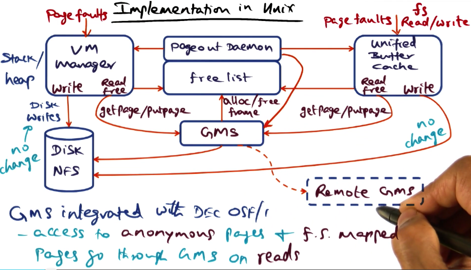

The GMS implementation modifies both of these systems to handle the needs of GMS.

When either system wanted a missing page, they would go to the disk. In GMS, they go to GMS first, :). They call `getPage`,  and GMS will query the network for that missing page. 

Notice that **writes to disk are unchanged**. We do not want to affect the reliability of the system. Only when there is a page fault do we consult GMS.

Remember that the most **important aspect of GMS is retrieving accurate age information** about the files in the system. This isn't too bad for pages housed in the unified buffer cache. We can just consult file handles to check for timestamps. The VMM manages anonymous pages, and these are much harder to determine any information about. To collect information about anonymous pages, a daemon is used to dump information from the TLB. The GMS uses this data dump to derive age information for the anonymous pages. 

#### Data structures

One of the things that GMS has to do is convert a local virtual address into a global identifier (universal ID). The universal ID is derived by concatenating a bunch of information (ip-addr, disk partition, i-node, offset) about the page.

There are three key data structures used in GSM work.

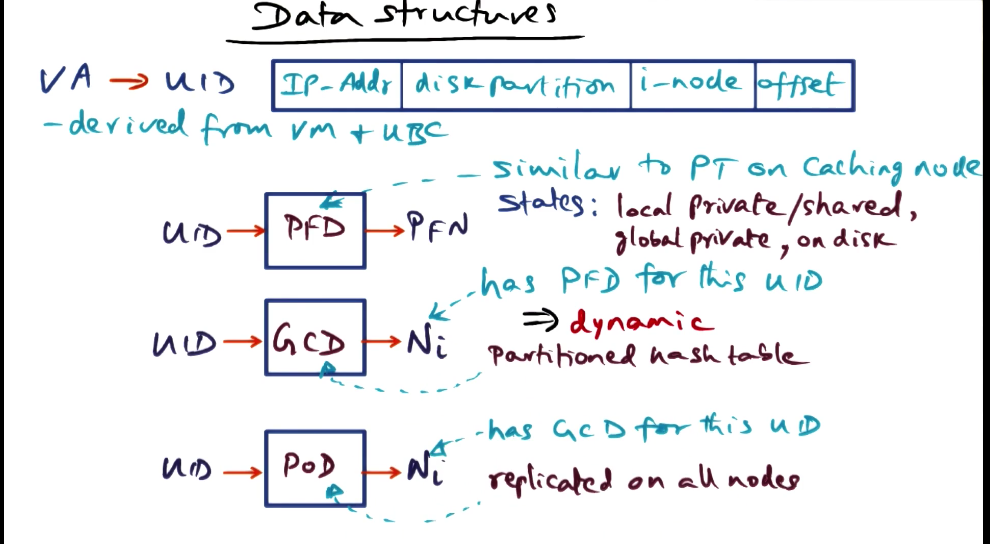

1. PFD (Page Frame Directory) - Like a page table. **A page table typically associates a virtual address with a physical page frame**. The PFD **has a mapping between a UID an the page frame that backs that UID**. The page can be in one of four different states: local private, local shared, global private, on disk. 
2. GCD (Global Cache Directory) - A distributed hash table that given a UID, will tell you which node has the PFD. Because it is partitioned, every node may not be able to determine where the PFD lives. How does it now which GCD to consult? See below :)
3. POD (Page Ownership Directory) - Maps GCD for UID. This is replicated on all the nodes. 

The **path for page fault handling** is as follows:

1. Convert VA to UID
2. Go to POD and ask who has the PFD for the UID? (this is local to the node requesting it because it is replicated)
3. Receive the node to query the GCD from
4. Query the GCD at the node from above for the node that holds the PFD. 
5. Receive the node to query the PFD from
6. Query the node for the PFD and grab the page you need.

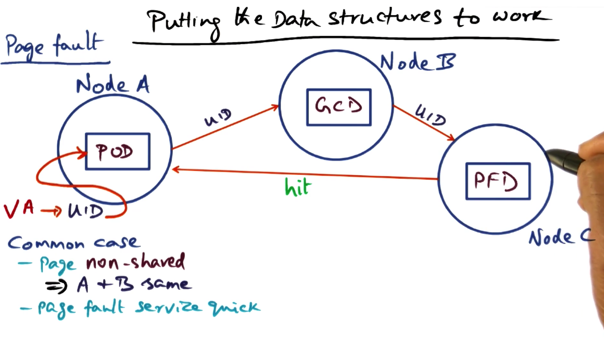

One thing to notice about the schema above is that the most common case for a node is that a page is non-shared. The page exists locally on the node. This means that the GCD entry for the page probably exists on the node that is experiencing the fault.

There is another case we need to talk about. What happens when you consult the node that is supposed to have the page frame that you care about and it has dropped that page?

In the case of eviction, the evicting node has to tell the owning node that it evicted the page. It is something that happens asynchronously, and it's possible that the data structures (GCD) haven't been updated yet to reflect this. 

Updating nodes about their evicted pages happens in a batch. This is because updating nodes individually for every eviction would be costly. **This is managed by the individual nodes paging daemon**. It is integrated with the GMS, and when the free list falls below a certain threshold, then it will start evicting pages and sending them to nodes that are storing fewer pages. This decision is made using the weight list.

Another case that is uncommon is that the POD information that the node has is stale. This happens when the POD information is being recomputed for the LAN. 

## Distributed Shared Memory

Let's look at another way to exploit remote memory. Let's look at a software implementation of distributed shared memory. We will create an OS abstraction that creates an interface for software that makes the system look like it is using shared memory.

### Implicit Parallelization

Let's start the section with a motivating question. Suppose we have a sequential program. How can we exploit the cluster of machines hooked up through the LAN?

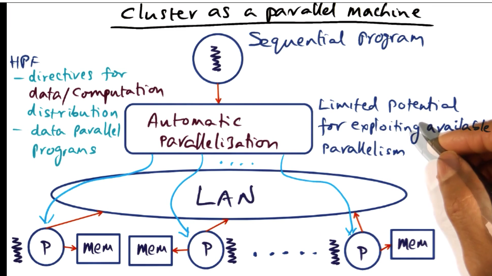

One possibility is to do **automatic parallelization**. In this scheme, instead of writing an explicitly parallel program, we write a sequential program and let someone else identify the opportunity for parallelism in the program and map it to the underlying cluster. 

Typically, this involves a compiler that knows how to sniff out parallel operations. High performance fortran is an example of this. This works pretty well for a certain class of programs - data parallel programs. Characteristics of these types of programs are that data accesses are fairly static and it is determinable at compile time. There is thus limited potential for exploiting parallelism if we result to implicitly parallel programming.

### Message Passing

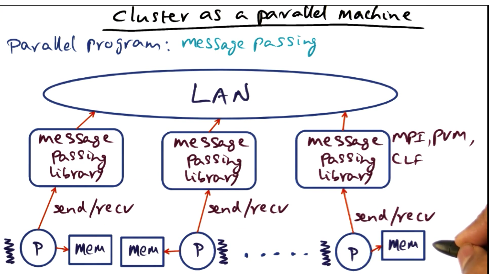

A different model is to write the program as a truly parallel program. 

There are two styles of doing this, we will talk about one of them, **message passing**. In this style, the **runtime system provides a message passing library which has primitives for an application thread to do sends and receives** to other nodes within the cluster. 

One way to think about this model is that it truly reflects the architecture of the system. It respects that each machine has its own CPU and memory. The second project of this class used MPI, to create barriers using message passing.

The only **downside to this style is that it is difficult to program** using this style. It would be easier if we had the notion of shared memory. 

### Distributed Shared Memory

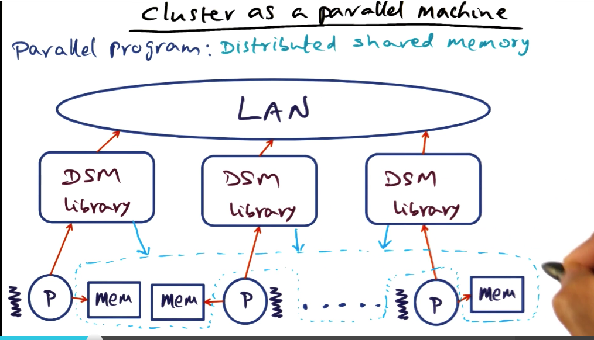

The alternative to message passing is the abstraction of distributed shared memory. **We want to give the illusion to the application programmer writing an explicitly parallel program that all of the memory that is in the entire cluster is shared**. The DSM library gives the illusion to all of the threads running in each of the nodes.

Therefore programs have an easier transition path from running on an SMP to running on a cluster. 

### Shared Memory Programming

We've already talked about shared memory synchronization. There are two types of memory access primitives. Locks and barriers.

Locks are used to protect data so that only one thread at a time can mutate the data. Barriers also help with coordination.

For more information please see [these notes](https://github.com/lkrych/aos_notes/blob/master/lectures/4_shared_memory.md#synchronization). 

If you are writing a **shared memory program, there are two types of memory accesses** that are going to happen. One type is the normal reads and writes to shared data that is being manipulated by a thread. The second type is for synchronization variables that are going to be used by the OS or a user-level threads library. In implementing the synchronization primitives, those algorithms are going to use reads and writes to shared memory.

### Memory Consistency and Cache Coherence

Recall that earlier we talked about the [relationship between memory consistency and cache coherence](https://github.com/lkrych/aos_notes/blob/master/lectures/4_shared_memory.md#memory-consistency-models). 

The **memory consistency model** is the **contract between the application programmer and the system**. It answers the 'when' question: **when a shared memory location is modified by a processor, how soon is that change going to be made visible to other processors that have that same memory location in their respective private caches**?

**Cache coherence** is answering the 'how' question: **How is the system implementing the contract of the memory consistency model?**

#### Sequential Consistency

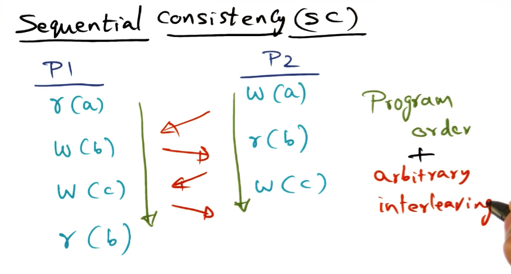

In sequential consistency, every process is making some memory accesses, and from the perspective of the programmer, the accesses are happening in the order that the program executes.

**Sequential consistency** says, that with two separate processors reading and writing to the same variable, **the accesses will happen in program order, but the executions will be arbitrarily interleaved between the processors**. 

A good analogy for sequential consistency is shuffling a deck of cards. 

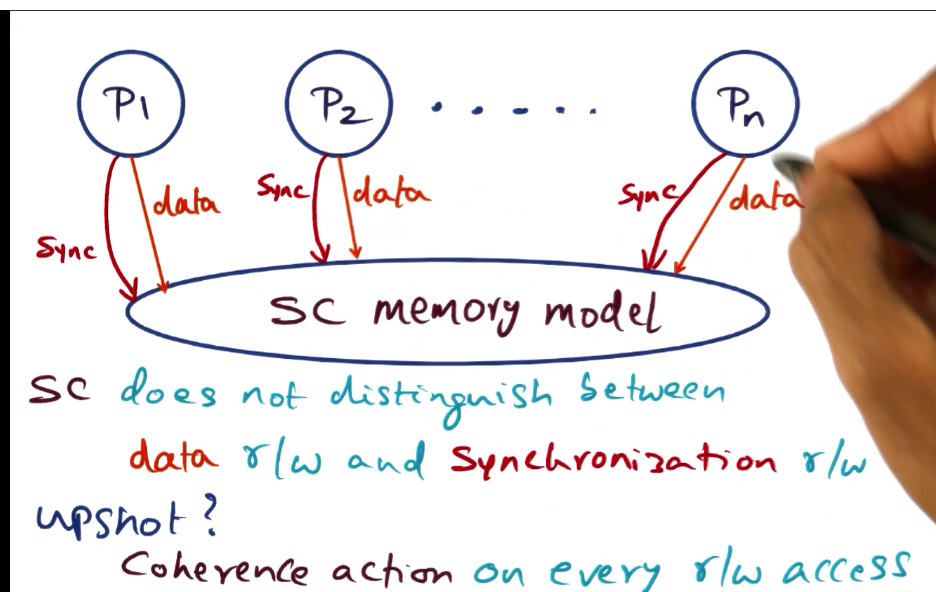

Let's come back to our parallel program now. We have multiple nodes all accessing the same memory. Some of the accesses are for data, some are for synchronization. **Sequential consistency does not distinguish between accesses for data and accesses for synchronization primitives.** This means there will be coherence action on every r/w access.

### Typical parallel program

In a typical parallel program, locks and other synchronization primitives make sure that parallel threads don't interfere with each other. 

The SC memory model does not know about the association between memory accesses emanating from the processor due to the lock primitive are different than the accesses in the critical section.

The cache coherence mechanism is thus going to be doing extra work than it needs to do. Because it's going to take action on every memory access. This means there will be more overhead for the SC memory model.

### Release Consistency

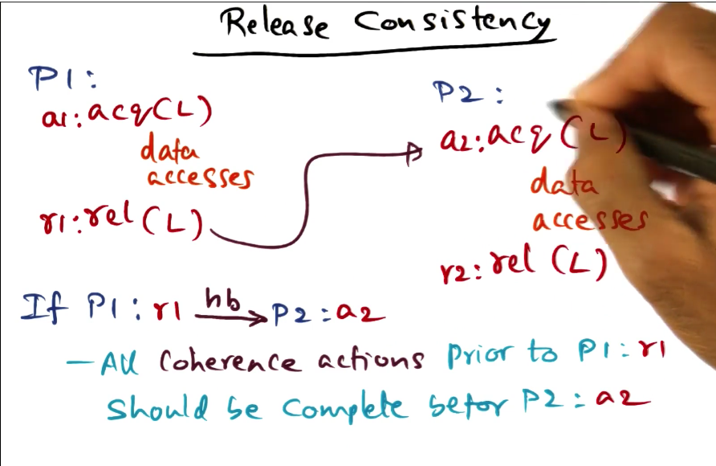

Parallel programs consist of several different parallel threads. If a thread wants to mess with shared data, it will acquire a lock. So long as they hold the lock, they can modify the structure. Once they are done, they will release the lock.

With release consistency, the model states that if a lock release happens before lock acquisition, coherence actions need to be taken before the acquisition happens. 

The idea of lock and release is actually general, you can think of arriving at a barrier and leaving a barrier as similar actions.

What this means is if the program is doing a shared memory access within a critical section that there will not be any processor blocking until lock release. In the SC model, this access would normally result in coherence actions and messaging on the interconnect to the other processes, which would block the processor that the thread was executing on.

#### Memory Model

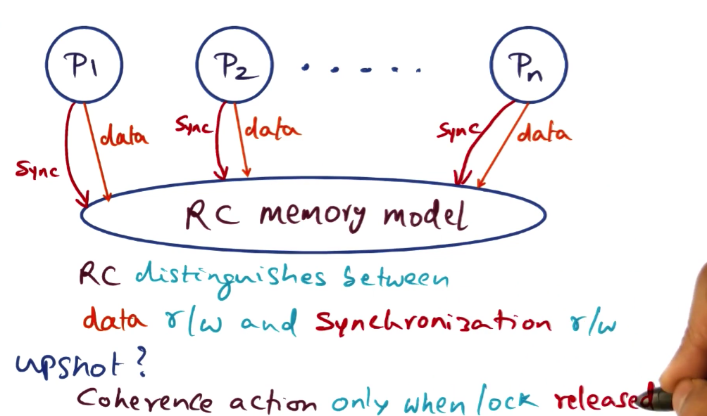

Let's return back to our program and analyze it with a release consistency model. Release consistency distinguishes between synchronization accesses and normal data accesses. This means the processor will be doing less work. The expectation is that you will get better performance in a shared memory machine if you use the RC memory model vs the SC memory model.

### Lazy Release Consistency

What we called release consistency is really an eager version of release consistency. In that model, all needed coherence actions are completed before a lock is released by a thread. The whole system is cache-coherent at the time of lock release.

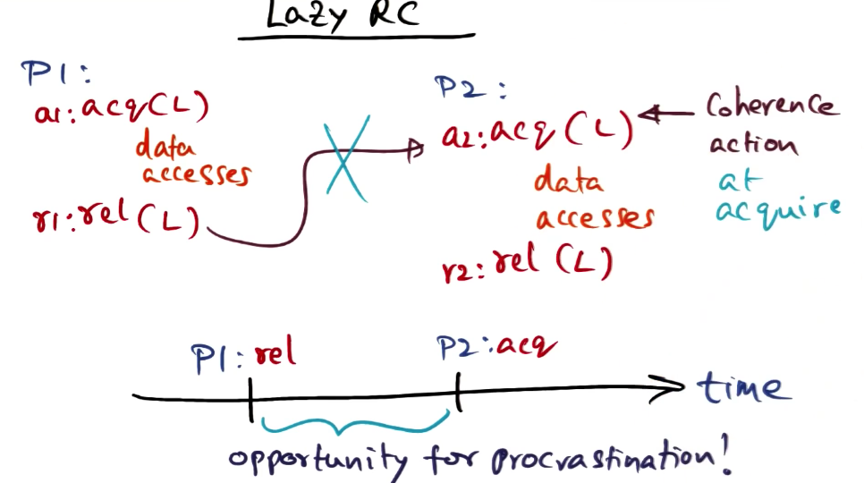

We have seen in a couple examples: lock acquisition algorithms (with delay), and process scheduling algorithms, that procrastination can sometimes improve system efficiency. 

In the lazy release consistency model, not all the coherence actions need to be done before a lock is released. They only need to be done before an acquisition of the lock.

### Comparing Eager to Lazy RC

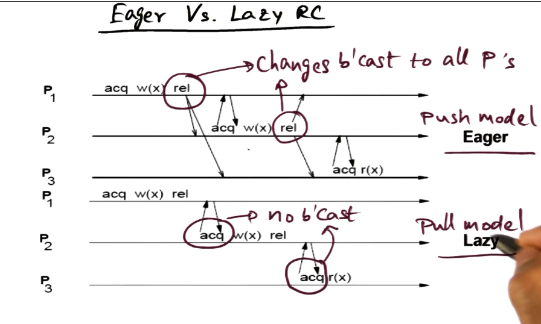

There is less communication overhead in lazy RC because it only needs to sync at acquisition time. This means it doesn't waste time communicating with processors that don't need to see the coherence updates yet. 

The downside of the lazy model is that there will be more latency at lock acquisition time.

### Software DSM

Let's talk about how these memory models come into play when building **software distributed shared memory**. We are dealing with a **computational cluster**, each node has its own private physical memory, therefore the **software system has to implement the consistency model for the programmer**.

In a tightly-coupled multiprocessor, coherence is maintained at individual memory access level by the hardware. Unfortunately, this fine-grained coherence will lead to too much overhead in a cluster. 

The first thought is to implement the sharing and coherence at the level of pages. Even in a simple processor, the unit of coherence isn't a single word. In order to exploit spatial locality, the block size in caches in processors tend to be bigger than the granularity of memory access that is possible from individual instructions in the processor. 

We are going to provide a **global virtual memory abstraction** to the application program running on the cluster. Under the covers, the DSM is partitioning the global address space into chunks that are managed individually by the nodes.

From the point of perspective of an application programmer, what this abstraction gives us is **address equivalence**, memory location X, is the same, no matter which processor or node it is executed on.

The way the DSM software handles maintenance of coherence is to have distributed ownership for the different virtual pages that constitute the global virtual address space. 

This means that the owner of a particular page is also responsible for keeping complete coherence information for that page. 

The **DSM software implementation layer implements the global virtual memory abstraction**. It exists on every single processor. It knows who and how to contact the owner of a page to get a current copy.

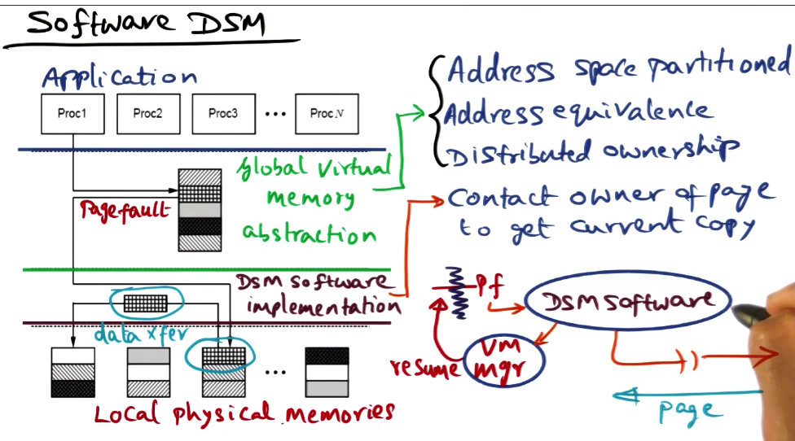

Previous implementations of the DSM software used what is called the **single writer protocol**. There is a directory associated with the portion of the global memory space managed by each node. The directory has information about who is sharing a page at a certain point of time. Multiple readers can share a page, but a single writer is allowed to have a page at a certain point in time. Once a node requests a page from the owner of that page, the owner has to make sure that it invalidates all of the copies that are being read at the current time. 

The problem with a single writer protocol is the potential for fault-sharing. Data appears to be shared even though programmatically it is not. What happens is that multiple locks exist in a single page, and two processors battle to ensure coherence of the page even though they are modifying two separate parts of the page. 

### Lazy Release Consistency with Multi-Writer Coherence

We want to maintain coherence at the granularity of pages because that is the granularity at which the OS operates. This makes it easy to integrate with the OS. 

However, we want multiple writers to write to the same page, recognizing that an application programmer might have packed many different data structures in the same page.

The OS has no way to distinguish memory accesses for synchronization primitives and typical memory accesses. It just knows the pages that were modified during a critical section and the page that a lock lives in. 

To support this new protocol, we are going to create a diff between the former state of the modified pages and the current state of the modified pages. The **next time the same lock is acquired**, say by a different process. We are going to **invalidate the pages that we know have been modified** by the previous lock holder. Once it is in the critical section, if it tries to access any of the pages that we have invalidated, it will trigger a coherence action. It consults the previous lock holder for the modifications that it stored in its diff and makes sure that the new lock holder can see these changes.

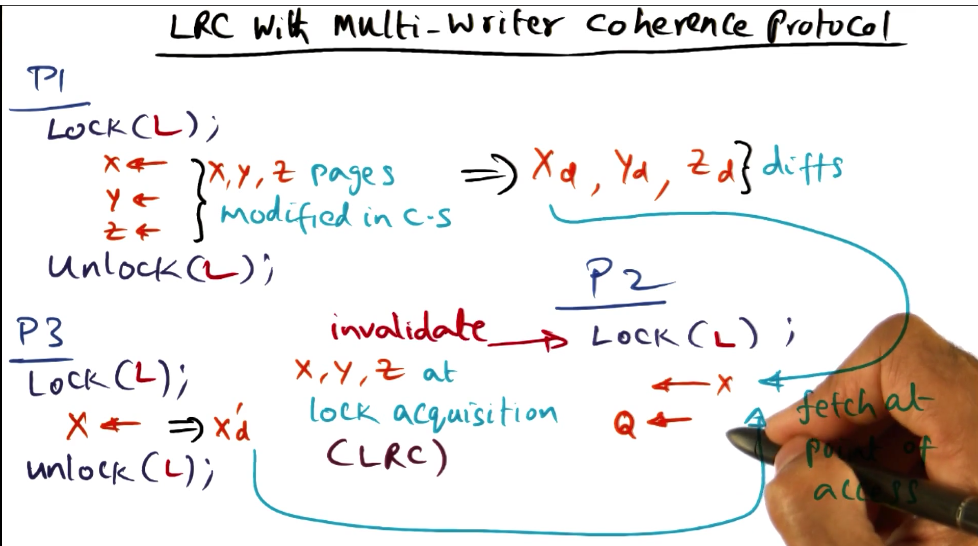

What happens when there are multiple locks that fit within a page in this protocol? The DSM software is not going to change its behavior. The only thing that determines which pages will experience coherence are the pages that are modified in the critical section of a lock. If the same page is modified by a different lock, say L2, the acquisition of the first lock will not pick up the changes from L2.

### Implementation

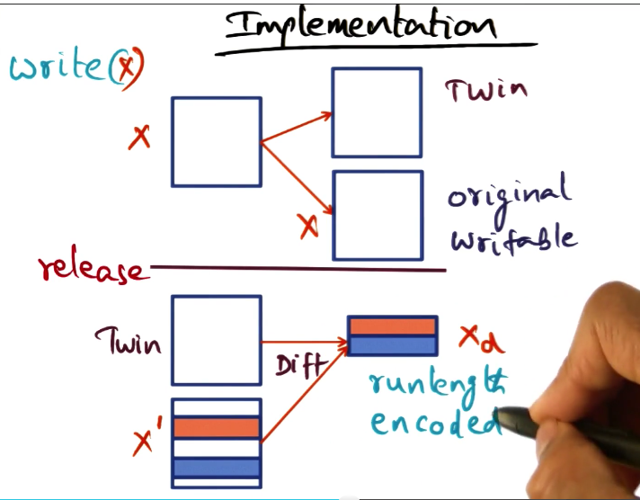

When a thread writes to a page X, at the point of the write, the OS will create a copy of the page, the original page will be writeable. The new copy is not referenced im the page table. 

When the thread releases the release point, the DSM software will compute the diff between the changes made to the original page and the copy. This diff will be run-length encoded, and thus only contain the changes.

Once the thread is completed, the page is write-protected to indicate that the page cannot be written to unless another thread comes into a critical section which means we have to do a coherence action. We can now delete the copy of the page.

As time goes by, there will be a ton of diffs lying around at all the nodes. Let's talk about a dramatic example where ten different diffs are stored in ten different nodes. In that case, when the lock that protects that page is acquired, the DSM software has to query all of those nodes for the diffs and create the coherent state for that page.

One of the things that happens in the DSM software is garbage-collection. If the diff timestamp exceeds a threshold, the garbage-collector will start applying the diffs to the owner of the page. 

### Non Page-based DSM

In this lesson we covered a particular example of DSM software that uses lazy release consistency and multi-writer coherence. Of course, distributed shared memory doesn't have to use pages as its unit of granularity.

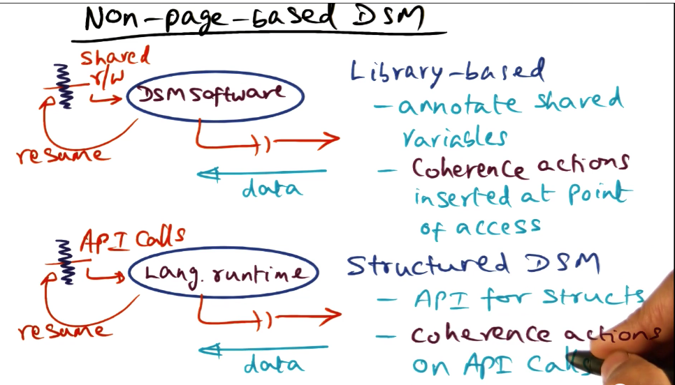

There are some implementations that track reads and writes on individual variables. How is this done? The programming library provides a way to annotated shared variables. Whenever the runtime detects that one of these shared variables has been modified, it traps to the DSM library which starts coherence procedures.

Another approach is not at the level of memory locations, but at the level of structures that are meaningful for an application.

### Scalability

DSM provides the same interface that an application programmer aspects from a shared memory multiprocessor. The DSM software looks and feels like a shared memory threads package. A good question to ask is whether the performance of a multi-threaded app scale up as we increase the processors in the cluster?

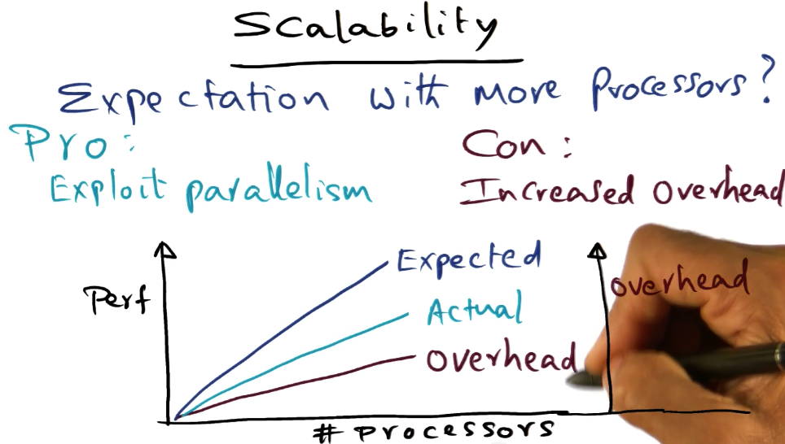

We are exploiting parallelism in our program and in our hardware. Unfortunately, there is much more overhead with cache coherence now. 

If the sharing is too fine-grained, we won't see much performance improvement. The basic principle is that **the computation to communication ratio has to be very high to see any chance of a speedup**.

## Distributed File Systems

Network file systems have evolved over time, but the central idea is still the same. There are distributed clients across a LAN, and there are file servers sitting on the LAN. The servers can be partitioned based on different types of users on the LAN. Because the disk is slow, caches are managed in front of the file servers. A centralized server is a serious bottleneck for scalability.

Instead of designing this system in a centralized way, can we create a distributed system?

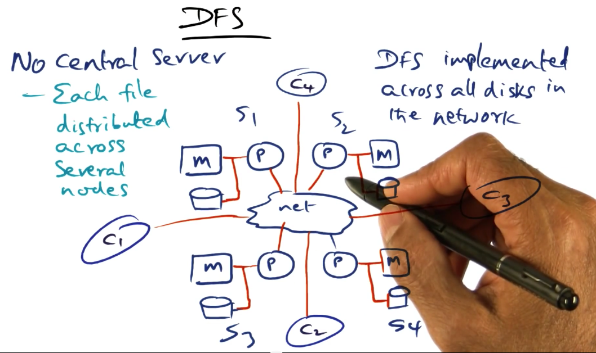

The vision of a **distributed file system** is that **there is no central server anymore, each file is distributed across several servers**.

The advantages of this design are that the I/O bandwidth is increased because multiple servers are now being used. Also, the management of the metadata for the files is distributed across the servers. Meaning there is less work per server. Furthermore, there is more memory available because multiple nodes are being used.

DFS wants to intelligently use cluster memory for efficient management of file metadata and caching. The DFS should try to avoid going to the disk as much as possible. A node should access the cache of other nodes instead of going to disk.

### Striping a file to multiple disks

To describe the ideas that are discussed in DFS, we need to cover some preliminaries. 

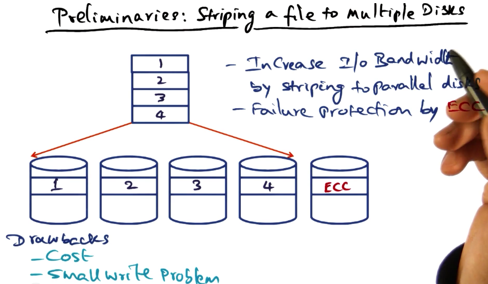

The first technology we are going to discuss is **RAID** **(redundant array of inexpensive disks)**. The idea is that a given disk might have a certain amount of I/O bandwidth available. If we string a bunch of disks together, we can have higher bandwidth. Unfortunately, this also leads to a higher chance of failure for an individual file because one of the disks could fail.

When you write a file in RAID, you do the following: You break the file into multiple chunks and write one chunk to each of the disks in the RAID. To help prevent file failure, we compute a checksum for the file and store it into an error-correcting disk.

The cons of RAID are higher cost and the so-called small-write problem, it is inefficient to store small writes across many disks. 

How can we solve the small-write problem? This brings us to another background technology - **Log-structure file systems**. 

### Log Structured File Systems

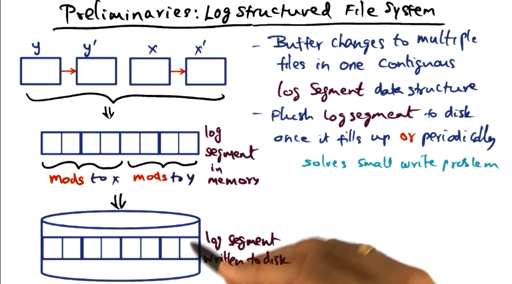

The idea here is that in making a change to file Y, we **store the diff/change to the file**, instead of the newly written data. This is called a log record. 

The file system keeps a data structure called the log segment in memory to hold all of the log records for a particular file.

Periodically, the log segment is written to disk so as to reduce the possibility that if the node fails that the in memory records are lost. This flushing also happens if a log segment fills up rapidly.

When a file is read in a log-structured file system, the file system has to reconstruct the file from the log segments for the file. This is a one-time cost though, as once it is read, it is stored in its entire state in memory.

### Software RAID

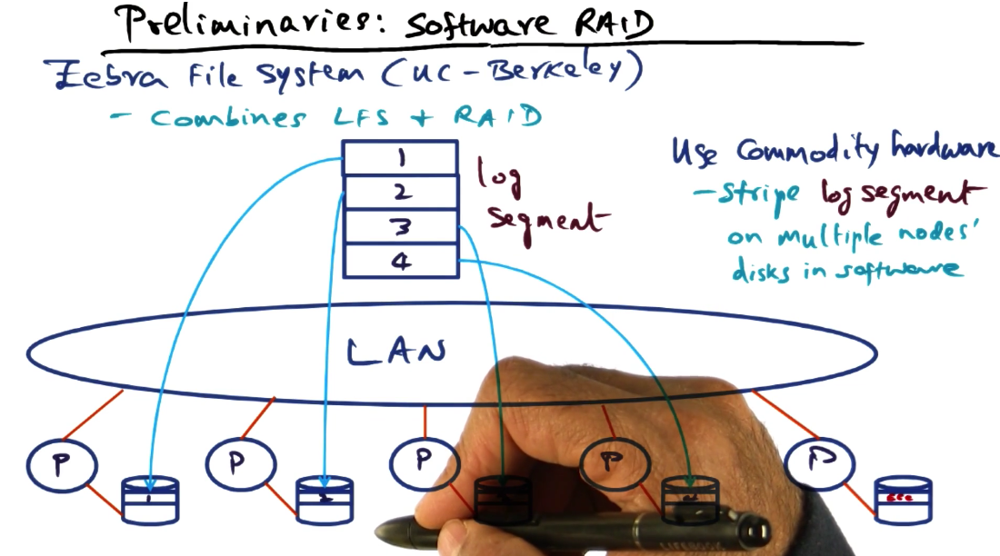

The next background technology is software RAID. We mentioned that hardware RAID has two problems, high-cost and the small-write problem. Fortunately we can alleviate the small-write problem by using a log-structured file system.

Unfortunately, the hardware RAID has another problem, multiple hardware drives. This is expensive and hard to manage.

On the other hand, with a LAN there is a lot of compute power, and every node has associated with it disks. **Could we not use disks on LAN to do the same thing that we did with hardware RAID?** Stripe a file across the disks in a LAN.

This was the idea behind the Zebra file system developed at Berkeley. It combines both the log FS and RAID technology across a LAN. We stripe log segments across the disks.

### Putting it all together

xFS is the distributed file system we are going to talk about. It builds upon the shoulders of prior technologies. 

* **Log-based striping** - Zebra
* **Cooperative caching**- from prior UCB work
* **Dynamic Management** - of data and metadata
* **Subsetting** - of storage servers
* **Distributed** - log cleaning