# System Recovery

## Table of Contents
* [Lightweight Recoverable Virtual Memory](#lightweight-recoverable-virtual-memory)
    * [Introduction](#introduction)
    * [LRVM Usage](#server-design)
    * [RVM Primitives](#rvm-primitives)
    * [How to use primitives](#how-the-server-uses-primitives)
    * [Transaction Optimizations](#transaction-optimizations)
    * [Implementation](#implementation)
    * [Crash Recovery](#crash-recovery)
    * [Log Truncation](#log-truncation)
* [RioVista](#riovista)
    * [System Crash](#system-crash)
    * [Rio File Cache](#rio-file-cache)
    * [Vista RVM](#vista-rvm)
    * [Crash Recovery](#crash-recovery)
* [Quicksilver](#quicksilver)

## Lightweight Recoverable Virtual Memory

### Introduction

System crashes can happen during power failures, hardware and software failures. As OS designers, we need to know how to build systems that can survive crashes. 

Many OS subsystems need persistence, for example, file systems have i-nodes that describe how files are persisted on disk. I-nodes are a persistent data structure. While the OS might manipulate that i-node, the OS needs to put it back on disk.

All of these subsystems need to have an in-memory cached copy of the persistent data that lives on the disk somewhere. If and when changes are made to these in-memory structures, those changes to need to be written back to the disk.

One possibility for achieving this is to make virtual memory persistent. The upshot of this is that the subsystems don't have to worry about flushing the persistent objects to the disk. Some other layer will handle this process. This also makes crash recovery really easy because all data at the time of the crash will be available. 

How do we make this abstraction efficient? 

The way the system works now is that the virtual address space of a process may have persistent data structures strewn all over the address space. If these structures are written to or manipulated and you want them to be reflected in storage, it requires that the system makes many I/O operations. Second, it could also mean that we may be writing to different portions of the disk. This can be very slow because there are latencies associated with seeking.

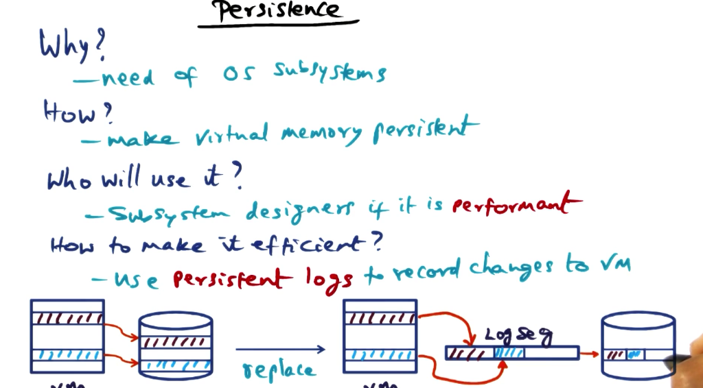

Instead of doing this, we would like to have a log segment, this is very similar to the [log structured system we saw in our discussion of xFS](https://github.com/lkrych/aos_notes/blob/master/lectures/7_memory_systems.md#log-structured-file-systems). 

The idea is that when we are makinng changes to the virtual memory and we know which portions are persistent, every time we write to a persistent in-memory data structure, then we write a log record that corresponds to the change we made to the data structure. The log segment is a data structure that supports this subsystem. It is a collection of these log records written contiguously. Then we commit the changes to the disk and store it contiguously on the disk. 

This design eliminates random writes/invidual I/O operations to the disk because we are recording them as changes. We also eliminate the disk write inefficiencies. 

### Server Design

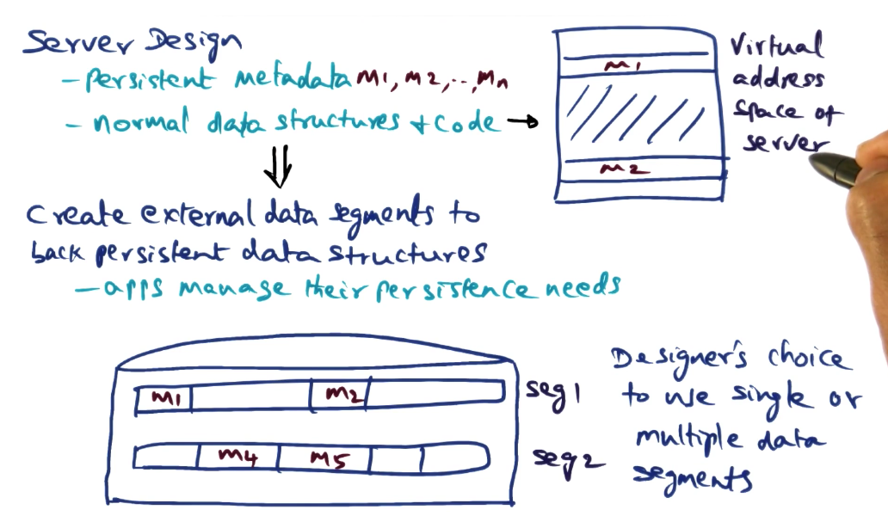

Let's discuss how we would design a server that requires persistent support using a persistent virtual memory.

Notice that the entire virtual address space doesn't need to be persistent. Because we are designing this system, we know which data structures need to be persistent. 

We allow an application to bundle these data structures together into an external data segment. This is a data segment that lives in the virtual address space but is directly mapped to persistent data on the disk.

The application establishes this mapping at startup but can easily unmap it during the runtime if it needs to. 

### RVM primitives

We do not want the in-memory data structures to immediately start writing to disk when they are modified. That would result in a lot of random writes. 

The better model is to **use a log-segment to aggregate the changes we are making to the virtual address space so that the log-segment can be committed to the disk** to record the changes that have been made. 

RVM is a runtime library that can be used by application developers.

RVM provides three initialization primitives:
* `initialize(options)` - identifies the log segment to be used by the server process for recording changes to the persistent data structures of this process. Every process can declare its own log segment for use in managing its persistence.
* `map(region, options)` - Allows the application to say what is the region of the virtual address space that they want to map to an external data segment. There is a 1-to-1 correspondence between an address range in the VA space and the external data segments. 
* `unmap(region)` - Unmap does the reverse, it decouples the address range from the external data segment.

In the body of the server code, the following actions are defined. 
* `begin_xact(tid, restore_mode)` - alerts the RVM runtime that the application is about to make changes to persistent data structures after this call.
* `set_range(tid, addr, size)` - the very first thing that an app developer would do between a begin and end. This establishes the portion of the address range that is going to be modified in the critical section.
* `end_xact(tid, commit_mode)` - alerts the RVM runtime that the application is not going to make any more changes to persistent data structures after this call. **After this call, all of the changes need to be flushed to the disk.**
* `abort_xact(tid)` - signals to the RVM runtime that all the changes that the application made bound between the begin and end should be aborted and not be committed to the disk.

As we said earlier, RVM needs to be efficient or no one would use it! The runtime does not actually write the persistent data directly to the data segments. Instead it writes the changes that it made to the block of address specified by the `set_range` call as a redo-log in a log segment that was named in the `initialize` call.

The log segment is an in-memory data structure specified by the RVM runtime. Once a transaction commits, the log segments that contains the changes that have been made to the in-memory version of the persistent data structures will be committed to the disk. 

There are two parts to managing the log: **flushing and truncation**. 
**Flush** - At the point of commitment the log has to be forced to the disk because you want to persist it.  
**Truncate** - You need to apply the changes from the log to the external data segments and  delete the log-segment. 

They are provided as primitives to the application, but **both of these are done automatically by the runtime**.

One optimization features provided by the runtime is an option to the `end_xact` call that informs the runtime that the developer does not want the system to flush the changes to the disk yet, but that she will take care of the flushing.

The main thing to take away is that the RVM API is simple :).

### How the Server uses primitives

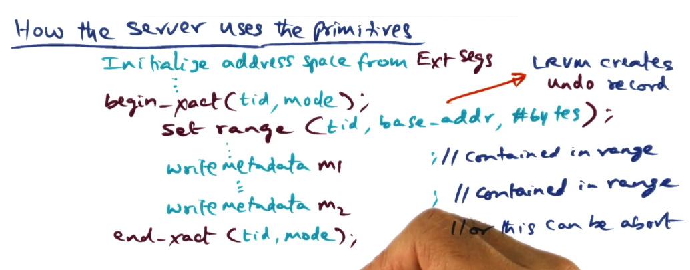

The first thing the runtime does inside a transaction is to create a copy of the chunk of the address space specified in the `set_range()` call. This copy is known as the **undo record**. It is set aside because it is possible that the developer will call `abort_xact()`, and it needs to make sure that none of the changes made to the persistent data structures are actually made.

LRVM creates the undo record only if it is needed by the transaction semantic, in the `begin_xact()` call there is a mode specifier that the user can specify to the runtime whether that transaction could ever abort. 

In any event if the transaction eventually commits, at that point it will throw away the undo record. 

Finally, if the transaction commits by calling `end_xact()`, then all the changes made to the persistent data structures need to be written to the log segment that records the redo logs for this thread. At this point the runtime creates a **redo log of the changes made to the region** specified by `set_range()`. The redo log is a data structure managed by the runtime in memory that corresponds to the changes made to the external data segments. It should not be confused with the external data segments themselves. 

The redo log is not available as a log entry in the log segment created at the beginning of the transaction. The runtime then needs to flush the redo log to disk synchronously, this means the `end_xact()` call waits for the redo log to be written to disk, then it returns. 

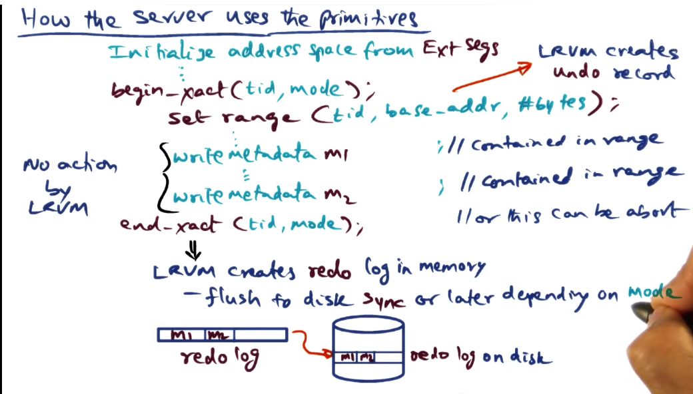

Once the transaction is committed, the redo log has been written to disk. Then the undo record is no longer needed, and can be thrown away. 

### Transaction Optimizations

The **no_restore mode** in `begin_xact()` signals to the RVM runtime that the transaction is not going to abort. This means that the undo log doesn't need to be created.

The **no_flush mode** in `end_xact()` tells the runtime that there is no need to synchronously flush the redo log to disk. It will happen, just not right after `end_xact()`. The upshot of this is lazy persistence. The downside is that there is a window of vulnerability. 

### Implementation

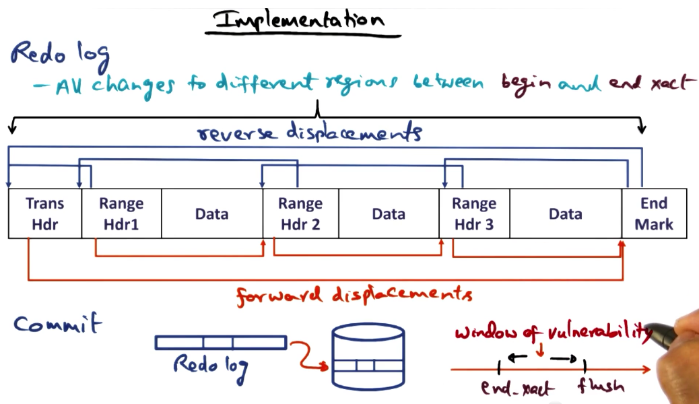

The goal is performance-efficient implementation of RVM.

The first strategy that is used to record changes to the persistent portion of the virtual memory is a logging strategy called **no-undo-redo-value-logging**.

The undo log is kept in memory, not on disk. 

On the other hand, the redo log is committed to memory. In committing the changes to memory we are **only writing the new value records** of committed transactions. 

Upon commit, we replace the old value records in the virtual memory with the new value records. This is automatic because it has created an undo record of the old value records and all the changes that the developer is making are happening in memory to the data structures. In other words, **we are mutating the persistent data structures**. We keep the undo log around so that we can catch an aborted transaction.

The redo log data structure allows traversal in both directions.

### Crash Recovery

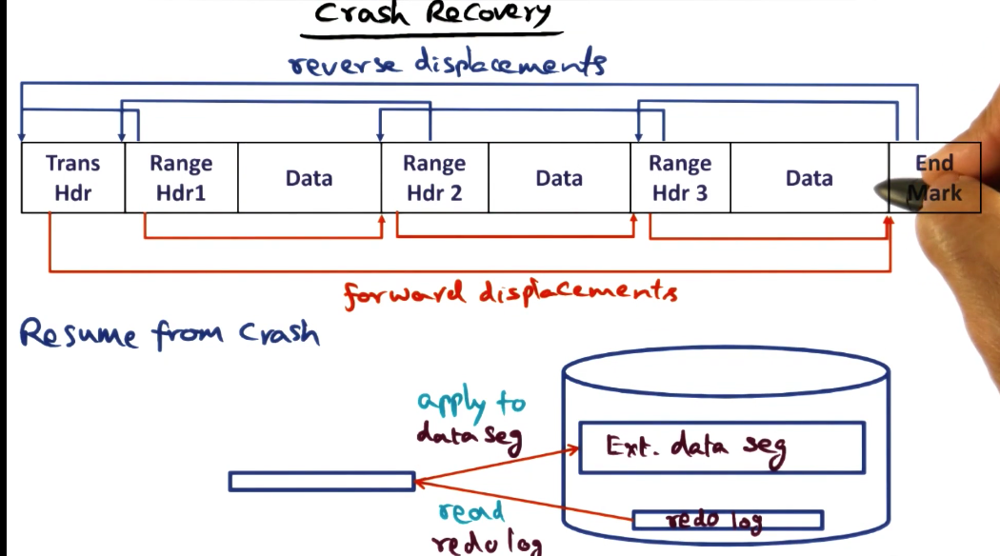

If you look at the redo log, between the transaction header and the end mark are all the changes that have been made in that critical section. 

When we resume from the crash we need to make sure that the external data segments are updated with all the changes that have been made and recorded in the redo log, but not yet applied to the data segments.

During crash recovery, we read the redo log from the tail displacements, and then apply them to the external data segments on disk. 

### Log Truncation

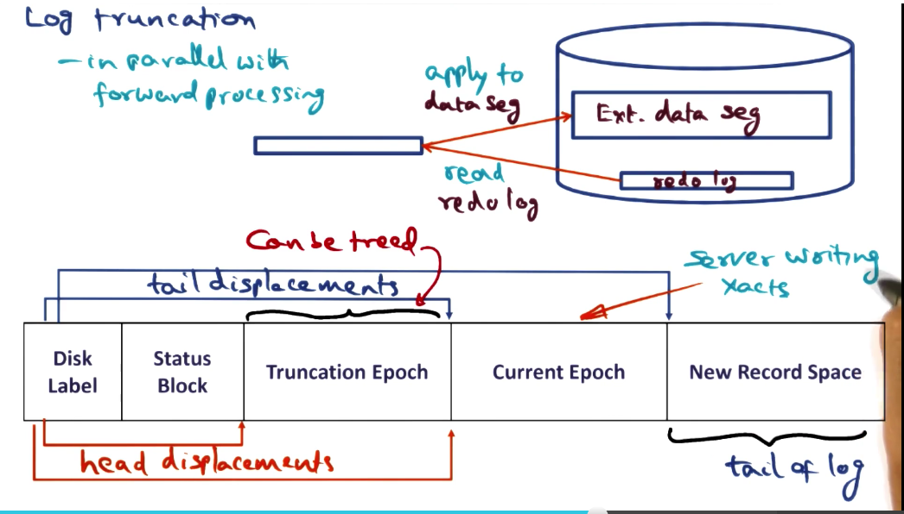

If crashes don't happen that often, but the system is progressing along, we are going to create a lot of log records on the disk. This means that we need to talk about log truncation.

In the case of LRVM the logs are clogging the disk space. If an application needs to map a data segment on disk, we need to know whether or not that are pending logs that need to be applied to that segment.

Log truncation is the process of reading the logs from disk and applying them to the disk. This sounds suspiciously like the crash-recovery algorithm. That's because it is! It uses the crash-recovery algorithm to truncate logs. 

We don't want to stop processing to do truncation, so we do it in parallel. LRVM allows this to happen by splitting the log record into epochs. Epochs chunk the log into segments, and the truncation process only needs to care about log segments that have been designated to be truncated.

The bulk of the LRVM implementation goes into doing log truncation efficiently.

## RioVista

The APIs provided by LRVM are designed to remove an important pain point for system developers, system crashes. 

In LRVM changes to virtual memory are written as redo logs at the end of a transaction. These logs are forced to the disk at the end of the transaction as commit records made to virtual memory. By default, transaction use synchronous I/O.

RioVista asks the question as to whether we can eliminate synchronous I/o.

### System Crash

There are two orthogonal problems that lead to a system crash:
1. **Power failure** 
2. **Software Crash** 

RioVista poses a question, supposing the only source of failure for systems are software crashes, how does that change the design and implementation of failure recovery?

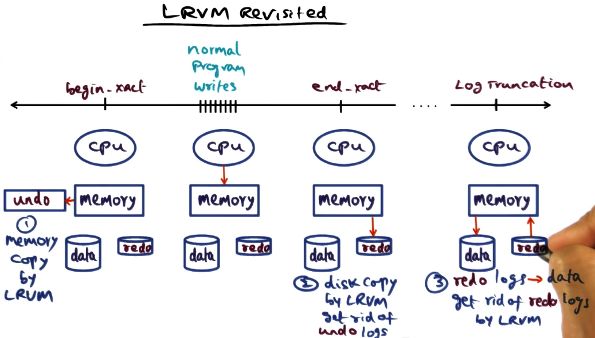

Let's revisit the semantics of LRVM.
1. When a transaction is started, we know that the application is going to modify some portion of memory.
2. Let's create a memory copy of the old contents of that memory so we can have a backup if an abort is called.
3. In the body of the transaction the program is doing normal program writes. 
4. The application reaches the end transaction. At that point, LRVM is going to write a redo record onto the disk, this record contains all of the log segments that describe the changes the application made to the persistent memory objects. 
5. At some point the redo log is applied to the disk. The redo logs are then truncated.

If you decide to defer the automated flush, there is a period of vulnerability wherein if the power goes out before you've written the redo log to disk, then you lose all the state that you've been storing. 

The RioVista designers suggest that we **put a battery backup on our DRAM so that we don't have to worry about power failures**. 

### Rio File Cache

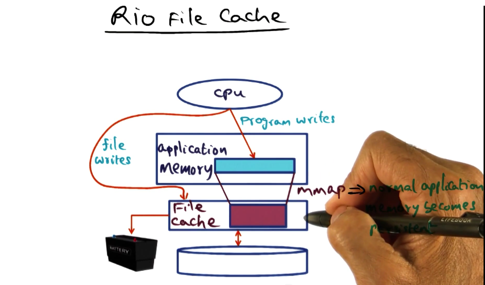

Before we talk about how we can implement RVM efficiently with a battery pack DRAM. Let's first understand how we can use a battery pack DRAM to implement at persistent file cache. 

Typically file systems use a file cache to hold data that it has brought to disk for efficiency of manipulation of programs running on the processor. When we talk about a persistent file cache, we mean that even if there is a power failure, the file cache will still be available. To do this we will hook up the file cache to a battery so the power never goes away.

There are two ways to use the Rio File Cache. The first is when a process does a file write, they are actually writing to the in-memory copy of the file. Typically OS writes buffer the file to DRAM and then write them out to the disk. This is called write-through. To force a write to disk in Unix systems, application programmers will use a `fsync` call.

Similarly another common operation that is done is that Unix allows files to be `mmap`'d which means it is mapped into memory, and if an application maps a file into memory and then writes to it, those writes will become persistent because the writes are backed by the file cache. 

With the Rio File Cache, file writes by a process as well as memory-mapped writes from a program become persistent.

If there is a system crash, whether it is power failure or software crash, the file cache will be written the disk for recovery. One really nice thing about this system is that no synchronous writes are needed to the disk. Writebacks can be arbitrarily delayed.

### Vista RVM

Vista is the RVM library that has been implemented on top of the Rio file cache. 

The semantics of RVM are exactly the same as what we saw earlier. It is just that the implementation takes advantage of the fact that it is sitting on top of a Rio File Cache.

To do this we will bring the data segment that needs to be persisted into the file cache. We will then map it into virtual memory.

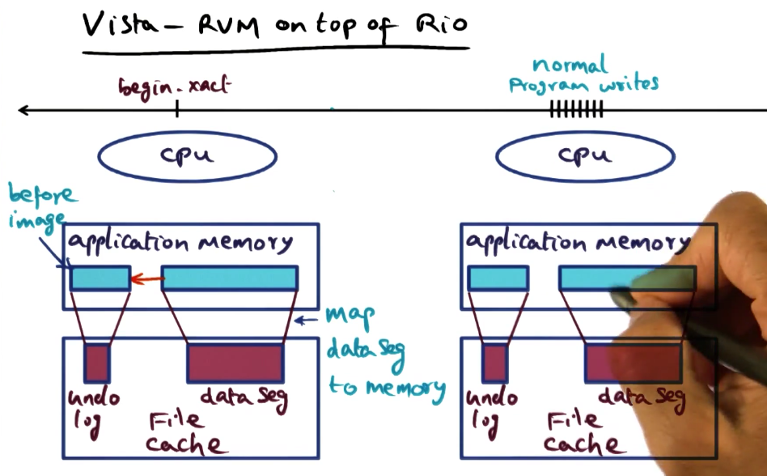

When we hit the begin transaction call, we are going to make a before image of the portion of the virtual memory that we are going to modify. This image is mapped to the file cache and that will serve as the undo log. 

When the application program writes to the memory-mapped data segment in virtual memory, these changes will be persisted automatically in the file cache. 

The changes will already have been committed so there is no need for the synchronous I/O in the typical RVM implementation. The only thing we need to do is get rid of the undo log.

If the transaction is aborted the before image is copied back into the virtual memory segment. This will correct the changes to the data segment automatically.

### Crash Recovery

For crash recovery, we treat it like an abort. We recover the old image from the undo log (it is in the rio file cache), we apply it to the virtual address space that it corresponds to and then we are back in business.

### Vista Simplicity

The implementation of Vista is very simple. It is so simple because there are no redo logs or truncation calls. Check-pointing and recovery code is simplified adn there are not group commit optimizations.

## Quicksilver

Quicksilver asks the question, if recovery is so critical for so many subsystems, shouldn't recovery be a first-class citizen in the design of OS?

### Distributed System Structure

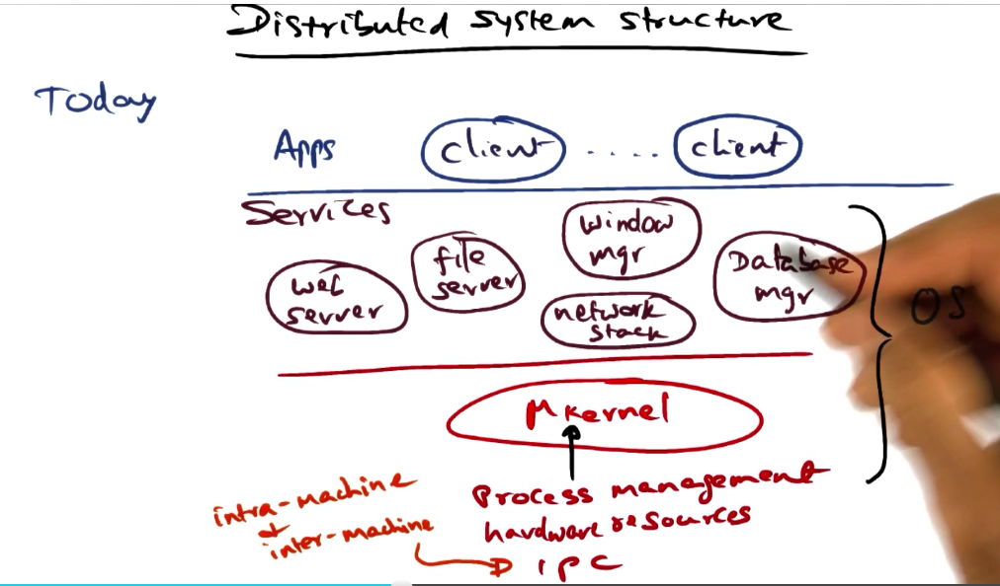

If you look at the structure of distributed systems you will likely see three layers, applications, services and a microkernel. The services and the microkernel are part of the OS. This structure lends itself to extensibility and high-performance.

### Quicksilver system architecture

The architecture of quicksilver looks similar to the previous image of distributed services.

Quicksilver was conceived of as a workstation operating system. The ideas enshrined in it predate or were concurrent with many things we take for granted.

What sets it apart was integrating a service to manage transactions across servers. 

### IPC Fundamental to System Services

Because quicksilver is a distributed OS, IPC within and on the local area network is a crucial component.

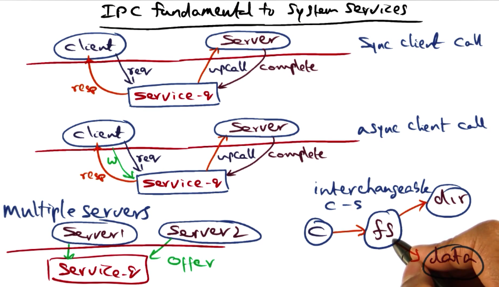

In the kernel, a data structure called the service-q is created by the server that wants to serve requests from clients. Clients make requests to the service-q, the kernel makes an up call to the server, and the server executes the request and then passes it back to the service-q, the kernel then gives the response back to the client.

Any process, anywhere in the network can make requests to the service-q. Any server process in the entire distributed system can service requests coming into the queue.

There are some fundamental guarantees guaranteed by Quicksilver which are that there is no loss or duplication of requests.

The IPC call can also be asynchronous. This means the client doesn't have to block on the response.

The only reason we are talking about this is because the recovery mechanism of quicksilver is tied intimately to IPC.

### Bundling IPC with Transactions

The secret sauce of recovery management is transactions. These are lightweight transactions. They are very similar to the transactions in LRVM. 

The IPC calls are tagged with a transaction ID.

Let's say a client makes an IPC call to a server. Under the covers, the client contacts the quicksilver kernel on the node it is on, which in turn, contacts the communications manager service on the quicksilver OS. This manager contacts the communication manager on Node B via the kernel on Node B. Depending on the nature of the client and the server, there will be state associated with the interaction.

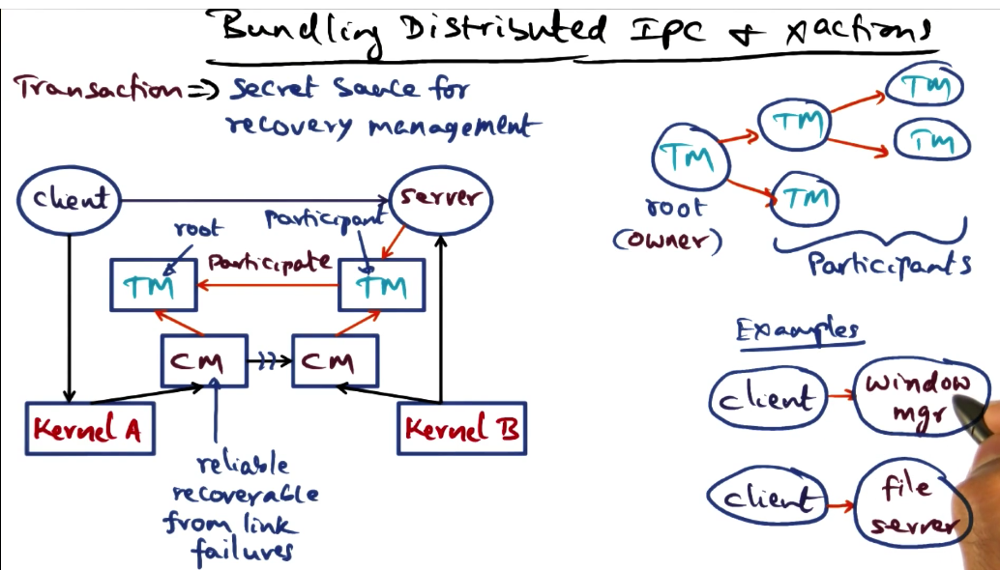

The communication manager may itself have state when it is communicating with its peer. We would like to make sure that this state as well as the client-server state is recoverable from failure.

Under the cover, the communication manager contacts the transaction manager, this manager contacts the transaction manager on Node B. This establishes a transaction link as a way of recording the client-server interactions as a way of recovering state if there is a problem with the communication.

The creator of the transaction is the default owner of the transaction. This is known as the root of the transaction tree. The other transaction manager is just a participant. The owner is the coordinator. **There is no extra overhead with transactions because they are built into the IPC calls.**

A chain of client server interactions leads to a transaction tree. 

### Transaction Management

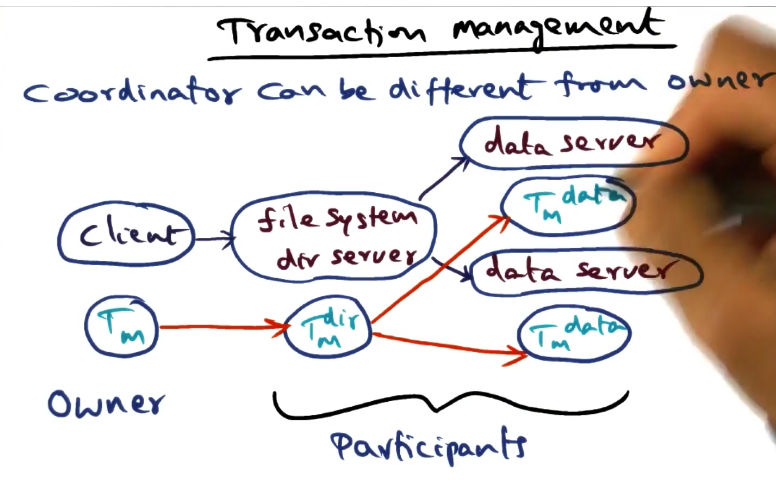

The owner of a transaction tree has the right to delegate ownership to someone else. The most fragile parts of a distributed system are the clients. 

In that sense, if the root of the transaction tree is on a client node, cleaning up the breadcrumbs that are left across the IPC path could be difficult if the client goes away.

The heavylifting that quicksilver does in keeping track of the ordered trail of IPC across the nodes.

### Distributed Transaction