# Giant Scale Services

## Table of Contents

* [Introduction](#introduction)
* [Systems Issues in Giant Scale Services](#systems-issues-in-giant-scale-services)
    * [Load Management at the Network Level](#load-management-at-the-network-level)
    * [Load Management in the Transport/Application Level](#load-management-in-the-transport-or-application-level)
    * [DQ Principle](#dq-principle)
    * [Replication vs Partitioning](#replication-vs-partitioning)
    * [Graceful Degradation](#graceful-degradation)
* [MapReduce](#mapreduce)
    * [Why MapReduce?](#why-mapreduce)
    * [MapReduce Runtime](#issues-handled-by-mapreduce-runtime)
* [CDNs]()

## Introduction

In this lecture we are going to talk about systems issues in large data centers, how to program big data applications, how to store and disseminate content on the web. 

## Systems issues in giant scale services

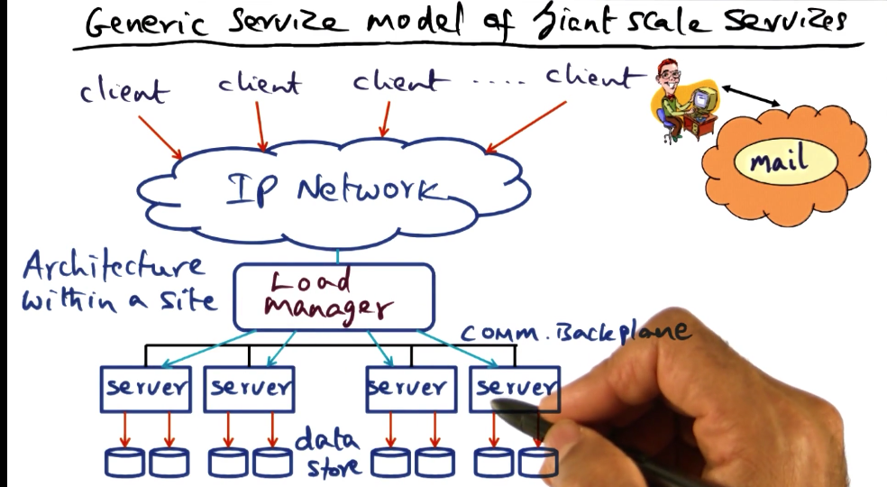

Let's talk about the architecture of giant scale services. The architecture of a site will probably look like the image above. 

A **load manager** is the first point of contact with the outside world. It **balances the traffic** between the horizontally scaled systems behind it. Any of the servers may be able to handle any of the client requests. 

Client requests are independent of one another, they can be **handled in parallel**.

Another role of the load manager is to hide partial failures. There are so many nodes behind this manager. **It's not a question of if something will fail, but when**. So the load manager needs to ensure that the incoming client requests are shielded from these inevitable failures. 

**Computation clusters are the workhorses of giant scale services.** Any modern data centers employ thousands and thousands of these nodes connected by high-performance networks. Each node in a cluster might be an SMP. 

The advantages of managing identical nodes in a data center in a horizontally scaled manner is that it is much easier to manage, and keep costs down.

### Load Management at the Network Level

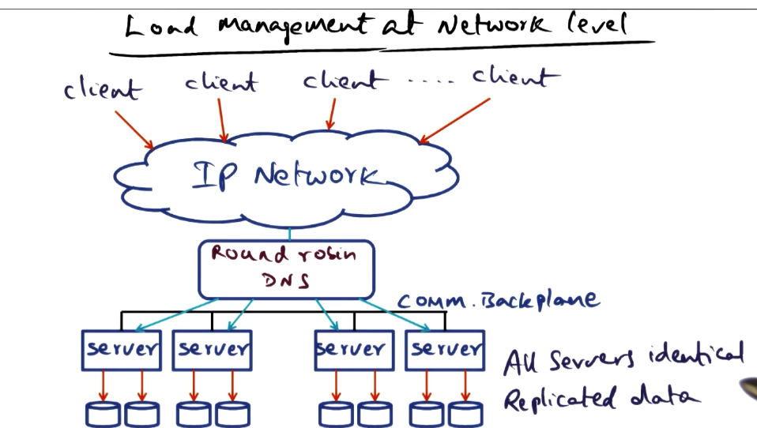

The load manager may be operating at the **network level**. In this case, the **load manager is a round robin DNS server**.

 When a client request comes in, they all have the same domain name to come to this particular service. The DNS server will direct the request to any of the nodes behind it by **returning a different IP (corresponding to a server) for the same domain name**. 

 The pro to this strategy is that there is good balancing because the scheduler can pick the least-loaded server. 

 The con is that it cannot hide downed server nodes from the external world. 

 ### Load Management in the Transport or Application level

 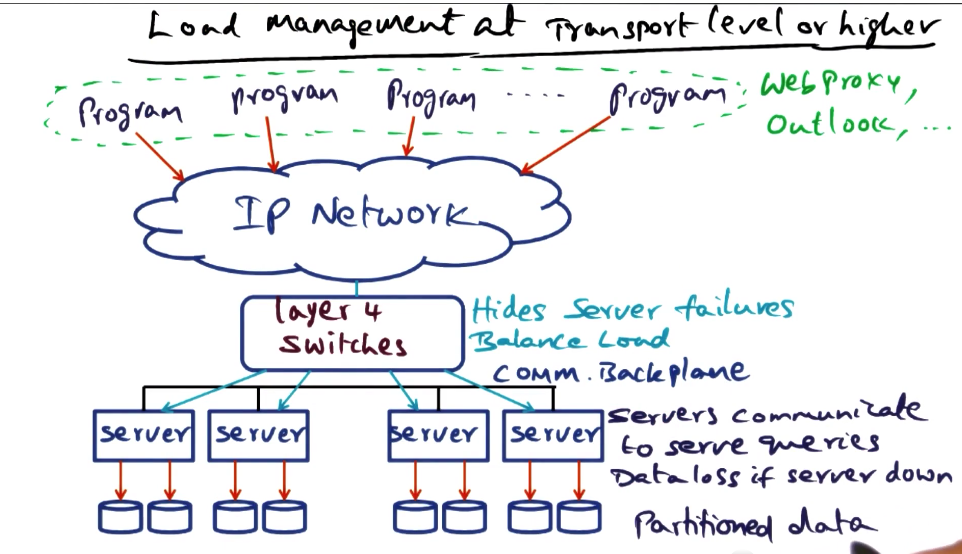

 The load manager could be **layer 4 switches**, or even higher-level switches. This **gives the system the opportunity to dynamically isolate downed server nodes**. 

 It is also possible with this architecture to have service-specific front-end nodes. 

 ### DQ Principle

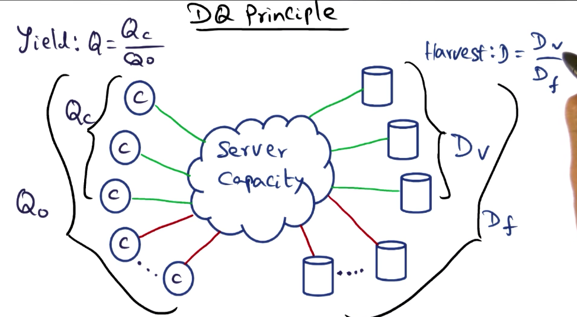

A service provides an offered load, in reality it can only provide a portion of that capacity because of random failures. This is known as the yield Q.

Each query that comes into the server might require processing all of the data in the scope of that server. This corresponds to the entire data corpus, however, in reality it can only process a portion of the data because of random failures. This value is known as the harvest of D. 

The **product of these two values**, the harvest D, and the yield of Q, **represents a system limit**. Said differently, we can **increase the number of client's served, if we reduce the amount of data that needs to be referenced** in a query.

As a system administrator, we have some choices to play with. The important thing to note is that in giant scale services, **the performance is limited by the network, not I/O capacity**.

A traditional measure that has been used in servers is IOPs (I/O operations per second), these are particularly meaningful in database applications. However, this isn't that meaningful in giant scale services which are bound by the network. DQ is a better metric.

Another metric is **uptime**, the ratio between the difference between mean time to failure and mean time to repair, and mean time to failure.

### Replication vs Partitioning

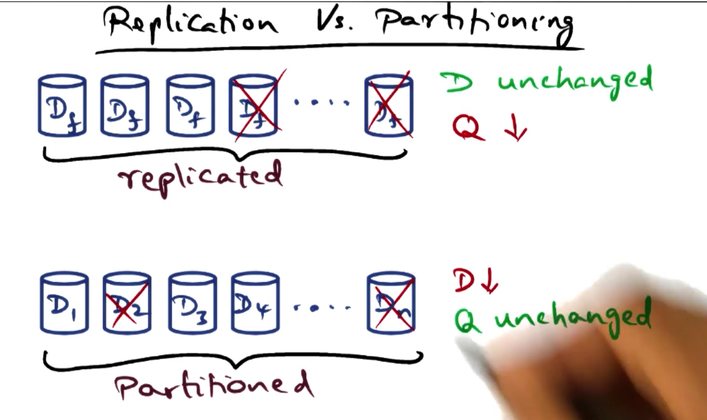

A system administrator has a choice to either replicate the data behind a service or to partition it.

In a **replicated system**, **every data store has the full corpus of data needed to serve a particular request**. Failures are inevitable in a giant scale service. What happens when we have replicated failure in a replicated system?

* The harvest is unchanged, but the capacity/yield goes down. A client request can be redirected to one of the live servers.

In a **partitioned system, every data store contains a portion of the data**. If there is a failure, then some of the data will be unavailable.

* The harvest will come down, but the capacity/yield will stay the same. 

One important thing to note is that **DQ is independent of whether we are replicating or partitioning the data**. This is because these services are network-bound. The only case where this is not the case is when a service requires a high amount of writes. In this case, replication may require a higher DQ.

Partitioned data should definitely be replicated.

### Graceful Degradation

The DQ principle is often helpful for managing graceful degradation of a service. DQ defines the system capacity. If a server is saturated, meaning we've reached the limit. Then we have the choice.

We can either keep the harvest the same, meaning every client request will have complete fidelity, but the amount of clients served will go down.

The other option is to keep the volume of the client steady, but to decrease the data harvest. The fidelity of the results will be less than 100%. We are keeping more of the community happy.

### Online Evolution and Growth

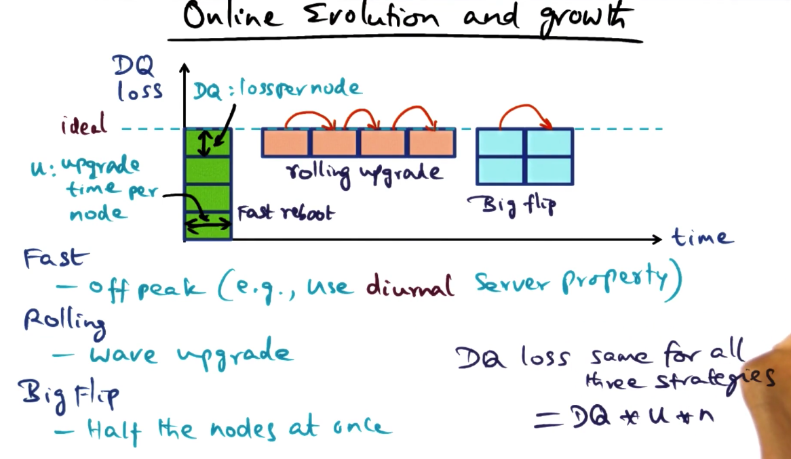

Services are continually evolving. This means the **servers at the datacenters need to be constantly updated**. Nodes need to be replaced or updated.

There are various strategies for doing this.

One is the **fast reboot** which means taking down all the services at once, update them and then turn them back on. This has to be done at offpeak times to not be incredibly disruptive. 

Another strategy is **rolling upgrade**. Bring down 1 server at a time. This means there is no loss in service, however, there will be disparities between individual services and there will be a loss in total yield.

A third alternative is the **big flip**. Bring down half the nodes at once and swap 'em. The service is always available but at 50% capacity.

No matter what strategy is taken, the DQ loss will be the same. 

## MapReduce

How do we program services on top of datacenters? How do we exploit hardware parallelism in these clusters?

The MapReduce programming paradigm helps solve some of these problems. Specifically, they help solve **embarrassingly parallel computations**, where no coordination or synchronization is needed amongst the parallel threads that comprise the applications.

MapReduce input is a set of records identified by **key-value pairs**. The big data application developer will supply the runtime environment with **two functions, map and reduce**. These are the **only two functions that the developer needs** to supply.

Both **map and reduce take user-defined key-value pairs as inputs and produce user-defined key-value pairs as outputs**.

Let's look at an example. Imagine we have a corpus of documents, and we want to get a count of how many times specific words are found in those documents.

The input key space will be the document filename, the value will be the contents of the file.

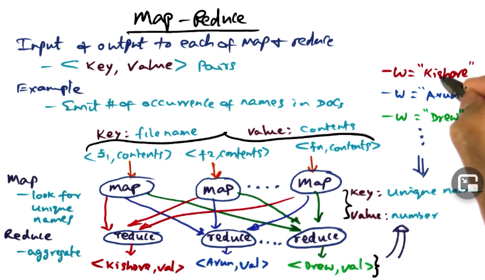

In this example, the **user-defined map function is looking for each of the unique words that we are interested in**. We will take as an input a specific file, and emit a value that corresponds to the number of times that word exists in the input file. This process is embarrassingly parallel, we can spawn as many map functions as we need. 

The output of the mappers are the input to the reducers. The **reducers will aggregate all of the emitted input** from the mappers. 

### Why MapReduce?

Several processing steps in giant scale services are expressible in the MapReduce framework. What are the common properties of these examples?

* embarrassingly parallel
* common in giant scale services
* all on big data sets

All the heavy lifting that needs to be done for this data crunching are taken care of by the programming framework runtime.

### MapReduce Runtime

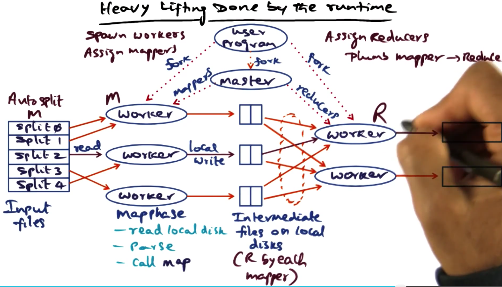

1. The input data is split.
2. A master node is spawned as well as all the worker threads. The master node oversees the whole operation and coordinates the work between the map workers and the reduce workers.
3. The master assigns some number of threads as map workers, and the others as reduce workers. Each worker thread grabs one split of the input data.
4. The master assigns some work to the reduce workers. The number of reducer threads is specified by the app developer. This typically correspond to the amount of entities that need to be reduced to.
5. Each mapper worker stores R intermediate files on their local disk. When they are done, they inform the master node.
6. The reducer worker needs to do a remote read to pull the intermediate files from the workers. The reducer worker than sorts the input and then calls the reduce function for each key in the intermediate results.
7. Finally the reducer worker writes to its output file. It then informs the master that it is done.

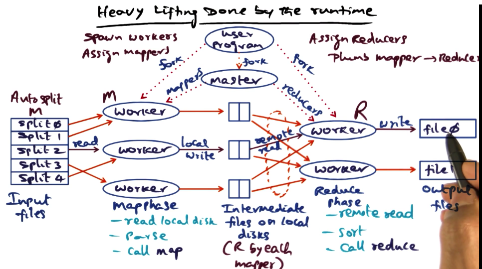

The data center might not have the number of machines needed to run the MapReduce function. It is the **role of the master node to figure out how to use the available resources**.

### Issues handled by MapReduce runtime

There is a lot of work done by the runtime system to ensure that MapReduce functions as expected.

The master data structures include:

1. **Bookkeeping** - the location of files created by the completed mapper workers. The namespaces of the files created by the mappers.
2. **Bookkeeping** - scoreboard of mapper/reducer assignments because the number of machines that may be available might be less than the number of machines that are needed.
3. **Fault tolerance** - for a variety of reasons, a worker might go offline. The master needs to be able to start new instance if there is no timely response from a worker. Completion messages need to be filtered out for redundant work.
4. **Locality Management** - make sure that memory usage is managed carefully for each of the machines. Accomplished using googleFS. 
5. **Task Granularity** - Good load balance of the computational resources. The programming framework uses a hashing function to split up the work.

## CDNs

In this lesson we will look at content distribution networks --  how is information organized, where is it located, and how is it distributed?

### Distributed Hash Tables

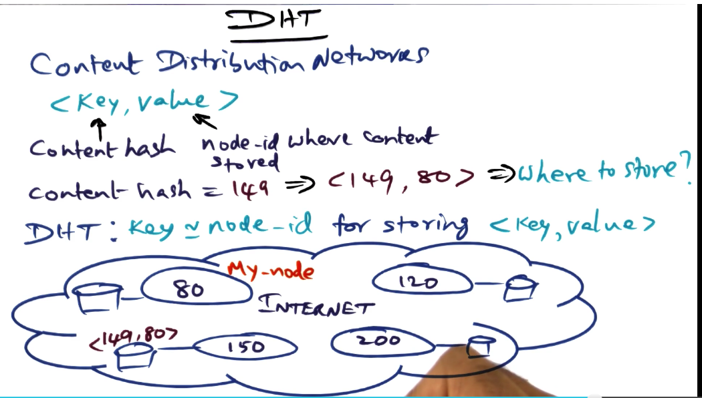

One scheme for publishing content across the internet is to create a unique entry in a global hash table that describes your content. You hash the contents of your data, and with a large enough key value, you can create a unique key in this table. The value of the entry will be where to look for your content. That way when someone wants to see your content, all they need to do is consult this table and then they can know where to look it up.

The idea behind a distributed hash table is that there needs to be a place where people can go to find this entry you just created. To use the DHT, you find a node whose node_id is the same or close to the unique key value that you created by hashing your content. You host your key-value content there. Now all that anyone on the internet needs to do to find your content is to hash the link to your video, consult the node closest to this value, and then they will find the entry that tells them where to look for your content. 

### DHT Details

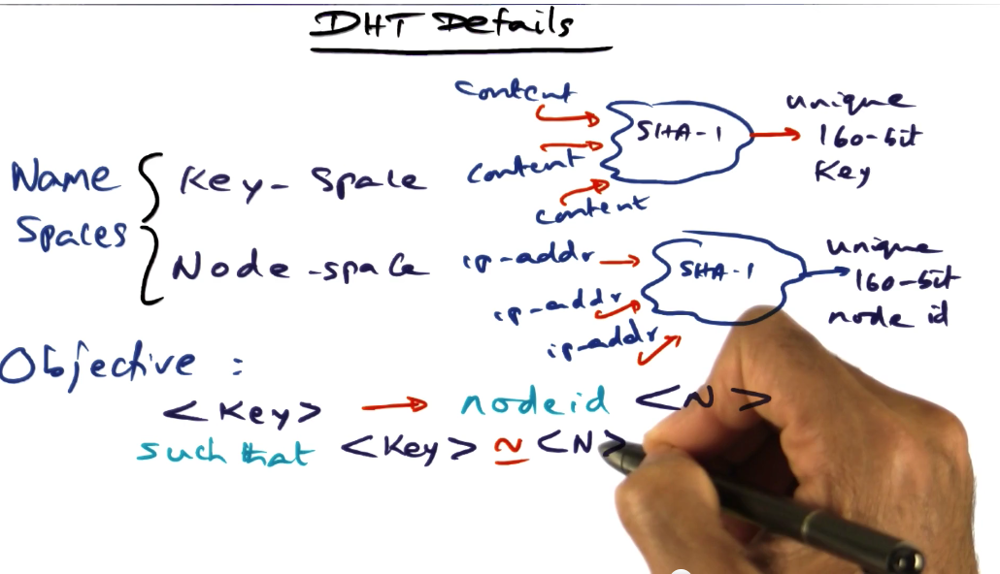

The first namespace that the DHT has to lead with is the keyspace namespace. The way this is managed is that you generate a unique 160-bit key by using some hashing algorithm like SHA-1 to create the key. The number of bits in the namespace is hopefully big enough that there will not be collision of key names.

The second namespace is the node space. Here we create a unique 160-bit node_id by passing the IP_addr through a hashing algorithm.

### CDN

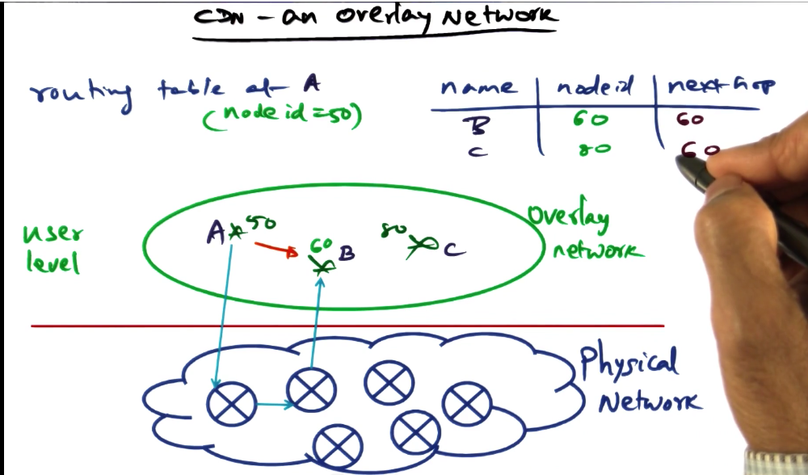

A CDN is an example of an overlay network. What does this mean? Well there's a big open question in the example that we gave when describing our DHT above: What does a client do once it is has consulted the hash table? It has retrieved that the content it wants to look at lives in node_id 80, but where does that live? Operating systems only know about IP addresses. **How do we translate the virtual address node_id to a physical address?**

The solution is to create a routing table at the user level. This is called an **overlay network**, **a virtual network on top of the physical network**.

What will this table look like? Well, the information we have is a node_id, there needs to be an association between the node_ids and the next hop along this overlay network. You don't actually have to know how to get to the end node that contains your content, all you need to know is the next hop along the way to getting to that content. So, if you have a peer that has seen something from that target node, you can route the request to your peer, who will route it to the target node.

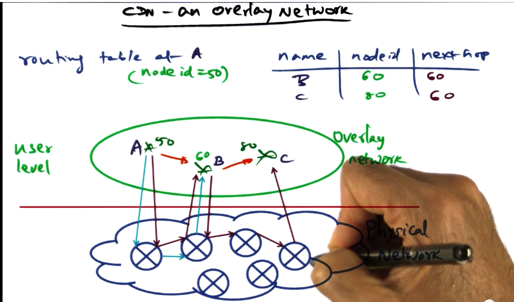

### Overlay Networks

Overlay networks are a very general principle and at the OS level we already have an overlay network: there is an IP network overlaying the LAN. One single IP Addr translates to many MAC addresses. 

### DHT and CDNs

A distributed hash table is an implementation vehicle for a CDN to populate the routing table at a user level.

For placement of key,value pairs, we are going to use a `put(key, value)` call. The key is going to be the content hash that uniquely identifies a resource, and value is the node-id where the content is stored. Retrieval of the key-value is done using a `get(key)` operation. The return value is the value associated with that key.

### Constructing a routing table

The traditional approach in constructing a DHT is considered a "greedy" approach.

To store a key, we pick a node N, where n is very close to the key and put our content there. If we want to retrieve a given key, K, we go to the node N which is closest to the key K.

The routing tables at the user level have a look-up table (somewhat like a DNS) associating node_id and IP address. The entries in this table are going to refer to the nodes that the system knows how to interact with directly.

If you want to consult a node that's not in your table, you will need to look for a node that's close to the key digest that you compute. You reach out to the peer that's closest to that value, and see if they have it. If they don't you have them see if they have that entry in their own routing table. 

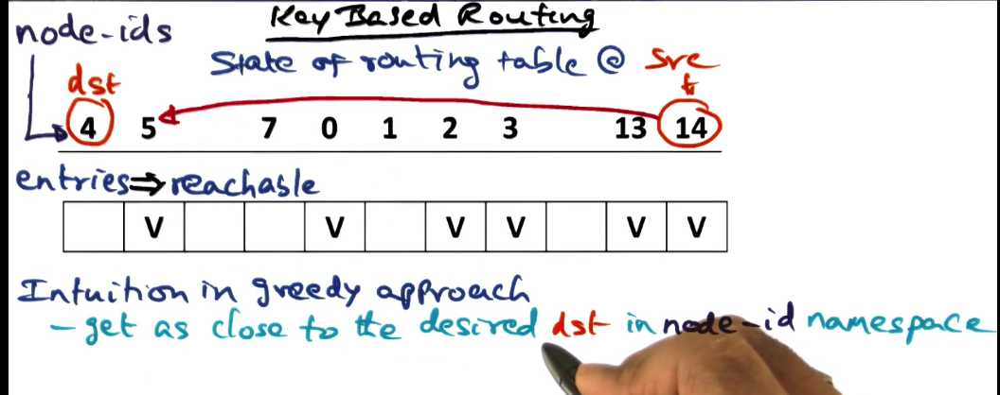

### Metadata and Origin Server Overload

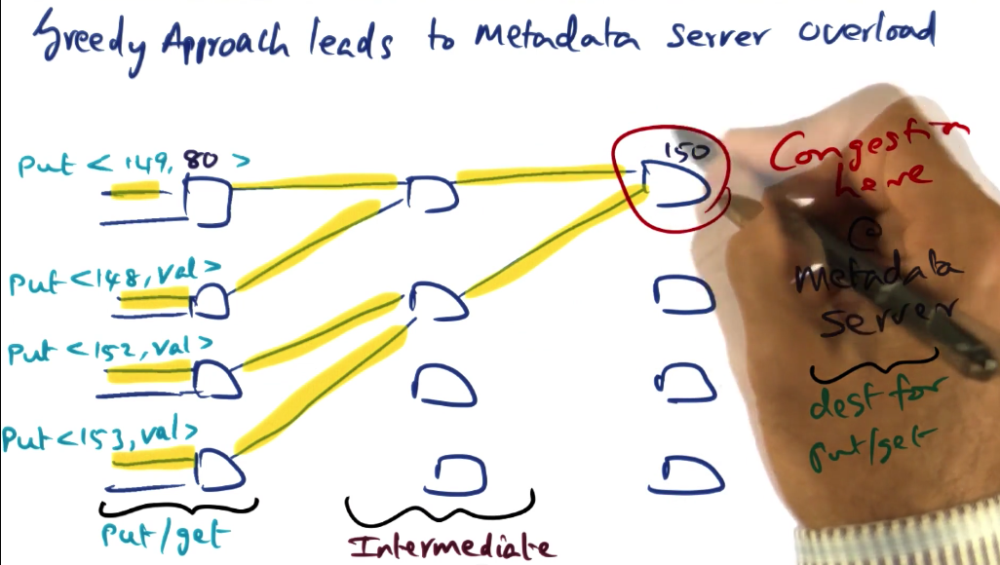

The greedy approach can lead to a metadata server overload. If there are a bunch of users generating content and they are all generating keys close to the value of say, 150. All of their content will be stored in that one server.

This creates a hotspot for the metadata that allows users to discover the content provider.

All of the users requesting that data will be making the same get calls, is there a better way to distribute the load of servicing this request?

The problem doesn't stop here. The metadata is overloaded because the content is popular, but so is the file server! This is called the origin server overload.

There are two solutions to origin server overload: a web proxy, which can alleviate load by taking up some of the service. Unfortunately, this isn't good enough for the slashdot effect, breaking news requires fresh content, the proxy isn't going to be able to cache that. 

This is where **CDNs** come into play. The **content is mirrored from the origin server to select geographical locations**. These locations are constantly updated by the origin server. This means that they can serve the content now.

**User-requests are dynamically re-routed to the geo-local mirror of the origin server**.

This is good if you are a big organization, because you can just pay a CDN. How can we democratize this technology? This is where the Coral system comes into play.

### Coral Approach

The coral approach to picking a key is to not be greedy when assigning your key to a node. The get/put is satisfied by nodes different from the Key K, this means the node_id N, might not be close to K. This is called **sloppy DHT**.

Our rationale here is that we want to avoid tree saturation and spread the metadata overload over many nodes.

So how does this work?

It has a novel key-based routing algorithm. The basis is that we compute the **XOR distance between the src and destination**. The reason why we want to do an XOR is that an XOR operation is faster than a subtraction. Remember, the node_id's are 160 bit numbers, so XOR is a fast operation.

### Coral Key-based Routing

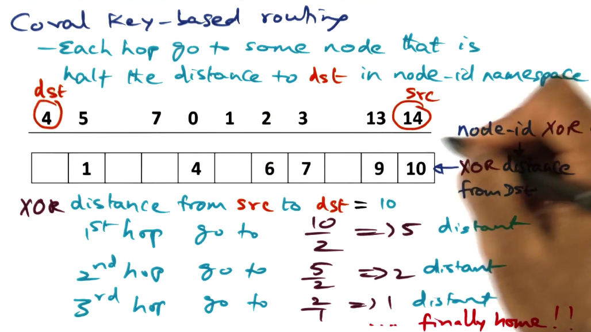

Coral key-based routing takes a different approach. Rather then trying to minimize the distance to the desired destination, we are going to slowly approach it. 

In particular, the distance between the two nodes in the node namespace is given by the XOR of the node_ids.

If we look at the XOR between node 14 (src) and our dest (4), will result in node_id 10. We compute the XOR distance from all the neighbors that we know about in our local routing table.

In the coral algorithm, **we will go to the node that is half the distance to the destination namespace**.

Thus in the above calculation, we will go to a node 5 because it is half of ten. 

The second hop we will go to 2, because node 2 is half of 5. 

The third hop will take us to our original dest node, 1.

What happens if we can't go exactly half the distance? We use approximate jumps and ask for information about jumps from our neighbors.

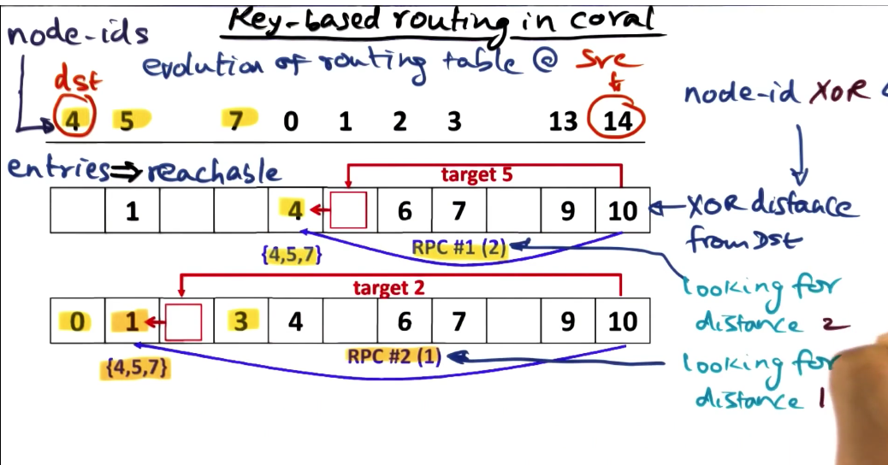

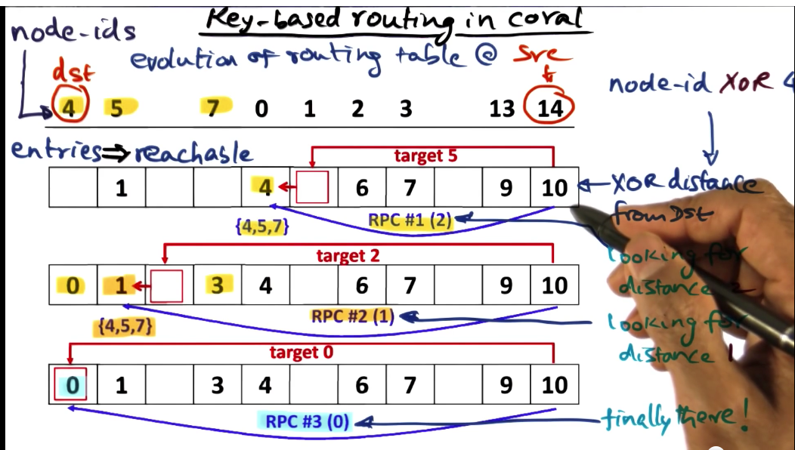

This algorithm results in increased latency for an individual, but better overall service for the content.

### Coral Sloppy DHT

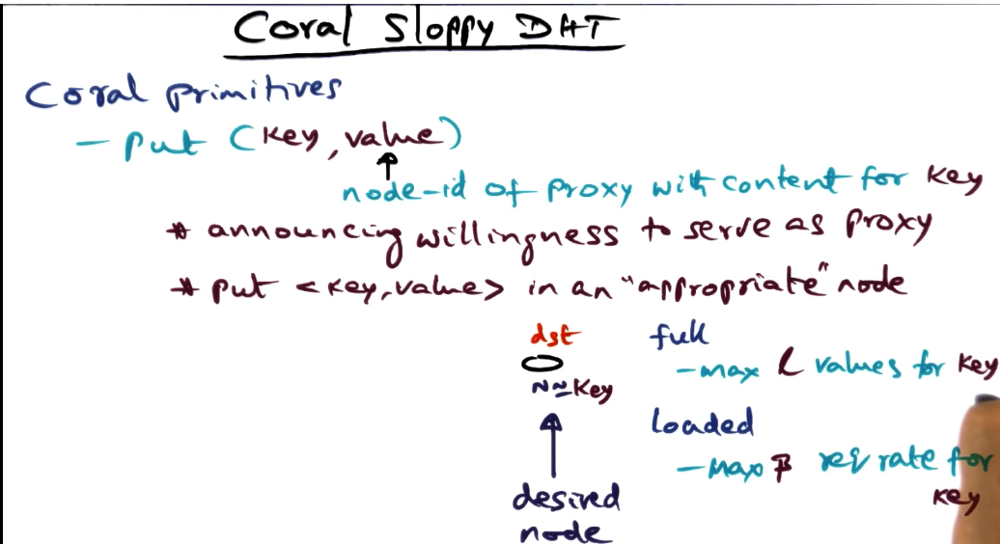

The primitives are exactly the same, except the semantics of the put and get are very different in how they are implemented.

We will define two states on our nodes:
1. A 'full' state - a node is already storing a threshold number of key-value pairs. Space parameter
2. A 'loaded' state - a node has received a number of requests per unit time over a threshold. Time parameter

These two values will help us determine where to place a key-value pair.

So let's say a proxy wants to put a key,value pair into the DHT. The proxy will take the key and go to a node that is half the distance to the desired destination until it gets to the desired destination. It will ask along the way if the nodes are loaded or full. If they aren't then you proceed to the next node along the way. If none of them are loaded or full, then the proxy would eventually reach the desired destination and place the key,value pair in the destination node.

If however one of those nodes is loaded or full, then the proxy is going to infer that the rest of the path is clogged up because of tree saturation. Therefore we shouldn't place the key,value pair to the destination. We should place the node at the most recent node visited along the path (the furthest along to the destination) that isn't full.

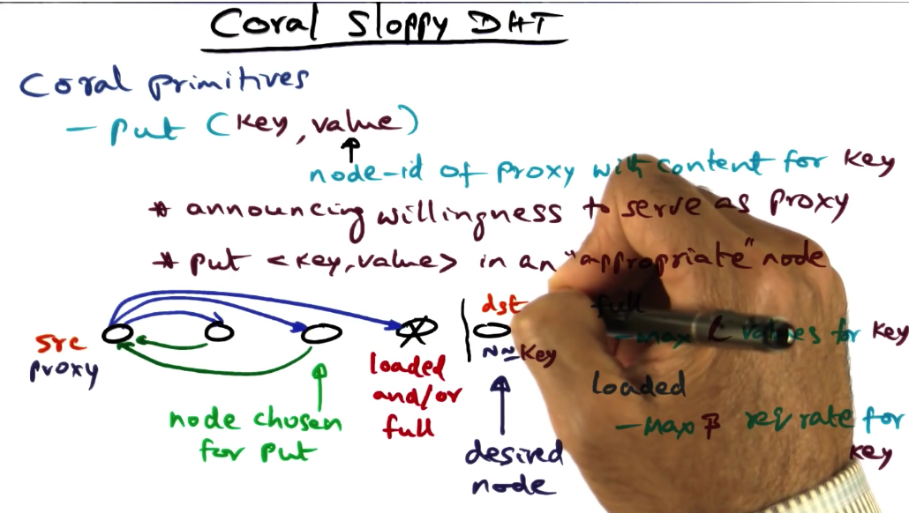

