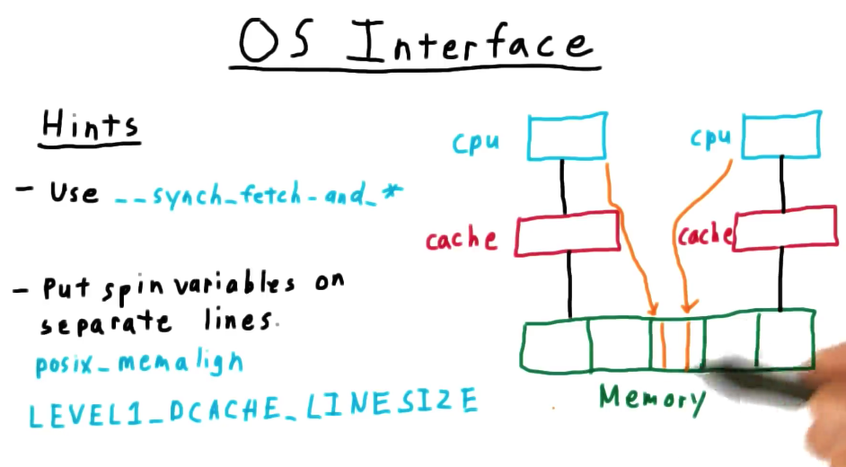
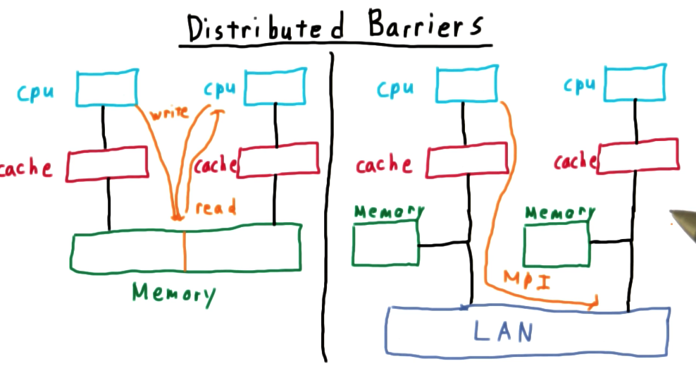

# Barrier Synchronization

## Table of Contents
* [Barrier Semantics](#barrier-semantics)

## Barrier Semantics

Let's suppose we have a bunch of threads running the same code and we want all of them to get to a certain place before continuing onward, we set up a barrier. 

All threads stop when they get to the barrier. When all threads have reached the barrier, the threads carry on.

## OpenMP's Interface

The most popular shared memory programming model is the OpenMP library. It works with C, C++ and Fortran. Part of the goal of this project is to familiarize yourself with OpenMP.

```c
#pragma omp parallel {

#pragma omp barrier

}
```

The task for this part of the project is to replace the above statement with:

```c
gtmp_init(num_threads); //tell our library that this is a parallel section of code
#pragma omp parallel {

gtmp_barrier();

}
gtmp_finalize();
```

## OS Interface



In some cases it will be important that one thread can test and change a value in memory without being interrupted (atomic). For this, `sync_and_fetch` family functions are going to be important.

Also remember, that memory is broken down into **cache lines**, the **granularity in which memory caching operates**. This has important implications for our programs.

Suppose that two variables are stored in the same cache line. If one of the memory location is written to, it will invalidate the cache of the other processor! This contention can lead to a slower barrier. 

## Distributed barriers



Until now, our threads have told each other that they've reached the barrier by changing some variable in shared memory. 

In a distributed system by contrast, there is no shared address space and no shared physical memory. We have separate processes running on separate processors and each processor has its own memory.

So instead of changing a variable in memory, we pass a message to a standard message passing interface called `mpi`.

Receiving a message is analogous to spinning on a variable. Sending a message is analogous to writing to a variable.

## MPI's Interface

```c
MPI_Init(&argc, &argv);

MPI_Barrier(MPI_WORLD_COMM);

MPI_Finalize();
```

The goal with this portion of the project is to replace the above with:

```c
gtmpi_init(num_threads); 
MPI_Init(&argc, &argv);

gtmpi_barrier();

MPI_Finalize();
gtmpi_finalize();
```