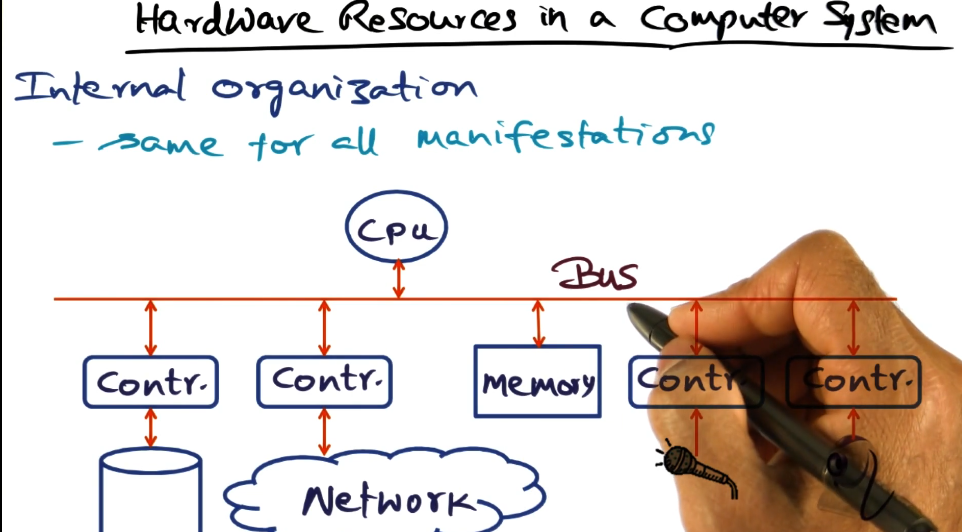
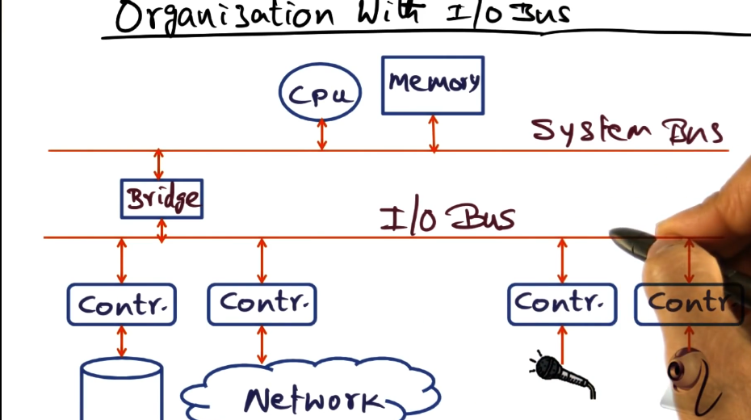

# Introduction to Advanced Operating Systems

## Table of Contents

* [Hardware Resources](#hardware-resources)

## Hardware Resources

One of the OSes **responsibilities is the control of access to the physical hardware**. 

Regardless of the computing system we are talking about: cell phone, laptop, server, etc, the internal organization of the computer hardware is largely the same. 

We have a **CPU** which processes instructions, it is connected to the rest of the hardware by a **bus**, we have **memory** that holds instructions and data. We have **storage** for persistence of files. We might also have other peripheral devices.

The **bus** is the **conduit for communication between all the different devices** in the computing system.

Depending on the sophistication of the devices that are hooked up the bus, they might have the **ability to move memory without intervention of the system CPU**, this is called **direct memory access (DMA)**.

## Hardware Organization with I/O bus

In a more typical elaboration of the computer system, the system bus and the I/O bus are separate. The system bus is a synchronous communication device between the CPU and memory. The I/O bus is for devices to communicate with the CPU. In this model, the system bus is typically much higher bandwidth so that the I/O bus never really disrupts CPU and memory communication.

## OS functionality

1. OS is a **resource manager**.
2. OS **provides a consistent interface to the hardware resources**.
3. OS **schedules application on the CPU**. 

