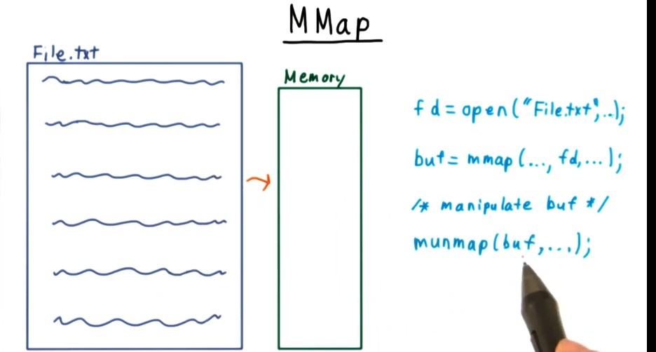

# Review - File Systems

## Table of Contents

## Introduction

A file system is an intuitive interface that allows computer users to not have to think about where data is physically stored.

There are three key abstractions at work:
1. **File** - in reality data might not be placed next to each other in order.
2. **Filename** - we don't have to remember the physical information about the file, we just have a name.
3. **Directories** - Containers for files that help us organize them.

The directory structure looks like an upside-down tree, the top-most directory is called the `root` or `/`. 

## Access Rights

As soon as we start letting multiple users interact with a filesystem, it becomes clear that we will need some form of control over the files.

Conceptually, we can think of access rights as a giant matrix with users and the files as the columns/rows respectively.

Unix, like OS's achieve a fairly efficient system by assigning an `owner` and `group` for each file.


There are separate read, write, and execute bits for the user, group and then another set for everybody else. This gives us 9 bits for representing the possibilities.

Directories are a little bit more complicated. Reading effects what you can see, writing effects your ability to create, delete and rename files. Execution permissions correspond to whether you can pass through a directory and do other more abstruse actions.

In some instances access-control lists are used. 

## Developer Interface

There are two ways that developers interact with the filesystem, the first is a *positional interface* where the developer uses a cursor to read and write to the file. The other way treats the file as if it is *just a block of memory*.

### Positional Interface

Let's look at the positional interface first:


Search through a simple text file and replace the value if it matches a key:

```c
int main(int argc, char **argv){
int fd;
ssize_t len;
char *filename;
int key, srch_key, new_value;
if(argc < 4){
  fprintf(stderr, "usage: sabotage filename key value\n");
  exit(EXIT_FAILURE);
}
filename = argv[1];
srch_key = strtol(argv[2], NULL, 10);
new_value = strtol(argv[3], NULL, 10);
fd = open(filename, O_RDWR);
while( sizeof(int) == read(fd, &key, sizeof(int)) ){
  if (key != srch_key)
    lseek(fd, sizeof(int), SEEK_CUR);
  else{
    write(fd, &new_value, sizeof(int));
    close(fd);
    return EXIT_SUCCESS;
  }
}
fprintf(stderr, "Key not found!");
return EXIT_FAILURE;
}
```

### Memory Interface

It's also possible to interact with a file in a way that let's us treat it just like memory. As before, we open a file using `open`, instead of using `read` and `write` however we use **mmap**, which returns a pointer to a region of memory that we can manipulate in our code. Eventually, whatever changes we make to this memory gets reflected in the file. When we are done we call **munmap**, which syncs the contents of memory with the file and then frees up the memory.

