# Review - Memory Systems

## Table of Contents
* [Introduction](#introduction)
    * [Naive Memory Model](#naive-memory-model)
* [Caches](#cache-motivation)
    * [Check for Understanding - Caches](#check-for-understanding-caches)
    * [Memory Heirarchy](#memory-heirarchy)
    * [Locality and Cache blocks](#locality-and-cache-blocks)
    * [Direct Mapping](#direct-mapping)
    * [Check for Understanding - Direct Mapping](#check-for-understanding-direct-mapping)
    * [Associative Mapping](#associative-mapping)
    * [Check for Understanding - Associative Mapping](#check-for-understanding-associative-mapping)
    * [Fully Associative Mapping](#fully-associative-mapping)
    * [Write Policies](#write-policies)
        * [Cache Hit Policies](#cache-hit-policies)
        * [Cache Miss Policies](#cache-miss-policies)
* [Virtual Memory](#virtual-address-abstraction)
    * [Virtual Address Translation](#virtual-address-translation)
    * [Paging](#paging)
    * [Check for Understanding - Paging](#check-for-understanding-paging)
    * [Page Table Implementation](#page-table-implementation)
    * [Accelerating Address Translation](#accelerating-address-translation)
    * [Page Table Entries](#page-table-entries)
    * [Page Faults](#page-faults)

## Introduction

The most important resources on a computer are **space and time**, space and memory for storage and time on the CPU for processing. 

### Naive Memory Model

The CPU is where instructions are executed, the instructions may be read or written from main memory or disk.

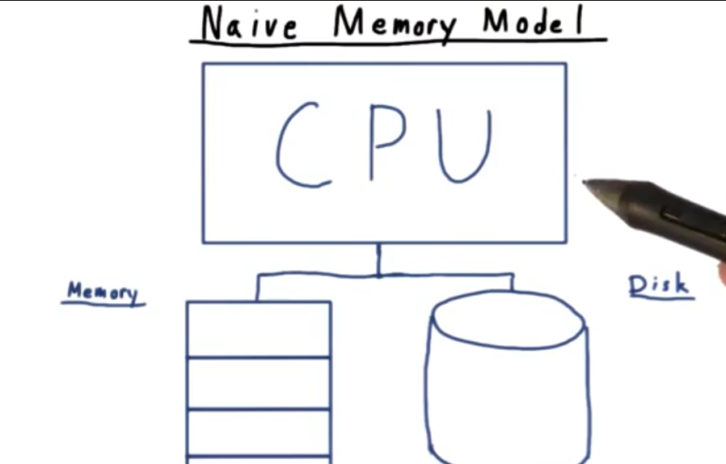

1. **Main memory** is fast, you can access any element in the same amount of time (random access), lastly it is temporary. 
2. **Hard Disk** is slow, it uses sequential access because the disk has to be spun to the right place, lastly the memory stored on a disk is permanent. 

In this lecture we are going to refine this picture by looking at **cache systems** which **allow the CPU to access the data in main memory faster**.  Second, we will talk about the **virtual memory system**, the abstraction provided by the OS that **makes handling memory easy**. 

## Cache Motivation

Let's gaze at the humble for-loop:
```c
int sum = 0;
int N = 5;
int a[5];
for(int i = 0; i < N; i++) {
    sum += a[i];
}
```

From an application programmer's perspective, the addition call would appear to happen in one step. Even in assembly, it would only take a few instructions. In terms of time on the clock however, **not all of these instructions are the same**.

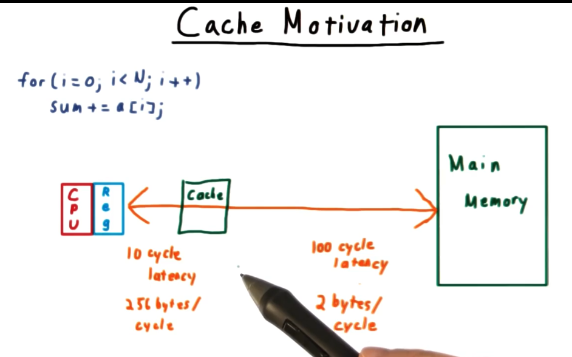

`sum` being a local variable, is likely stored on a register in the CPU, therefore there is almost no cost to retrieving it. `a[i]` however resides in main memory and retrieving it can take 100 CPU cycles. 

Trips to main memory are expensive. The solution to this problem is to place **smaller faster memory closer to the CPU**, this is called a **cache**. The latency to pull from the cache is closer to 10 CPU cycles. 

Keeping cache misses infrequent is a goal of computer system designers. 

### Check for understanding - caches

Suppose retrieving data costs 4 cycles on a cache hit, and 100 cycles on a cache miss. 

How many cycles does a process with a 99% hit rate spend on average?

`((1 * 100) + (99 * 4))/100 -> 4.96 cycles`

How about one with a 90% hit rate?

`((10 * 100) + (90 * 4))/100 -> 13.6 cycles`

### Memory Hierarchy

One of the most important considerations in cache design is the **tradeoff between speed and capacity**. We would like the retrieval to be fast and for the cache hit rate to be high. These goals however are somewhat contradictory.

To deal with this we trade-off size vs speed multiple times by creating a cache hierarchy. 

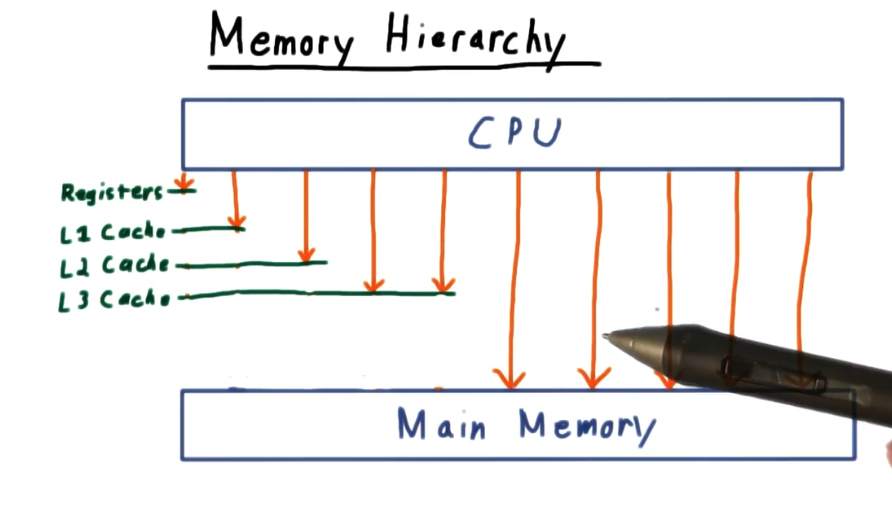

### Locality and Cache Blocks

In order for a cache to be effective, the hit rate needs to be high. That is, we need to anticipate what data the process will need next.

Ideally we would be able to plan ahead, instead we use the **heuristic of locality**. If an application needs memory from one memory address, it will likely need memory from the surrounding blocks. 

Experts like to distinguish between **two types of locality**: **temporal** and **spatial**. 

1. **temporal locality** - refers to the tendency of programs to refer to the same memory close in time. 
2. **spatial locality** - refers to the tendency of programs to access memory that is close together in terms of address.

Typical cache policies exploit both kinds of locality. It exploits temporal locality by putting your data in the cache after you use it, thinking you might use it again soon. It exploits spatial locality, by not just putting the address you needed into the cache, but the whole block that the address is part of in the cache. 

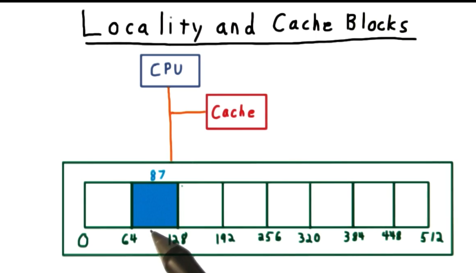

**Blocks** are a division of memory in relatively small amounts. Often 64 bytes.

### Direct Mapping

Given an address, how can I find out if that data is in the cache and how do I retrieve it? We will start with a direct-mapped cache and a little notation.

Let's suppose we have 2^m addresses, 2^n block size, and we have 2^k cache entries.

The lowest n-bits in an address are the **offset**. They **specify where within a given cache block the memory is**. The rest of the bits tell us the block number. 

How do we know where to look for this block within the cache? We need some kind of hashing function. The next k bits of the address are called the **index**. They tell us where to look for our data within the cache. The higher order bits are called the **tag**, and they specify within an index, which block is being used.

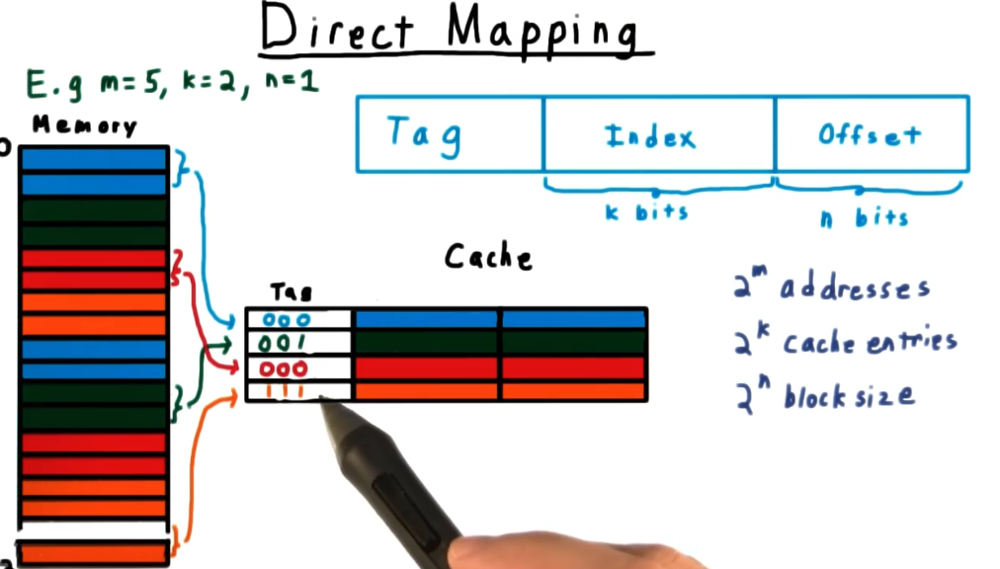

### Check your Understanding - direct mapping

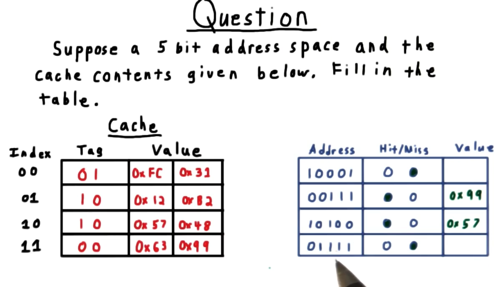

In the example above, the offset is 1 bit, and the index and tag are both 2 bits.


Let's do the index first.

The cache can be broken into 8 blocks. 512/64. This means that only 2^3 blocks are needed for representing the index. `3`.

Next, for the tag we can work backwards. There are 22 total bits, minus 3 which are being used for the index, minus six (2^6), which is used for the cache offset to describe all of the addresses within the cache block. The answer is thus `13`.

### Associative Mapping

It's possible to get unlucky with direct map caching in that **blocks that are important to your application are mapped to the same index in the cache and are constantly evicting each other**. This is kind of silly given that a bunch of other cache indexes are probably vacant. 

The **fundamental problem is that the address is only associated with one location in the cache**. You can mitigate these effects by **associating an address with more than one block in the cache**.

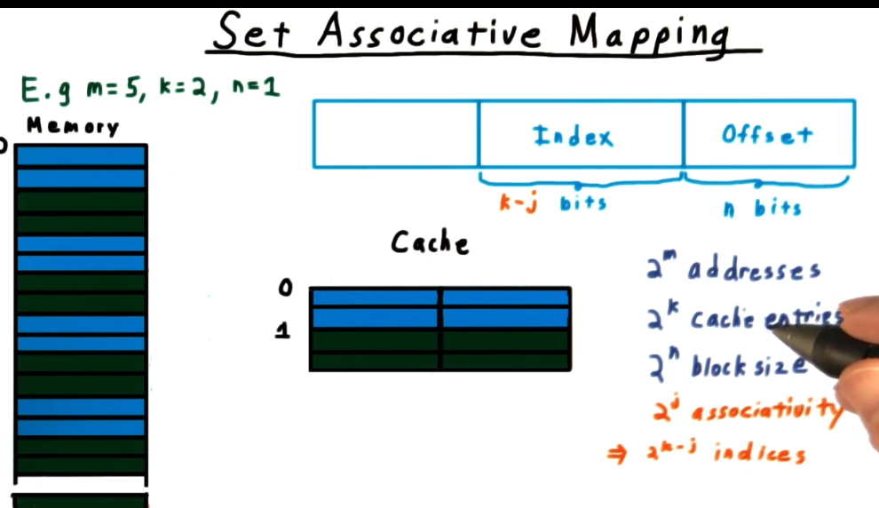

The downside of this strategy is that we now have to check the tags of multiple cache lines. The upside is that we won't run into the problem of cache lines constantly evicting each other. 

### Check for understanding - Associative mapping

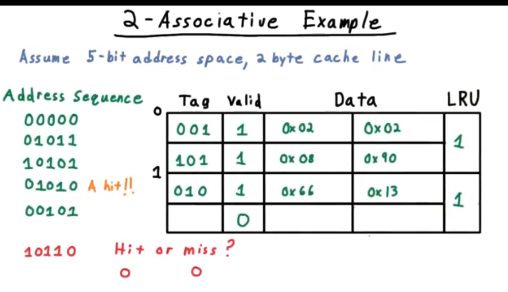

It's a miss. The index is 1. It is the 4th bit. The tag is `101`, and it doesn't match the tag in the cache ~ `010`. 


### Fully Associative Mapping

If we take associativity to the extreme, we let any cache block be put anywhere in the cache. All cache blocks are treated alike. With full associativity we don't treat any part of the address as an index anymore. It's all tag. This means that the hardware has to check tags for every entry into the cache. This fact generally limits fully-associative caches to being pretty small.

## Write Policies

For write policies, we need to consider what happens when there is a cache hit, and what happens on a miss.

### Cache hit policies

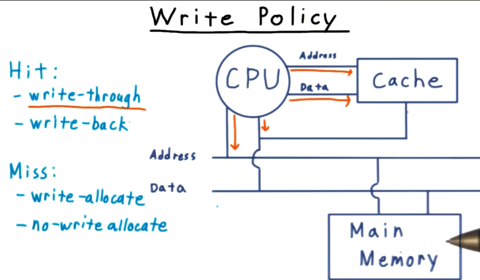

One strategy is the **write-through policy**. That is we will write to the cache, and also to main memory to copy the data to keep the cache and memory consistent. This strategy is betting on quick eviction in the cache. No work needs to be done because main memory has already been updated.

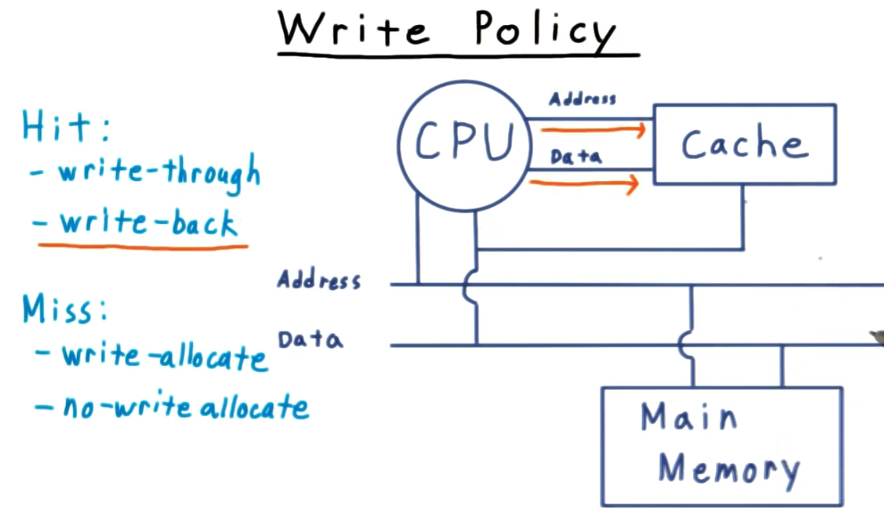

Another strategy is **write-back** where only the cache is written to. As long as no other processors need access to the data that is being written, it is find just to write to the cache (this is where the same processor will look first) and then write to main memory when the cache block gets evicted. This strategy is betting that the cache will be used a lot without any evictions, bundling the writes to main memory will be more efficient than constantly writing through in a cache-hit heavy workload.

### Cache miss policies

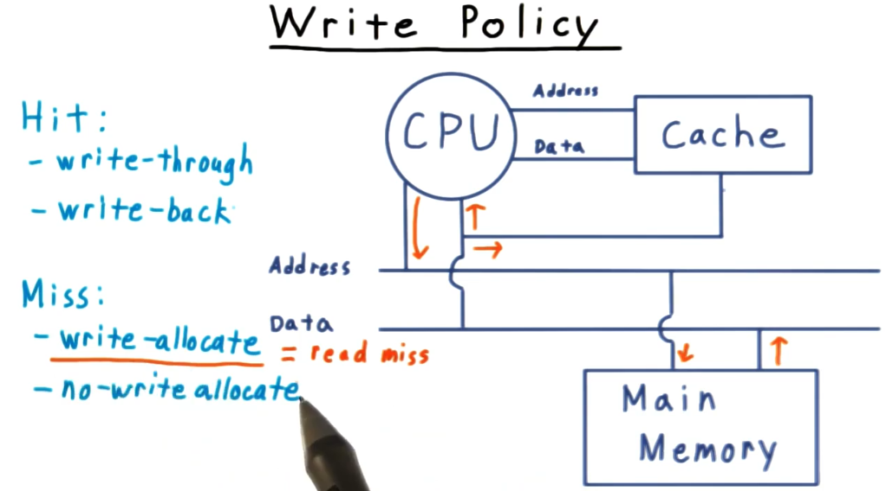

For cache misses we also have two strategies. The first is **write-allocate**, which first reads the current value from main memory into the cache and then behaves as if it were a hit using either of the two hit strategies.

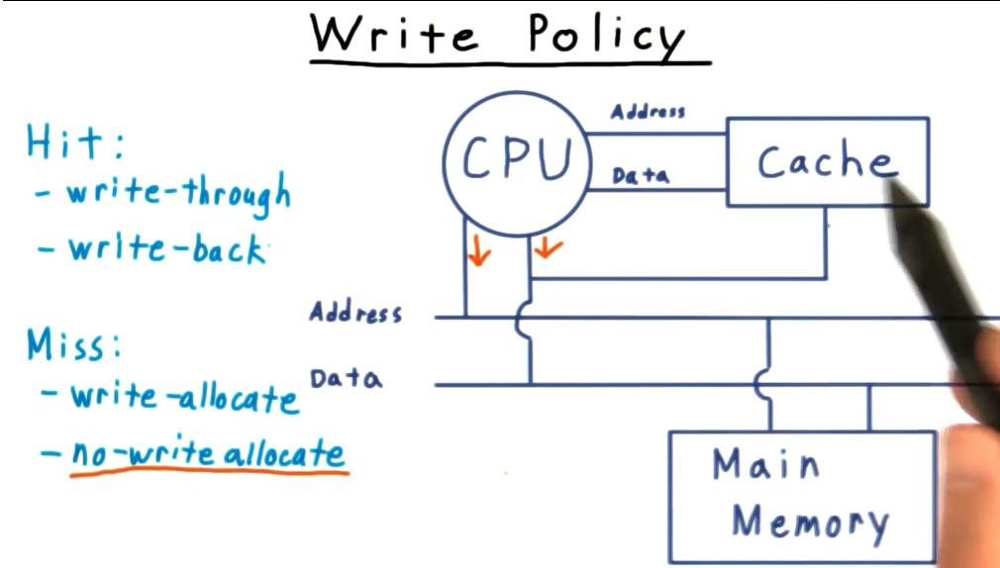

Lastly we have the **no-write allocate** strategy which writes directly to memory and doesn't bother with the cache at all.

## Virtual Address Abstraction

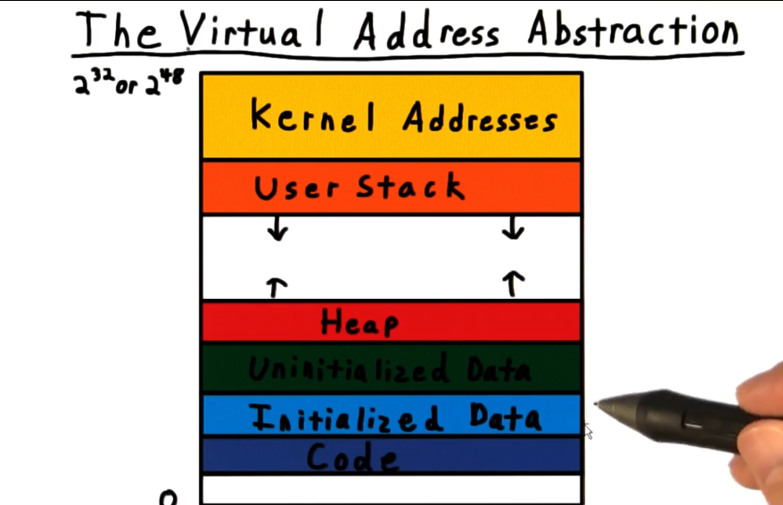

The **goal of the virtual memory system is to provide the abstraction that a process has the address space all to itself**. 

Typically, organized as:

1. We have addresses for the program code.
2. We have addresses for variables that are initialized (literals).
3. Space for uninitialized global variables.
4. Space for the heap which is dynamically-allocated.
5. Space for the user's stack.
6. And spaces for the Kernel.

### Virtual Address Translation

The **key to maintaining the virtual memory abstraction** is **a layer of indirection**. Without this layer, two processes couldn't use the same address for a variable because they would end up overwriting each other. 

So, to solve this problem we use a classic computer science trick, introduce a layer of indirection.

Inside the OS, **each process has** a data structure called a **page table** that acts like a phone book, **translating from virtual memory address to physical memory address**. 

Usually the physical address will be an address in main memory, but **when main memory is low, sometimes it will reference a disk address**. This is known as **swap**.

This indirection allows us to accomplish a few things:

1. It allows us to have an address space bigger than main memory. This is convenient when main memory isn't big enough and we need to use the disk, or when we need to map new storage devices.
2. It provides protection between processes. With the OS properly managing the page tables, there is no risk of overwriting.
3. It allows for sharing.
4. Because **Kernel addresses** are the same for each process, they get their own page table, **the Global Page Table**.

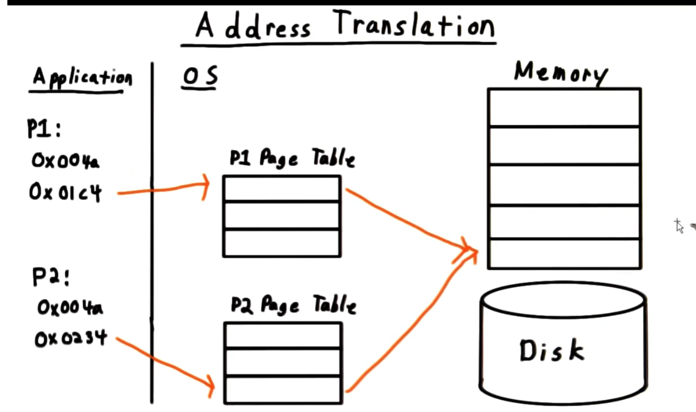

### Paging

Recall how for caches we divided it into blocks or cache lines. Similarly, with the virtual memory system we divide up our **physical memory into frames**, often 4KB long.

The higher order bits in an address determine the page number (physical page frame), and the lower order bits determine the offset into the page. 

Correspondingly, the **virtual address space is similarly divided into pages**. Again, lower order bits determine the offset, the higher ones determine the virtual page number. 

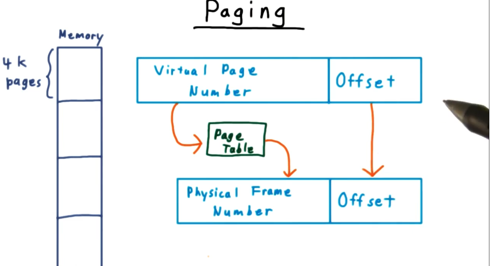

### Check for understanding - paging

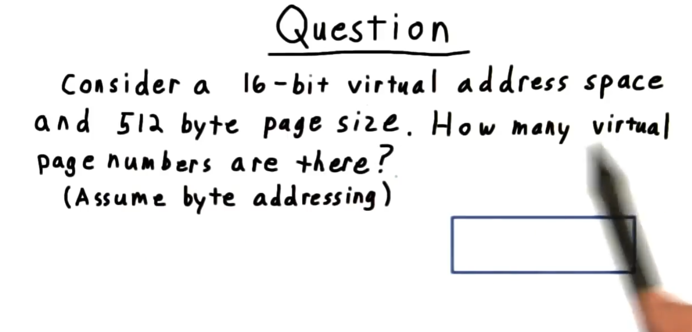

The fact that we have a 512 byte page size means that we need 9 bits to reference the offset. That leaves us 7 bits a page number which means there are 2^7 = 128 page numbers.

### Page Table Implementation

The page table data structure translates virtual page numbers into physical page frames.

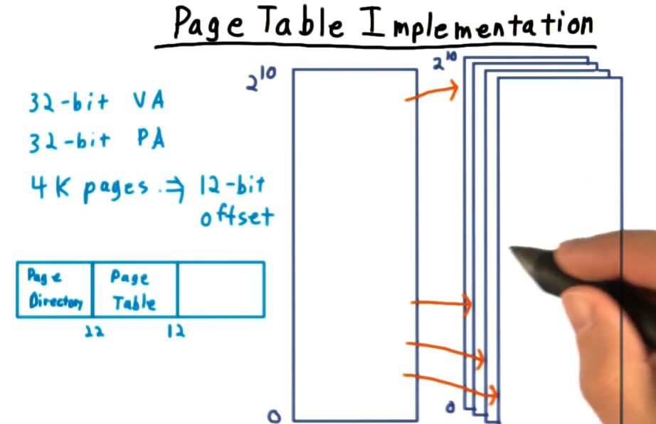

Because representing an entire address space would take a lot of memory, page tables are constructed in a heirarchical way. The first ten bits are used to index into a top-level page directory which give us the base address of the page table that holds the translation we are looking for. We use the next ten bits to index into the lower-level page table, and the entry here gives us the physical page number.

### Accelerating Address Translation

So far we have described the address translation process as follows:

1. The offset for the virtual address simply gets copied to the physical address. 
2. In order to translate the virtual page number we do a lookup of the page table in memory which translates to a physical page frame.

Won't going to memory for the page table every time we access a memory address be slow? Yep, but thankfully the page table entries might end up in our cache, but even more relevant, architects have created a **special cache called the Translation Lookaside Buffer (TLB) for storing page table entries**. 

The TLB is indexed by virtual addresses. How does the TLB manage context switches? One virtual address in one address space might be mapped to a specific physical address, but the same virtual address in another address space might be mapped to a different physical address.

There are a couple of ways of handling this problem:

1. Some systems flush the TLB on context switch.
2. Other systems track the address space ID in the TLB. 

### Page Table Entries

Let's consider the contents of the page table entries. Let's take the example of a 32-bit address space. 

It would be typical to have page table entries to also be 32-bits, with 4KB pages, only 20 bits would be needed for the physical page frame. What do we do with the other 12 bits? 

There is a lot of other information that is important to store like access control (should you be able to read, write or execute that page?). Another piece of essential information is is that page in memory or not (valid or present).

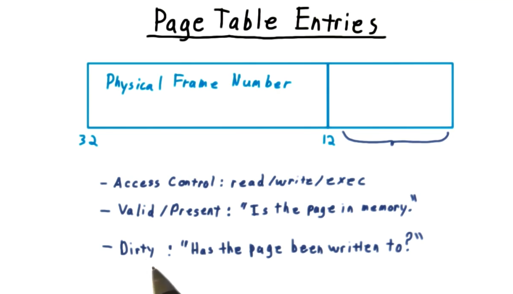

### Page Fault

What happens when an application requests a **virtual address that is not mapped to main memory, but is somewhere on disk**? A **page fault**.

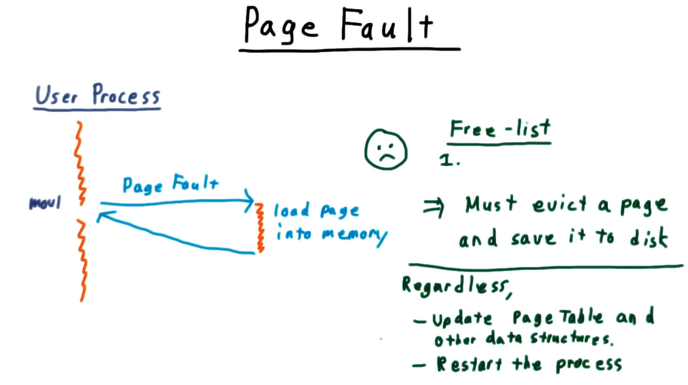

1. An exception is raised which sets the running process back to be ready to repeat the instruction that caused the page fault.
2. Meanwhile, the OS page fault handler takes over. It checks to make sure the request is valid, and if it is, it loads the desire page into memory.
    1. Find a physical page frame in main memory to load the data into. The handler keeps a list of free pages to load data into.
    2. If there are no free page frames, the handler must evict a page and save it to disk.
3. The OS Page Fault handler then tells the OS scheduler that the process that caused the page fault is ready to be run again.
