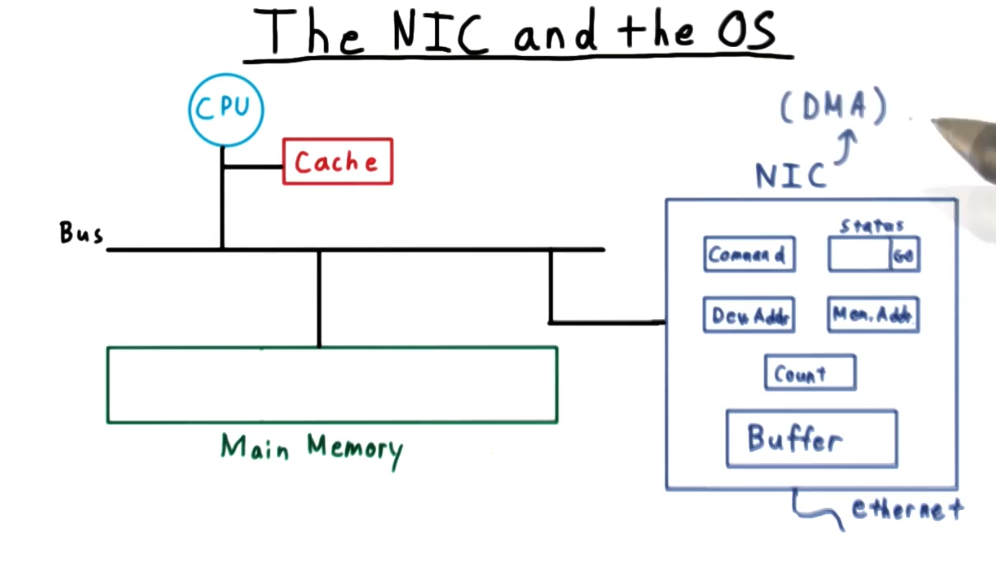
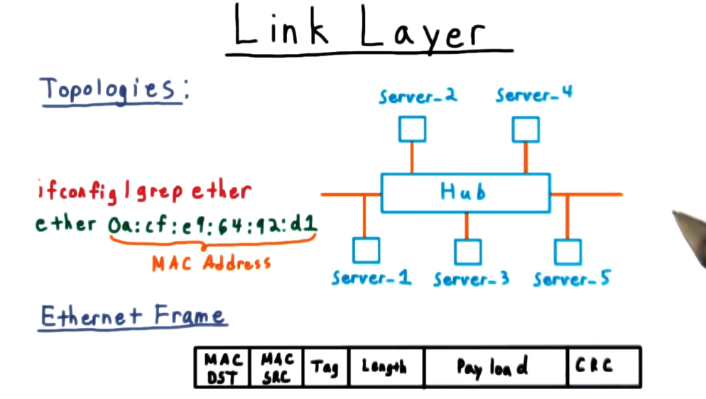
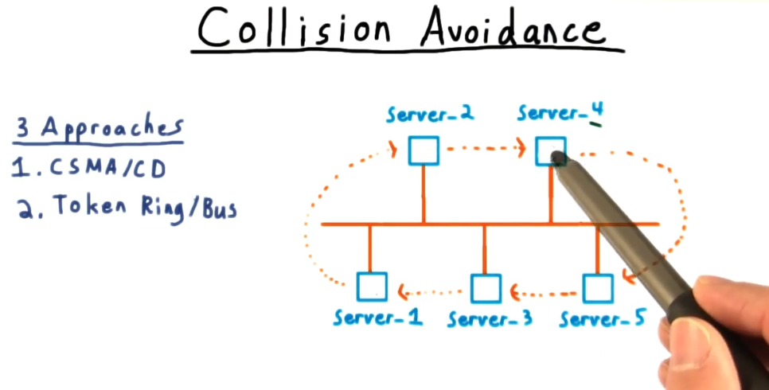
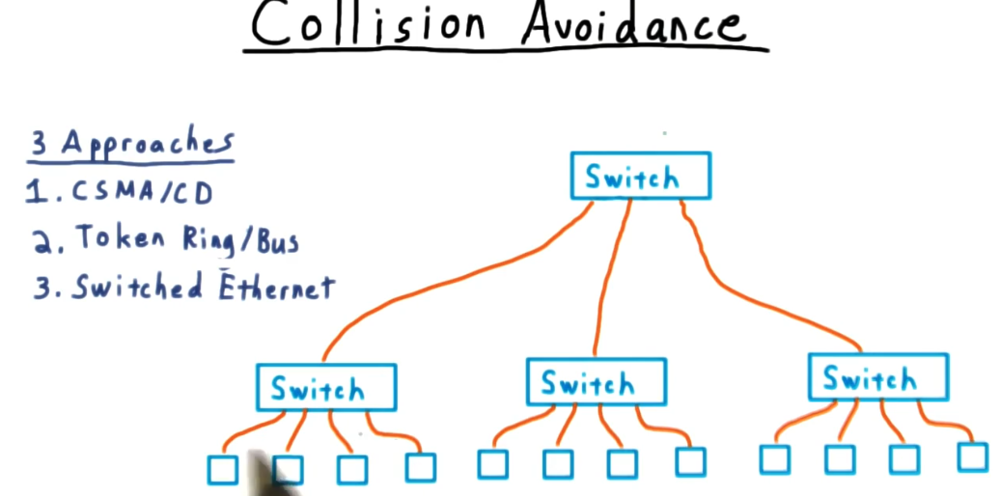
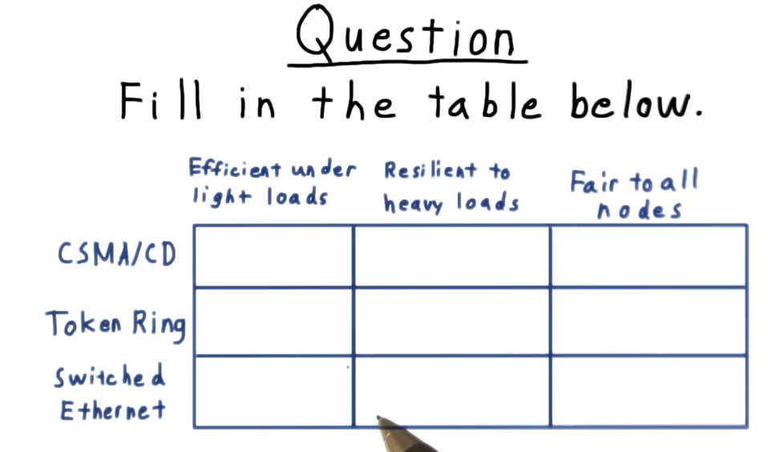
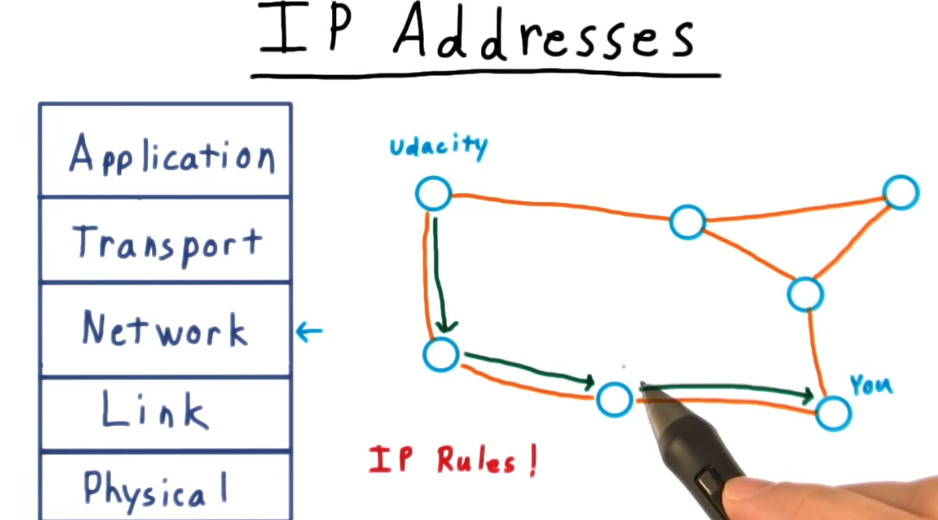
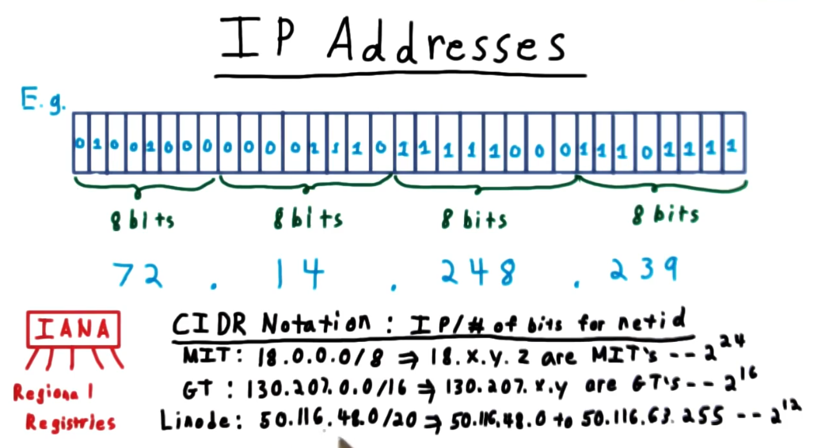
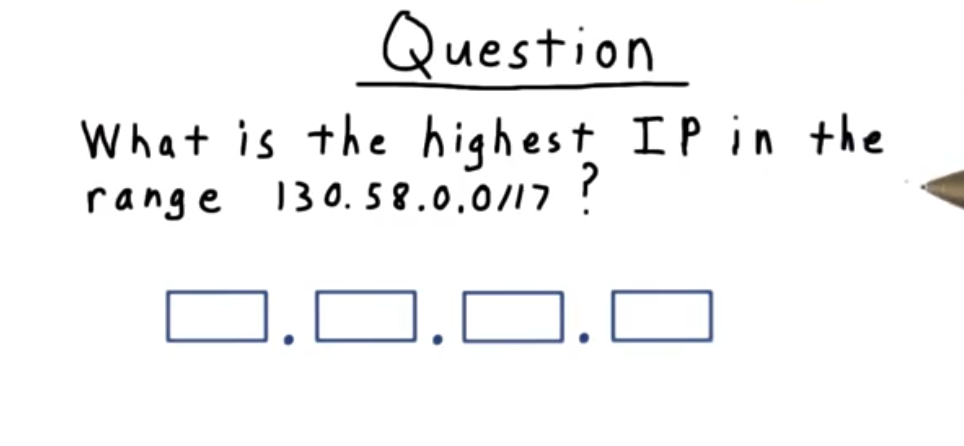
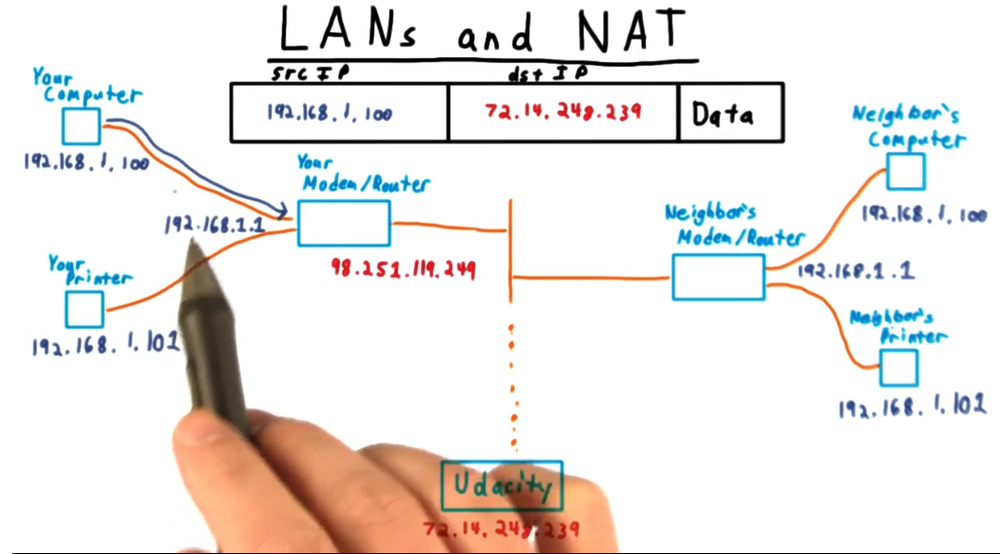

# Review - Networking

## Table of Contents
* 
* 
* 

## Interconnection Layers

A discussion of networking usually starts with the interconnection layers:

1. **Physical layer** - refers to hardware that creates and transmits the electronic and optical signals, as well as the protocols for interpreting these signals as bits. This would include the NIC, modems, ethernet cables, and even submarine fiber-optic cables.
2. **Link Layer** - governs the communication between peers in a local network. This includes switching. 
3. **Network Layer** - responsible for end-to-end communication on the Internet. The process of routing belongs to the Network layer. Unlike other layers which have many protocols, the network layer is primarily ruled by the IP protocol.
4. **Transport Layer** - Demultiplexes transmissions inside a machine and makes sure the communications are delivered and in order.
5. **Application Layer** - application-specific protocols, like HTTP for web, SMTP for mail, etc.  

All of these layers sit on top of each other with the physical layer on the bottom, the application layer on the top.

## The NIC and the OS

The **network interface card (NIC)** is typically a DMA-device (ability to read/write from memory independently of the CPU). 

Typically the CPU specifies through the bus the range of memory it wants read/written and then specifies the go bit let the NIC do its stuff. 

Only when the NIC finishes will it interrupt the CPU. The NIC is also responsible for putting hardware-specific headers and footers on the data. 

## The Link Layer

If every link between computers were a dedicated permanent point-to-point connection, it would be relatively straightforward to get the machines to talk to one another. 

The challenges are solved by breaking up larger chunks of data into smaller chunks and adding metadata to them so we can know how long the smaller chunks are and what order they should be in.

Things get more interesting when there are multiple nodes all sharing the same medium (think of the cable that is carrying all the internet traffic to this neighborhood).

A **media access control(MAC) address** is used to identify NICs on respective machines in the link layer.

## Collision Avoidance

Another important consequence of machines sharing the same medium is that two messages can't be sent at once. 

If they tried, the data on the line would likely be corrupted. 

There are three solutions to the collision problem:
1. **Carrier sense multiple access with collision detection (CSMA/CD)** - When a node sends a frame, it measures the signal on the wire to see if it can detect what it sent. If it does, great. Otherwise it assumes another node was trying to send at the same time, and jams the signal, and waits based on an exponential amount of time before sending again.
2. **Token Ring/Bus** - The nodes are arranged in a ring that continually pass around a token that determines whose turn it is to send a message. This is a fair system and doesn't crumble under heavy loads. It does however adds more latency than CSMA/CD.

3. **Switched Ethernet** - A switch is physically connected to the nodes like a hub, but instead of broadcasting every frame, it looks up the destination MAC address on the frame and routes it accordingly. The advantage of this solution is that we have fewer collisions. This means two pairs of nodes that don't take the same path can communicate simultaneously without colliding. The switch needs a table to associate MAC addresses with ports to achieve this, and one way it populates this table is with learning. 

Once we run out of ports, we can arrange switches in a hierarchy. In our top level switch, we map all the MAC addresses to the port that goes to the switch that controls those addresses. 

### Check for Understanding - collision avoidance

Token Ring is the only scheme that isn't efficient underneath a light load. That's because it is fair. It is however good underneath heavy loads, which CSMA/CD is not because under heavy loads this scheme is likely to see a lot of backoff and exponential delay. Switched ethernet is pretty much just good at all of these things. 

## IP Addresses

Let's look at how machines communicate across the Internet. This layer only uses the Internet Protocol (IP). 

Every machine on the internet proper gets a **unique 32-bit address, an IP address** (For IPv6, it is 128 bits).

Ranges of addresses are allocated by regional internet registries, all of which are under the control of IANA (International Assigned Number Authority).

The ranges themselves are commonly specified by a 32-bit **IP followed by a slash and then the number of bits for a network ID**. This is called **CIDR** notation. The rightmost bits specify the particular host.

### Check for understanding - IP addresses

`130.58.127.255`

## LANs and NATs

One solution to the problem of the scarcity of IP Addresses is **network address translation**. This also allows mobile devices to quickly join and exit networks as you are roaming around.

Your modem/router **allocates IPs to internal entities via Dynamic Host Configuration Protocol (DHCP)**. It then exports a single visible public IP and then keeps a mapping between traffic going into and out of its boundary so that it can properly route traffic.

## Internet Routing

How are the hops between IP addresses determined?